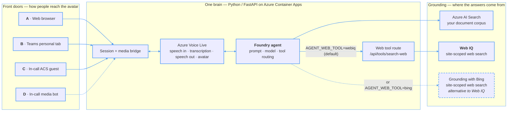
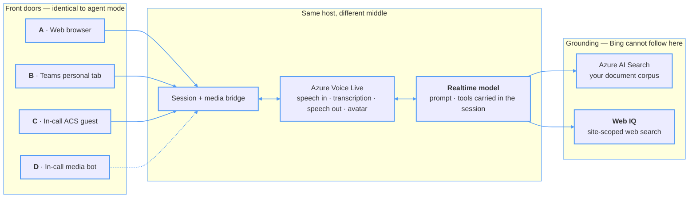

# Avatar Forge

A talking, photorealistic AI avatar that answers from **two sources at once**: your
own documents, and the outside web sources you choose. It speaks and listens in real
time (Azure **Voice Live**), grounded by Azure AI Search RAG over your corpus plus a
domain-scoped web search for anything current. By default it answers through a
**Microsoft Foundry agent**; it can instead bind straight to a **realtime model**, so
the answer no longer waits on the transcript. Reach it in a browser or
inside Microsoft Teams. The Voice Live SDK runs **entirely server-side**
(Python/FastAPI); the browser only handles audio I/O and avatar video.

## Architecture

Two independent choices decide what you deploy:

| Axis | Question | Set by | Options |
|---|---|---|---|
| **Front door** | Where do people reach the avatar? | `DEPLOY_PROFILE` | `web` (A) · `teams-tab` (A+B) · `in-call-browser` (A+B+C) · `in-call` (A+B+D) |
| **Brain** | What answers? | `VOICE_BINDING` | agent mode · model mode |

They are orthogonal — **every front door works with either brain**. Both are chosen
once, together, by `scripts/set_profile.py`.

**One brain, several front doors.** Every channel shares the same backend, Voice Live
session and grounding corpus — only the edge differs.

### Agent mode — `VOICE_BINDING=agent` *(default & recommended)*

Voice Live binds to a Foundry agent, which owns the prompt, model and tool routing.
The agent is text-only, so Voice Live's transcription sits on the answer path — the
agent cannot start until the words exist.

New agent configurations default to **GPT-5.6-Terra / reasoning `none`** and
**BM25 + semantic reranking, top-k 5**, over whole sections of the supplied
meeting DOCX files. The ingestion defaults are `CHUNKING_MODE=section` and
`DOCUMENT_SCOPE=minutes`; explicit `window` / `all` options retain the older
general-document path. Existing indexes are not rebuilt automatically.
See [configuration](docs/configuration.md) and the
[source-grounded evaluation results](docs/evaluation-results.md).



The agent has **one web tool**, chosen at deploy time with `AGENT_WEB_TOOL`.
The default, `webiq`, is an OpenAPI tool that calls back into this backend's
`/api/tools/search-web`: the same trusted-site Web IQ search model mode uses. The
dashed alternative, `bing`, is Grounding with Bing Custom Search; environments
deployed before Web IQ became the default keep it until you switch. In the
measured comparison Web IQ reached first token in 3.88 s against Bing's 5.07 s,
and answered 15/15 web questions well against Bing's 13/15
([evaluation](docs/evaluation-history.md#web-iq-as-the-agents-web-tool-24-september-2026)).
How to switch, and how Foundry's call is authenticated:
[choosing the agent's web tool](docs/deployment.md#choosing-the-agents-web-tool).

### Model mode — `VOICE_BINDING=model`

Voice Live binds straight to a realtime model, which takes the audio itself. The
prompt and tools travel in the session instead of living in an agent. **The front
doors are unchanged** — only the middle differs, and the web tool is always Web IQ.



Transcription is configured identically in both modes and is **not** a separate
component — it is one field on the Voice Live session, next to the voice and the
avatar. The difference is what waits for it: in agent mode the answer cannot start
without the text, while in model mode the transcript is still produced for the
on-screen transcript but the model is already working from the audio.

Why the grounding box changes: Voice Live accepts exactly two tool types in model
mode, `FUNCTION` and `MCP`, so the managed Grounding-with-Bing tool has nowhere to
attach. Web search is re-implemented as a function tool over Web IQ, in-process.
The document corpus is identical in both modes, and with `AGENT_WEB_TOOL=webiq`
so is the web search.

The Python backend bridges the edge and Azure Voice Live. In agent mode it binds each
session to an existing Foundry agent via `agent_config = { agent_name, project_name }`,
so tool routing resolves server-side inside Foundry; the Web IQ option is the one
tool that calls back into the backend. Internals in
**[docs/architecture.md](docs/architecture.md)**; the full comparison, including
measured latency, is in **[docs/voice-binding.md](docs/voice-binding.md)**; each
channel's own edge diagram is on its [channel page](docs/channels/README.md).

## Channel support

Four front doors onto that one brain. What differs between them is only how audio and
video get in and out — which drives cost and, more importantly, **how much
administrator access you need**.

| | Channel | Status | Extra Azure infra | Admin burden | Doc |
|---|---|---|---|---|---|
| **A** | **Web** (standalone) | ✅ Shipped | — *(the core)* | **None** | [a-web.md](docs/channels/a-web.md) |
| **B** | **Teams — personal tab** | ✅ Shipped | **None** | Upload a Teams app package | [b-teams-tab.md](docs/channels/b-teams-tab.md) |
| **C** | **Teams — in-call avatar** (ACS browser guest) | ✅ Media leg working | ACS resource (`ENABLE_ACS`) | **None** — joins as an anonymous guest | [c-in-call-headless.md](docs/channels/c-in-call-headless.md) |
| **D** | **Teams — in-call avatar** (Graph media bot) | ✅ Working | Azure Bot + **Windows VM** + DNS + TLS | **Highest** — incl. **Teams app access policy** | [d-in-call-media-bot.md](docs/channels/d-in-call-media-bot.md) |

They are not four equal options: **A → B is a ladder** (each additive on the one
before), while **C and D are rivals** — two implementations of the same capability.
The [channel hub](docs/channels/README.md) explains how to choose.

Picking a profile is enough on its own: it writes every flag that profile needs and
resets the ones it does not, so choosing the browser guest turns ACS on *and* turns the
media bot's Windows VM off. Nothing has to be set by hand.

👉 **Start here: [docs/channels/README.md](docs/channels/README.md)** for the decision
guide, and **[docs/admin-checklist.md](docs/admin-checklist.md)** for every manual step
and who must perform it. If you have no Teams administrator, read that first — it will
tell you in one page which channels are available to you.

All Teams surfaces are **additive** — the standalone web app is unaffected, and the
Teams JS SDK is never loaded outside Teams.

## Deploy to Azure

Deploying is a *sequence*, not one command: some steps Bicep performs, some only a
person with the right directory role can, and they interleave. Rather than make you
discover that halfway through, the tooling tells you the whole sequence up front.

**Before running these commands, read the [deployment prerequisites](docs/deployment.md#prerequisites).**
You need the Azure CLI (`az`), Azure Developer CLI (`azd`), `uv`, and the required
Azure access: **Contributor + User Access Administrator** on the target subscription,
or **Owner**. Channel-specific Entra and Teams administrator requirements are listed
in the [admin checklist](docs/admin-checklist.md).

> **Platform: Windows + PowerShell.** All commands are written for PowerShell; on
> macOS or Linux the `azd` and Python steps work unchanged, but you translate the
> shell syntax yourself ([details](docs/channels/README.md)). Channel D requires
> Windows regardless — the Teams Real-Time Media Platform runs on nothing else.

```powershell
az login
azd auth login
azd env new <environment-name>

# Pick the region. Only these four support both Voice Live and the avatar:
#   eastus2 · southeastasia · swedencentral · westus2
azd env set AZURE_LOCATION swedencentral

# 1. Choose the avatar. Types: standard-video, standard-photo, custom-video,
#    custom-photo. AVATAR_MODEL is a catalogue name or custom Speech model id.
azd env set AVATAR_TYPE standard-photo
azd env set AVATAR_MODEL Simone

# Optional: agent mode creates a Foundry agent named AvatarAgent by default.
# Set this before deployment only if you want a different name.
# azd env set AGENT_NAME ContosoAvatarAgent

# Optional: record each turn's question, tool results and answer for audit.
# Off by default. Turning it on provisions a Cosmos DB account, so confirm
# retention, access control and any notice obligation first — docs/audit.md.
# azd env set ENABLE_AUDIT true

# The trusted sites the web tool may search. Unset, Web IQ searches the open
# web and agent mode on Bing gets no web tool (Bing needs a list). A leading +
# ranks a source first; MTN's list is in docs/configuration.md#trusted-web-sources.
# azd env set TRUSTED_WEB_SITES "+www.example.com/investors,news.example.com"

# 2. Choose which channel you are deploying, which brain answers (agent or model
#    mode) and, for agent mode, the web tool (Bing or Web IQ). Records them in the
#    azd env and prints the full numbered plan, marking who performs each step.
uv run python scripts/set_profile.py

# 3. Check you can actually finish it — region support, providers, tooling and
#    every input your channel needs. Cheap now; expensive after a 20-minute deploy.
#    Also settles subscription, region and resource group if you have not, so
#    step 4 does not stop halfway to ask.
uv run python scripts/preflight.py

# 4. Deploy. Preflight runs again automatically and blocks a doomed deploy.
azd up
```

`azd` reads these values from its environment, not from the local `.env` file.
For the full avatar options, see
**[docs/configuration.md](docs/configuration.md#selecting-an-avatar)**.

`azd up` ends by printing the steps that remain for your channel — the manual and
administrator ones. Re-print them at any time:

```powershell
uv run python scripts/preflight.py --steps-only    # the whole plan
uv run python scripts/preflight.py --remaining     # only what is left
```

Profiles follow the channel order: `web` · `teams-tab` · `in-call-browser` · `in-call`.
The profile is stored in the azd environment rather than prompted for at deploy time,
so `azd up` stays non-interactive and re-deploys and CI keep working.

Details: **[docs/deployment.md](docs/deployment.md)** ·
**[docs/channels/README.md](docs/channels/README.md)** ·
**[docs/admin-checklist.md](docs/admin-checklist.md)**.

## Quickstart (local)

You need Python 3.10+, [`uv`](https://docs.astral.sh/uv/), and a Foundry resource in a
Voice Live region (see [docs/development.md](docs/development.md) for prerequisites).

```powershell
# 1. Install uv
powershell -ExecutionPolicy ByPass -c "irm https://astral.sh/uv/install.ps1 | iex"

# 2. Configure — copy the template and fill in the required values
Copy-Item .env.example .env   # edit AZURE_VOICELIVE_ENDPOINT, AGENT_*, PROJECT_ENDPOINT

# 3. Authenticate (the agent path requires Entra ID — no API key)
az login

# 4. Run
uv run avatar-forge         # → http://localhost:3000
```

Full walkthrough — building the search index, smoke tests, developer mode — in
**[docs/development.md](docs/development.md)**.

## Documentation

**Start here** — pick a front door, then check whether you can actually deploy it.

| Doc | What's in it |
|---|---|
| **[docs/channels/README.md](docs/channels/README.md)** | The channel ladder, comparison, and decision guide — which front door to deploy and why. |
| **[docs/admin-checklist.md](docs/admin-checklist.md)** | **Every manual step automation cannot do**, per channel, with who must perform it and what to do when you're blocked. |

**Get it running**

| Doc | What's in it |
|---|---|
| **[docs/development.md](docs/development.md)** | Run locally, build the AI Search index, smoke-test the index and agent, dev-only knobs. |
| **[docs/deployment.md](docs/deployment.md)** | Deploy to Azure with `azd`: topology, region preflight, BYO Foundry/Search, cross-RG RBAC, post-deploy. |
| **[docs/configuration.md](docs/configuration.md)** | **Every** environment variable, grouped by concern — the single source of truth. |

**Understand it**

| Doc | What's in it |
|---|---|
| **[docs/architecture.md](docs/architecture.md)** | System design, tool-calling accuracy, meeting-catalogue injection, frontend UX, project structure. |
| **[docs/voice-binding.md](docs/voice-binding.md)** | Agent mode vs model mode: what binding Voice Live straight to a realtime model gives, what it costs, and the measured numbers. Also why Voice Live itself is in the path at all — dropping it costs the avatar and the custom voice. |
| **[docs/auth.md](docs/auth.md)** | `DefaultAzureCredential`, required roles, the keys that remain (Web IQ, the agent's web tool), startup pre-warm, IMDS skip, token caching. |
| **[docs/audit.md](docs/audit.md)** | The optional conversation audit trail: what each binding can prove, how agent-mode tool I/O is recovered, the latency rules, storage and retention. Off by default. |

**Per component**

| Doc | What's in it |
|---|---|
| **[teams/README.md](teams/README.md)** | Building and sideloading the Teams app package (serves channel B). |
| **[meeting-bot/README.md](meeting-bot/README.md)** | The .NET/Windows media bot itself (channel D): project layout, configuration, operator runbook, and the traps that cost real debugging time. |
| **[prompts/README.md](prompts/README.md)** | Agent and model-mode prompt content, and the edit workflow. |
| **[scripts/README.md](scripts/README.md)** | Every script that touches Azure, and the prefix convention that tells you what running one costs — which four are wired into `azd up` and must not be renamed. |
| **[tests/README.md](tests/README.md)** | The offline suites: no network, no credentials, no cost, and what each one pins. |
| **[docs/testing-meetings.md](docs/testing-meetings.md)** | **How to test the two in-meeting paths** — browser joiner vs. media bot: what each can and cannot hear, runbooks, healthy logs, rollback. |

**Design records** *(archive — why the in-call channel is built the way it is; not needed to deploy)*

| Doc | What's in it |
|---|---|
| **[docs/channels/d-design-media-bot.md](docs/channels/d-design-media-bot.md)** | The three in-call options evaluated, why Python + a thin .NET/Windows media bot, and the final architecture. |
| **[docs/channels/d-design-avatar-video.md](docs/channels/d-design-avatar-video.md)** | The avatar's synced video face as a meeting camera tile, and why audio + video share one synthesis. |

## References & Acknowledgements

Avatar Forge was built by referencing the following Microsoft samples and documentation. Thanks to the teams behind them.

- **Azure AI VoiceLive samples** — the project started from and the real-time avatar/voice implementation is based on these official samples: [microsoft-foundry/voicelive-samples (Python)](https://github.com/microsoft-foundry/voicelive-samples/tree/main/python) ([`azure-ai-voicelive` SDK](https://pypi.org/project/azure-ai-voicelive/)).
- **Azure AI Search** — retrieval/grounding index: [Azure AI Search documentation](https://learn.microsoft.com/en-us/azure/search/).
- **Azure AI Foundry (Agent Service)** — agent orchestration and tool-calling: [Azure AI Foundry documentation](https://learn.microsoft.com/en-us/azure/ai-foundry/).
- **Grounding with Bing Custom Search** — domain-scoped web grounding for the agent, the alternative to Web IQ (`AGENT_WEB_TOOL=bing`): [Bing Custom Search tool](https://learn.microsoft.com/en-us/azure/foundry-classic/agents/how-to/tools-classic/bing-custom-search).
- **Foundry OpenAPI tool** — how the agent calls the Web IQ route (`AGENT_WEB_TOOL=webiq`, the default), with API-key or managed-identity auth: [Connect OpenAPI tools to Foundry agents](https://learn.microsoft.com/en-us/azure/foundry/agents/how-to/tools/openapi).
- **Foundry web search (Grounding with Bing Search) tool** — real-time web grounding: [Grounding with Bing Search tools](https://learn.microsoft.com/en-us/azure/foundry/agents/how-to/tools/bing-tools).

## License

This project is licensed under the **MIT License** — see the [LICENSE](LICENSE) file
for the full text.

Copyright (c) 2026 Sridhar Arrabelly
