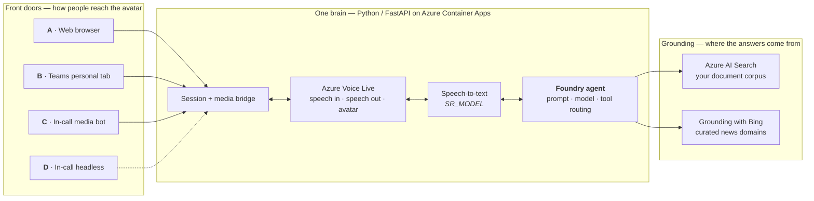
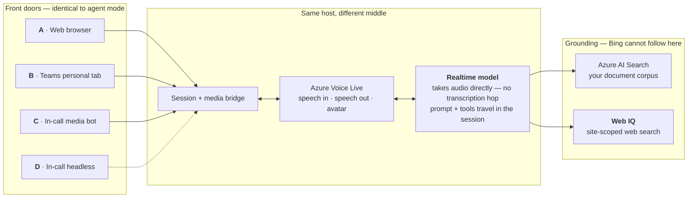

# Avatar Forge

A talking, photorealistic AI avatar that answers questions from **your own
documents** — over the web and inside Microsoft Teams. The avatar speaks and listens
in real time (Azure **Voice Live**), grounded by Azure AI Search RAG over your corpus
plus a web tool for live facts. By default it answers through a **Microsoft Foundry
agent**; it can instead bind straight to a **realtime model**, which removes the
transcription hop from the answer path. The Voice Live SDK runs **entirely
server-side** (Python/FastAPI); the browser only handles audio I/O and avatar video.

## Architecture

Two independent choices decide what you deploy:

| Axis | Question | Set by | Options |
|---|---|---|---|
| **Front door** | Where do people reach the avatar? | `DEPLOY_PROFILE` | A web · B Teams tab · C in-call bot · D headless |
| **Brain** | What answers? | `VOICE_BINDING` | agent mode · model mode |

They are orthogonal — **every front door works with either brain**. Both are chosen
once, together, by `scripts/set_profile.py`.

**One brain, several front doors.** Every channel shares the same backend, Voice Live
session and grounding corpus — only the edge differs.

### Agent mode — `VOICE_BINDING=agent` *(default)*

Voice Live binds to a Foundry agent, which owns the prompt, model and tool routing.
Speech is transcribed before the agent sees it.



### Model mode — `VOICE_BINDING=model`

Voice Live binds straight to a realtime model. It accepts audio natively, so the
transcription hop disappears from the answer path and the prompt and tools travel in
the session instead. **The front doors are unchanged** — only the middle and the web
tool differ.



Why the grounding box changes: Voice Live accepts exactly two tool types in model
mode, `FUNCTION` and `MCP`, so the managed Grounding-with-Bing tool has nowhere to
attach. Web search is re-implemented as a function tool over Web IQ. The document
corpus is identical in both modes.

The Python backend bridges the edge and Azure Voice Live. In agent mode it binds each
session to an existing Foundry agent via `agent_config = { agent_name, project_name }`,
so RAG + grounding resolve server-side inside Foundry. Internals in
**[docs/architecture.md](docs/architecture.md)**; the full comparison, including
measured latency, is in **[docs/voice-binding.md](docs/voice-binding.md)**; each
channel's own edge diagram is on its [channel page](docs/channels/README.md).

## Channel support

Four front doors onto that one brain. What differs between them is only how audio and
video get in and out — which drives cost and, more importantly, **how much
administrator access you need**.

| | Channel | Status | Extra Azure infra | Admin burden | Doc |
|---|---|---|---|---|---|
| **A** | **Web** (standalone) | ✅ Shipped | — *(the core)* | **None** | [a-web.md](docs/channels/a-web.md) |
| **B** | **Teams — personal tab** | ✅ Shipped | **None** | Upload a Teams app package | [b-teams-tab.md](docs/channels/b-teams-tab.md) |
| **C** | **Teams — in-call avatar** (Graph media bot) | ✅ Working | Azure Bot + **Windows VM** + DNS + TLS | **Highest** — incl. **Teams app access policy** | [c-in-call-media-bot.md](docs/channels/c-in-call-media-bot.md) |
| **D** | **Teams — in-call avatar** (headless browser) | 🔜 Placeholder | Container/job | TBD | [d-in-call-headless.md](docs/channels/d-in-call-headless.md) |

They are not four equal options: **A → B is a ladder** (each additive on the one
before), while **C and D are rivals** — two implementations of the same capability.
The [channel hub](docs/channels/README.md) explains how to choose.

👉 **Start here: [docs/channels/README.md](docs/channels/README.md)** for the decision
guide, and **[docs/admin-checklist.md](docs/admin-checklist.md)** for every manual step
and who must perform it. If you have no Teams administrator, read that first — it will
tell you in one page which channels are available to you.

All Teams surfaces are **additive** — the standalone web app is unaffected, and the
Teams JS SDK is never loaded outside Teams.

## Quickstart (local)

You need Python 3.10+, [`uv`](https://docs.astral.sh/uv/), and a Foundry resource in a
Voice Live region (see [docs/development.md](docs/development.md) for prerequisites).

```powershell
# 1. Install uv
powershell -ExecutionPolicy ByPass -c "irm https://astral.sh/uv/install.ps1 | iex"

# 2. Configure — copy the template and fill in the required values
Copy-Item .env.example .env   # edit AZURE_VOICELIVE_ENDPOINT, AGENT_*, PROJECT_ENDPOINT

# 3. Authenticate (the agent path requires Entra ID — no API key)
az login

# 4. Run
uv run avatar-forge         # → http://localhost:3000
```

Full walkthrough — building the search index, smoke tests, developer mode — in
**[docs/development.md](docs/development.md)**.

## Deploy to Azure

Deploying is a *sequence*, not one command: some steps Bicep performs, some only a
person with the right directory role can, and they interleave. Rather than make you
discover that halfway through, the tooling tells you the whole sequence up front.

> **Platform: Windows + PowerShell.** All commands are written for PowerShell. On
> macOS or Linux the `azd` and Python steps work unchanged — translate the shell
> syntax yourself. Channel C requires Windows regardless (the Teams Real-Time Media
> Platform runs on nothing else).

```powershell
azd auth login
azd env new <environment-name>

# Pick the region. Only these four support both Voice Live and the avatar:
#   eastus2 · southeastasia · swedencentral · westus2
azd env set AZURE_LOCATION swedencentral

# 1. Choose which channel you are deploying. Sets DEPLOY_PROFILE and prints
#    the full numbered plan, marking who performs each step.
uv run python scripts/set_profile.py

# 2. Check you can actually finish it — region support, providers, tooling and
#    every input your channel needs. Cheap now; expensive after a 20-minute deploy.
#    Also settles subscription, region and resource group if you have not, so
#    step 3 does not stop halfway to ask.
uv run python scripts/preflight.py

# 3. Deploy. Preflight runs again automatically and blocks a doomed deploy.
azd up
```

`azd up` ends by printing the steps that remain for your channel — the manual and
administrator ones. Re-print them at any time:

```powershell
uv run python scripts/preflight.py --steps-only    # the whole plan
uv run python scripts/preflight.py --remaining     # only what is left
```

Profiles map onto the channel ladder: `web` · `teams-tab` · `in-call`.
The profile is stored in the azd environment rather than prompted for at deploy time,
so `azd up` stays non-interactive and re-deploys and CI keep working.

Details: **[docs/deployment.md](docs/deployment.md)** ·
**[docs/channels/README.md](docs/channels/README.md)** ·
**[docs/admin-checklist.md](docs/admin-checklist.md)**.

## Documentation

| Doc | What's in it |
|---|---|
| **[docs/channels/README.md](docs/channels/README.md)** | **Start here.** The channel ladder, comparison, and decision guide — which front door to deploy and why. |
| **[docs/admin-checklist.md](docs/admin-checklist.md)** | **Every manual step automation cannot do**, per channel, with who must perform it and what to do when you're blocked. |
| **[docs/development.md](docs/development.md)** | Run locally, build the AI Search index, smoke-test the index and agent, dev-only knobs. |
| **[docs/configuration.md](docs/configuration.md)** | **Every** environment variable, grouped by concern — the single source of truth. |
| **[docs/architecture.md](docs/architecture.md)** | System design, tool-calling accuracy, meeting-catalogue injection, frontend UX, project structure. |
| **[docs/voice-binding.md](docs/voice-binding.md)** | Agent mode vs model mode: what binding Voice Live straight to a realtime model gives, what it costs, and the measured numbers. |
| **[docs/deployment.md](docs/deployment.md)** | Deploy to Azure with `azd`: topology, region preflight, BYO Foundry/Search, cross-RG RBAC, post-deploy. |
| **[docs/auth.md](docs/auth.md)** | `DefaultAzureCredential`, required roles, startup pre-warm, IMDS skip, token caching. |
| **[teams/README.md](teams/README.md)** | Building and sideloading the Teams app package (serves channel B). |
| **[docs/channels/c-design-media-bot.md](docs/channels/c-design-media-bot.md)** | **Design record** — the three in-call options evaluated, why Python + a thin .NET/Windows media bot, and the final architecture. |
| **[docs/channels/c-design-avatar-video.md](docs/channels/c-design-avatar-video.md)** | **Design record** — the avatar's synced video face as a meeting camera tile, and why audio + video share one synthesis. |
| **[docs/testing-meetings.md](docs/testing-meetings.md)** | **How to test the two in-meeting paths** — browser joiner vs. media bot: what each can and cannot hear, runbooks, healthy logs, rollback. |
| **[meeting-bot/README.md](meeting-bot/README.md)** | The .NET/Windows media bot itself: project layout, configuration, operator runbook, and the traps that cost real debugging time. |
| **[prompts/README.md](prompts/README.md)** | Agent prompt content, the reasoning/non-reasoning variants, and the edit workflow. |

## References & Acknowledgements

Avatar Forge was built by referencing the following Microsoft samples and documentation. Thanks to the teams behind them.

- **Azure AI VoiceLive samples** — the project started from and the real-time avatar/voice implementation is based on these official samples: [microsoft-foundry/voicelive-samples (Python)](https://github.com/microsoft-foundry/voicelive-samples/tree/main/python) ([`azure-ai-voicelive` SDK](https://pypi.org/project/azure-ai-voicelive/)).
- **Azure AI Search** — retrieval/grounding index: [Azure AI Search documentation](https://learn.microsoft.com/en-us/azure/search/).
- **Azure AI Foundry (Agent Service)** — agent orchestration and tool-calling: [Azure AI Foundry documentation](https://learn.microsoft.com/en-us/azure/ai-foundry/).
- **Grounding with Bing Custom Search** — domain-scoped web grounding for the agent: [Bing Custom Search tool](https://learn.microsoft.com/en-us/azure/foundry-classic/agents/how-to/tools-classic/bing-custom-search).
- **Foundry web search (Grounding with Bing Search) tool** — real-time web grounding: [Grounding with Bing Search tools](https://learn.microsoft.com/en-us/azure/foundry/agents/how-to/tools/bing-tools).

## License

This project is licensed under the **MIT License** — see the [LICENSE](LICENSE) file
for the full text.

Copyright (c) 2026 Sridhar Arrabelly
