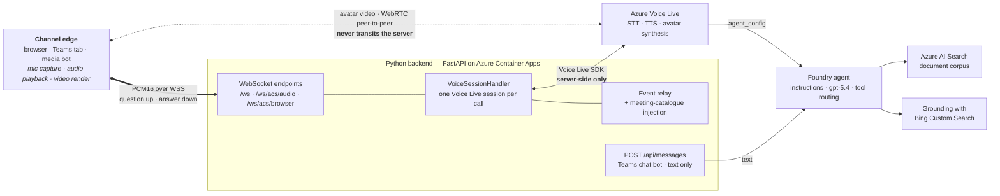

# Architecture

How Avatar Forge is put together: the server-side Voice Live bridge, the Foundry
agent it binds to, the tool-calling design that makes answers accurate, and the
frontend UX. For environment variables see [configuration.md](configuration.md);
for deploying it see [deployment.md](deployment.md).

## System overview

The channel-level view ("one brain, several front doors") is in the
[root README](../README.md#architecture); each channel's own edge diagram is on its
[channel page](channels/README.md). This page is the **inside of the brain** — the part
every channel shares.



**Key design.** The Python backend is a bridge between the browser and the Azure
Voice Live service. Voice Live binds the session to an existing **Microsoft Foundry
agent** via `agent_config = { agent_name, project_name }`. The agent (created once
with [`scripts/setup_foundry_agent.py`](../scripts/setup_foundry_agent.py)) owns the
system prompt, model selection, and tool wiring — an **Azure AI Search** index over
the document corpus plus **Grounding with Bing Custom Search** for live web facts
restricted to a curated domain allow-list. Voice Live handles speech-in/speech-out
and routes turns through the agent so tool calls resolve server-side in Foundry.

**All Voice Live SDK operations run on the server** (session creation, configuration,
audio forwarding, event processing). The browser only:

- captures the microphone → sends PCM16 audio over the WebSocket;
- plays back PCM16 audio received over the WebSocket;
- relays WebRTC signaling for the avatar video (SDP offer/answer through the backend)
  and renders the avatar via a direct WebRTC peer connection to Azure;
- (WebSocket video mode) receives fMP4 chunks for MediaSource Extensions playback.

The **Teams bot** (channel C) is hosted inside the same FastAPI app as a `POST
/api/messages` route and reuses the same Foundry agent — see
[`teams/README.md`](../teams/README.md).

The **in-call avatar** (issue #27) reuses the same Voice Live + Foundry pipeline inside a
*live Teams meeting*. Two transports exist, and they are not equivalent:

- **Graph media bot (channel D — the shipped design).** A thin .NET service on a Windows
  host joins the meeting through the Graph Real-Time Media Platform, which is the only
  way to receive the **mixed audio of every participant**. It forwards raw PCM16 over a
  WebSocket (`/ws/acs/audio`) to [`backend/acs/bridge.py`](../backend/acs/bridge.py)'s
  `AcsVoiceBridge`, which adapts it onto the unchanged `VoiceSessionHandler`
  (wake-phrase turn-taking, barge-in). The avatar's face is decoded from Voice Live's
  fragmented-MP4 avatar stream to NV12 in Python and sent back as a camera tile.
- **Browser joiner (`frontend/acs-join.html`) — a fallback for demos.** Joins with the
  ACS Calling Web SDK (anonymous, lobby-governed, no admin) over `/ws/acs/browser`. It
  can only ever hear **the operator's own microphone**, because Teams isolates
  per-client audio. Useful when you have no admin rights; not a substitute for D.

Both are non-recording and fully opt-in — every `/api/acs/*` route returns 503 when
disabled. An optional Teams meeting **side-panel control panel**
(`frontend/companion.html`, opt-in `configurableTabs` via
`build_package.py --enable-companion`) shows live call status (`GET /api/acs/status`)
and launches the joiner in a separate window; it is a control plane only, deliberately
not an unsynced avatar face on the stage.

> An earlier design attempted ACS Call Automation `connect_call` media streaming from
> the server. Live testing proved it does **not** carry Teams *meeting* audio (every
> inbound frame arrived silent), which is why the Graph media bot exists.

Details: [`docs/channels/d-in-call-media-bot.md`](channels/d-in-call-media-bot.md) and
[`d-design-media-bot.md`](channels/d-design-media-bot.md).

## Tool-calling accuracy

The avatar's usefulness hinges on calling the **right tool** per question: the Azure
AI Search index for internal questions, **Grounding with Bing Custom Search** for
live external facts from a curated allow-list (share price, competitor news), or
**both** for comparisons ("how does our revenue compare to what analysts expected?").

The original agent decided tools entirely on its own and reached only **~70%**
first-tool accuracy, frequently **fanning out** multiple external web calls (≈45% of
web turns), inflating latency and token cost. Adopting **Grounding with Bing Custom
Search** (a single hosted Bing call instead of an open-ended web tool) and pinning
the model lifted first-tool accuracy to **~93.5%** on the original `gpt-4.1-mini`
baseline and cut fan-out to ≈3%. The **current production model is `gpt-5.4` with
`AGENT_REASONING_EFFORT=none`**, which scores **30/30** on the routing harness
([`prompts/agent/routing-test-questions.md`](../prompts/agent/routing-test-questions.md))
with cleaner numeric synthesis; `gpt-5.4-mini` is a faster, cheaper fallback and
`gpt-4.1-mini` remains the documented baseline.

**The web tool.** The agent's only external tool is **`bing_custom_search`** — a
single grounded round-trip that returns curated snippets restricted to a server-side
domain allow-list (the "configuration" provisioned in the Bing Custom Search portal,
referenced by `BING_CUSTOM_CONFIG_NAME`). An open-ended web-search tool on
`gpt-4.1-mini` either fans out into many calls or bloats the context;
`bing_custom_search` resolves a turn in one call. It is wired via `BING_CONNECTION_NAME`
+ `BING_CUSTOM_CONFIG_NAME` when running `setup_foundry_agent.py`.

**The system prompt.** The provisioning script picks one of two prompt variants based
on `AGENT_MODEL`: [`instructions-nonreasoning.md`](../prompts/agent/instructions-nonreasoning.md)
for `gpt-4.x`/`gpt-4o` (literal, hard rules, one tool per turn) and
[`instructions-reasoning.md`](../prompts/agent/instructions-reasoning.md) for
o-series/`gpt-5` (softer principles, up to 3 tool calls per turn, refined follow-up
search allowed). Both share the voice-first output rules, the silent meeting-catalogue
contract, the intent-aware Bing query block, and the JSE-cents conversion rule. The
selector uses the same `_model_supports_reasoning()` predicate that gates
`reasoning.effort`, so prompt and model capability stay in lock-step. Full detail in
[`prompts/README.md`](../prompts/README.md).

## Meeting-catalogue injection

At session start the backend fetches a compact catalogue of every indexed meeting
(date + title) from AI Search and injects it as a system message. This lets the agent
answer "how many meetings / first / last / list them" with **no** search call, and
lets it phrase precise content searches using exact dates. The catalogue is cached
for `MEETING_CATALOG_TTL_S` (default 15 min). Code:
[`backend/voice/catalog.py`](../backend/voice/catalog.py).

## Frontend UX

The browser UI has two modes, selected by `DEVELOPER_MODE` and delivered to the
client through [`/api/config`](../backend/api/routes.py):

- **Normal mode** (production default, `DEVELOPER_MODE=false`) — a clean, avatar-only
  experience. The session auto-starts; the settings/transcript side panel is hidden.
- **Developer mode** (`DEVELOPER_MODE=true`) — exposes the settings panel, the live
  chat transcript, and per-event debug logging alongside the avatar.

### The avatar stage (normal mode)

Everything the end user sees is anchored to the avatar:

- **Avatar video** — the WebRTC (or WebSocket/MSE) photo or standard avatar.
- **Identity lockup** — top-left, a branding block with the avatar's **name** (bold)
  and an optional **tagline** (italic). The name comes from `AVATAR_DISPLAY_NAME`
  (the single branding knob, also used for the Teams bot) or is derived from the
  selected avatar model; the tagline is `AVATAR_TAGLINE` (empty hides it).
- **Bottom control row** — the **text composer** (when shown) fills the left; the
  **Stop button** and the **docked mic** cluster in the right corner. They share a
  height and scale with the avatar across screen sizes.
- **Text composer** *(host-aware)* — a "Type a message…" pill so users can type
  instead of (or alongside) talking. Reuses the existing text path (voice stays
  primary) and stays disabled until the session connects. Shown on the **web** app
  (default on, `ENABLE_TEXT_INPUT`); **always hidden inside Teams** — the frontend
  detects the Teams host (`isEmbeddedInTeams()`, mirroring `frontend/teams.js`) and
  suppresses it, because the bot chat tab has Teams' native compose box and the
  avatar tab is voice-first. Hidden in developer mode, which keeps its own input.
- **Stop button** *(`ENABLE_STOP_BUTTON`, default on)* — a small control beside the
  mic, always visible while the avatar is on screen: greyed when idle, red and
  actionable while the avatar speaks. Tapping it truncates the avatar mid-answer via
  the same interrupt path as voice barge-in (`response.cancel()` **and**
  `output_audio_buffer.clear()` server-side — see [below](#interrupt-and-truncation)).
- **Thinking indicator** — shows between the user's turn and the avatar's first
  words, with rotating captions and a failsafe timeout.
- **Connection & permission states** — a status pill (and toasts) surface connecting,
  mic blocked/denied, reconnecting, session ended, and avatar/transport errors.
- **Live captions** *(`ENABLE_CAPTIONS`, default off)* — a frosted subtitle band
  below the avatar mirroring the streamed transcript (and optionally the user's last
  utterance). Reuses the transcript stream — no extra model calls.
- **Speaking-state colour shift** — the avatar renders **grayscale while idle** and
  **shifts to full colour** while actually speaking. Driven by real-playback signals
  (the WebRTC data-channel `EVENT_TYPE_SWITCH_TO_SPEAKING`/`_IDLE` events plus an
  `AnalyserNode` on the live audio track), with a watchdog so it never sticks on.
- **Suggested prompts + onboarding hint** *(`ENABLE_SUGGESTED_PROMPTS`, default on)*
  — on first load, a one-line hint and 2–3 tappable example chips. The hint wording
  is derived from the *effective* composer state (so Teams never says "…or type…").

The captions, suggested-prompt, text-input, and stop-button features are additive and
individually configurable — see [configuration.md](configuration.md#avatar-ux-additive-frontend-features).
The UI is themeable via CSS custom properties and ships a **dark variant** following
the OS `prefers-color-scheme` (with an `applyTheme(light|dark|system)` hook); all
animations respect `prefers-reduced-motion`.

### Interrupt and truncation

Voice barge-in works because the server VAD config in
[`backend/voice/builders.py`](../backend/voice/builders.py) (`interrupt_response`,
`auto_truncate`) truncates output audio when the user speaks. The **Stop button**
replicates this without speech: `backend/voice/handler.py`'s `interrupt()` calls both
`response.cancel()` (cancels in-flight generation) **and**
`connection.output_audio_buffer.clear()` (immediately truncates already-generated
audio the WebRTC avatar is still rendering). `response.cancel()` alone is a no-op once
a turn has finished generating but is still being spoken — the `output_audio_buffer.clear()`
call is what actually stops her.

## Project structure

```
avatar-forge/
├── backend/                       # FastAPI server (Python) — the one brain
│   ├── main.py                    # App factory, lifespan, middleware, static mount, run()
│   ├── config.py                  # .env loading, logging, UI defaults (get_ui_defaults)
│   ├── api/
│   │   ├── routes.py              # HTTP routes: /health, /api/config
│   │   └── websocket.py           # /ws/{client_id} endpoint, session lifecycle
│   ├── voice/                     # Voice Live SDK integration
│   │   ├── handler.py             # VoiceSessionHandler: session lifecycle, audio I/O, avatar, interrupt
│   │   ├── builders.py            # build_voice_config / build_avatar_config / build_turn_detection
│   │   ├── event_handlers.py      # SDK event -> frontend message translation
│   │   ├── catalog.py             # Meeting catalogue fetch from AI Search (injected at session start)
│   │   ├── functions.py           # Built-in tool implementations (get_time, get_weather, calculate)
│   │   └── auth.py                # DefaultAzureCredential + caching wrapper
│   ├── bot/                       # Channel C — Teams conversational bot
│   │   ├── app.py                 # M365 Agents SDK app + POST /api/messages route
│   │   ├── agent_runtime.py       # Foundry-agent bridge (reuses the voice agent)
│   │   └── cards.py               # Adaptive Card + deep link back to the tab
│   └── acs/                       # Channels D/E — in-call media bridge (opt-in)
│       ├── client.py              # ACS Call Automation + Identity clients (browser-joiner path)
│       ├── bridge.py              # AcsVoiceBridge / BrowserVoiceBridge <-> VoiceSessionHandler
│       ├── avatar_stream.py       # fMP4 demux + H.264 decode -> NV12 frames for the media bot
│       └── routes.py              # /api/acs/{config,status,token,call,callback} + /ws/acs/{audio,browser}
│
├── frontend/                      # Static client assets (served at /) — channels A and B
│   ├── index.html                 # Avatar stage: video, identity lockup, composer, stop, mic, captions
│   ├── style.css                  # Styles (speaking-state colour, caption band, stop button, chips)
│   ├── app.js                     # Audio capture/playback, WebRTC, WebSocket, UI logic, Teams host gate
│   ├── acs-join.html / .js        # Browser joiner: join a Teams meeting via the ACS Calling Web SDK
│   ├── companion*.html / .js      # Optional in-meeting control panel + its configurableTabs page
│   └── teams.js                   # No-op unless in Teams: loads Teams JS SDK, mirrors host theme
│
├── meeting-bot/                   # Channel D — .NET/Windows Graph media bot (separate host)
│   ├── Bot/                       # MeetingBot, CallHandler, AuthenticationProvider
│   ├── Bridge/                    # VoiceLiveBridgeClient — the Python contract, unit-tested
│   ├── Http/                      # JoinController (operator API), CallingController (Graph webhook)
│   ├── Configuration/BotOptions.cs
│   ├── scripts/setup-host.ps1     # 4-stage Windows host setup: Prep, Cert, Build, Run
│   └── README.md                  # Build, configuration, and the traps that cost debugging time
│
├── docs/                          # Documentation hub (see docs/channels/README.md to choose a channel)
│   ├── channels/                  # One page per delivery channel (a-web … e-in-call-headless) + design records
│   ├── architecture.md            # This file — the shared core
│   ├── admin-checklist.md         # Every manual step and who must perform it
│   ├── configuration.md           # Every environment variable
│   ├── deployment.md              # azd mechanics, greenfield and brownfield
│   ├── development.md             # Local dev, index build, smoke tests
│   ├── auth.md                    # Identity and RBAC model
│   └── testing-meetings.md        # Runbook for the two in-meeting paths
│
├── scripts/                       # Utility / one-off scripts (not part of the server)
│   ├── channels.py                # Single source of truth for deploy profiles and their steps
│   ├── set_profile.py             # Step 0: choose a channel, record DEPLOY_PROFILE, print the plan
│   ├── preflight.py               # Gate before azd up: regions, providers, tooling, per-profile inputs
│   ├── setup_foundry_agent.py     # Creates the Foundry agent with AI Search + Bing Custom Search tools
│   ├── setup_aisearch_index.py    # Creates/updates the AI Search index and ingests data/
│   ├── test_aisearch_query.py     # Smoke-tests the index (hybrid + semantic query)
│   ├── test_foundry_agent.py      # Smoke-tests the live agent end-to-end
│   └── grant_byo_rbac.py          # Idempotently grants BYO runtime RBAC (brownfield)
│
├── teams/                         # Teams app package for channels B and C
│   ├── manifest.template.json     # Manifest (schema v1.17): staticTabs + bots, templated placeholders
│   ├── build_package.py           # Stdlib-only: renders the manifest and zips a sideloadable package
│   └── README.md                  # Packaging mechanics + sideload walkthrough
│
├── infra/                         # Bicep IaC consumed by azd (azure.yaml)
│   ├── main.bicep                 # Deployment entry point; derives what to deploy from DEPLOY_PROFILE
│   ├── resources.bicep            # Resource composition (BYO/create switches)
│   └── modules/                   # containerApp, foundry, aiSearch, botService, meetingBotHost, RBAC, ...
│
├── assets/brand/                  # Canonical brand assets (logo, outline icon, favicon, generator)
├── assets/avatar/                 # Source photo(s) for custom photo-avatar training (not runtime)
├── data/                          # Source corpus ingested into the AI Search index (.docx/.pdf/.md/.txt)
├── prompts/agent/                 # Agent prompt content (Markdown), loaded by setup_foundry_agent.py
├── azure.yaml                     # azd service + hooks (infra path, preprovision/postprovision)
├── pyproject.toml / uv.lock       # Project metadata + locked dependencies
├── Dockerfile                     # Container build (python:3.12-slim + uv)
└── .env.example                   # Template for .env (copy and fill)
```
