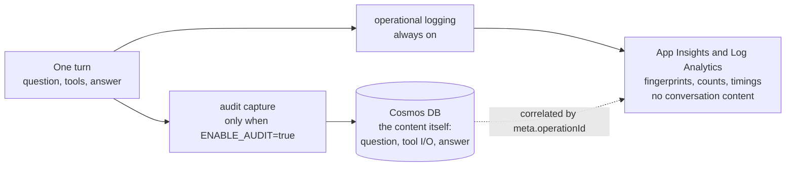
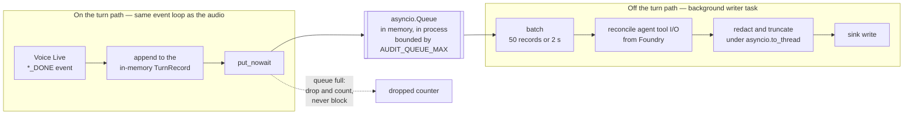
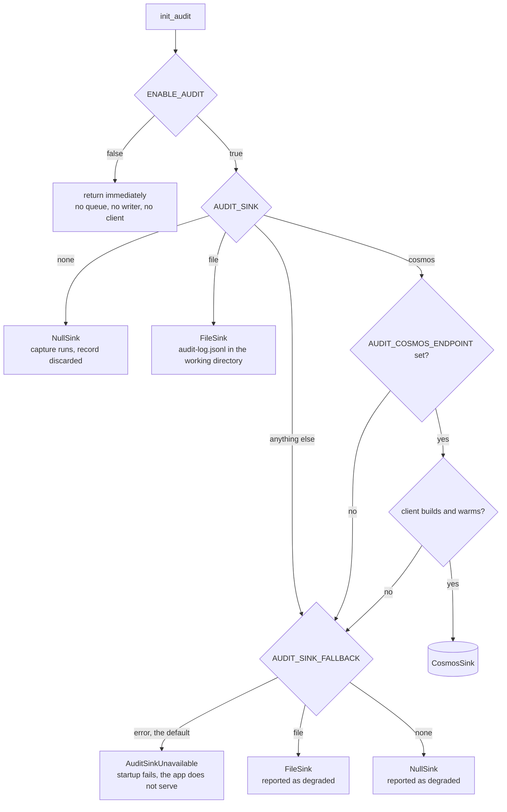

# Conversation audit trail

Persists, for every turn of every conversation, **what the user asked**, **what
the tools returned**, and **what the model answered** — across all four channels
and both voice bindings.

Off by default. When `ENABLE_AUDIT=false` the entire feature costs one
`is None` check per turn and no infrastructure is deployed.

> [!IMPORTANT]
> This records the substance of conversations, including anything a user says
> to the avatar and every passage retrieved on their behalf. Turning it on is a
> **policy decision, not just a config change** — confirm your retention period,
> access controls, and any notice or consent obligation before enabling it in an
> environment real people use.

---

## Why this is not just "log the messages"

Two properties fight each other, and the design exists to satisfy both.

**1. It must be complete.** An audit trail with holes is worse than none,
because it invites conclusions it cannot support. The hard part is agent
binding: when Voice Live is bound to a Foundry agent, the agent runs the tool
call *server-side* and relays **no tool events at all** to us. We see the
question and the answer, and nothing about the retrieval in between.

**2. It must not slow the avatar down.** This is a latency-sensitive
application — the number that matters is time-to-first-audio, and the whole
repo is organised around not spending it. An audit path that adds even tens of
milliseconds to the turn path is not worth having.

The resolution to (1) is the Foundry **conversation items** API, which returns
the complete turn after the fact. The resolution to (2) is that the turn path
does only the cheap half — build a record in memory, push it to a queue — while
every expensive operation happens in a background writer. Capture is not free
and this doc does not claim it is: it is [measured](#measured-cost) at **5.5 µs**
per turn, against a turn budget of hundreds of milliseconds.

---

## Where the data goes

Audit and operational telemetry are **two separate stores with two different
jobs**, and the split is deliberate. Conversation content goes to Cosmos and
nowhere else. The operational logs describe the same turn without reproducing
any of it — they carry fingerprints, counts and timings, so that an engineer
debugging a production issue never needs access to what a user said.



The dotted line is the part that makes both useful at once. An audit record
carries the `operationId` of the request that produced it, so a slow or failing
turn found in Log Analytics can be traced to the exact stored turn, without
either store having to hold the other's data. The rule that keeps the right-hand
box content-free is enforced by a test, and is written up in
[development.md](development.md#never-log-conversation-content).

---

## What each binding can prove

This is the table to bring to a compliance review. "Fidelity" means: is this
the real value, or a reconstruction?

| Field | model binding — source | agent binding — source | fidelity |
|---|---|---|---|
| User text | input-audio transcription completed | same | **exact**, both |
| Assistant text | response audio-transcript / text done | same | **exact**, both |
| Turn outcome (completed / cancelled / failed) | `response.done` status | same | **exact**, both |
| Barge-in / truncation | interrupt path | same | **exact**, both |
| Tool **name** | [`backend/voice/functions.py`](../backend/voice/functions.py) | `remote_function_call.name` | **exact**, both |
| Tool **arguments** (the query) | in-process call args | `remote_function_call.arguments` | **exact**, both |
| Tool **results** (retrieved passages) | in-process return value | `remote_function_call_output.output.documents[]` | **exact** for AI Search; **empty** for Grounding with Bing (see below) |
| Citations / sources | derived from results | document `id` + `content` per output doc | **exact** for AI Search; **unavailable** for Bing |
| Per-tool latency | measured in-process | not exposed by the API | exact / **unavailable** |
| Session & identity metadata | app | app | exact, both |

**Two asymmetries, both upstream of us and neither fixable here.**

*Per-tool latency.* In model binding the tool runs in our process, so we time it.
In agent binding it runs inside Foundry and the conversation item carries no
timing, so `elapsedMs` is `null`.

*Grounding-with-Bing results.* Verified against a real ten-turn agent-binding
session: `azure_ai_search` returns a structured output we record in full, but
`bing_custom_search` returns an **empty string**, so there is nothing to record:

| Tool | `output` type | Recorded |
|---|---|---|
| `azure_ai_search` | `dict` with `documents[8]`, `get_urls[8]` | ~12 KB, `hitCount: 8` |
| `bing_custom_search` | `str`, length **0** | `results: ""`, `hitCount: null` |

The call itself is still audited — name, `args` (the exact query sent to Bing),
`callId` and `status: completed` are all recorded, so the trail proves *that* a
web search happened and *what was asked*. What it cannot prove is **what came
back**, which means a web-grounded answer is not fully reconstructible from the
audit trail. If that matters for a given deployment, prefer AI Search grounding,
or bind in model mode where the tool runs in-process.

Each captured tool call records **how** we learned it, in `tools[].source`:

| `source` | Meaning |
|---|---|
| `in-process` | Observed directly as we executed it (model binding). Includes timing. |
| `foundry-conversation-item` | Recovered from the Foundry conversation after the turn (agent binding). |

### Agent binding: how the gap is closed

When Voice Live creates a response it emits `response.created`, and in agent
binding that event carries a **`conversation_id`**. That single field is the
whole mechanism:

```text
response.created ──► conversation_id captured on the turn record
                          │
        (turn completes, audio already delivered to the user)
                          │
        background writer ├──► conversations.items.list(conversation_id)
                          │        ├─ message              (user)
                          │        ├─ remote_function_call (name + args + call_id)
                          │        ├─ remote_function_call_output (call_id + documents)
                          │        └─ message              (assistant)
                          └──► calls joined to outputs by call_id ──► tools[]
```

> [!WARNING]
> There is **no list operation** for Foundry conversations. If `conversation_id`
> is not captured live from `response.created`, that turn's tool detail is
> unrecoverable — permanently. This is why capture happens on the event itself
> rather than being derived later.

Until reconciliation completes, the record carries `meta.toolsPending: true`.
The reconciler clears it, so an incomplete fetch stays **explicit in the data**
rather than silently indistinguishable from "no tools were used" — with one
narrow exception, noted below.

> [!IMPORTANT]
> `conversations.items.list` returns **every item in the session**, not just the
> current turn's, and the items carry no timestamp to filter on. Each turn record
> therefore keeps a reference to one session-scoped set of already-attributed
> tool calls (`TurnRecord.seen_call_ids`, owned by the handler) and appends only
> calls it has not seen. Without it every turn re-reported all preceding tool
> calls: in a real ten-turn session, turn 9 carried nine tool calls of which
> eight were copies, and each document grew by roughly 12 KB per prior search —
> which a long session would eventually push past the 2 MB Cosmos item limit,
> failing the write and (under the default `AUDIT_SINK_FALLBACK=error`) stopping
> the app. Calls are keyed by `call_id`; the rare item without one is keyed by
> name, arguments **and its position in the session**, so that asking the same
> question twice stays two calls rather than collapsing into one. Covered by
> `tests/test_audit_tool_leak.py`.
>
> **Known limitation.** Attribution is "first claimant wins", which is exact only
> because reconciliation runs in turn order on a single writer. If a turn's fetch
> is delayed until *after* the next turn's tool call has landed in the
> conversation — a backed-up writer, several seconds late — the earlier turn
> absorbs the later turn's call, and the later turn is written as `tools: []`
> with `toolsPending: false`. Not observed in production, but possible under
> load. An exact join is not currently available: the `response_id` on a Foundry
> conversation item belongs to Foundry's id space, while the `meta.responseId` we
> capture is Voice Live's, and the two do not correspond.

Set `AUDIT_RECONCILE_AGENT_TOOLS=false` to skip reconciliation entirely; records
are still written, with tool detail absent and `toolsPending` left `true`.

---

## Latency design

The guarantee is that the turn path does no audit work beyond appending to an
in-memory object and one non-blocking queue push.



Everything in the left box is charged to the conversation; everything in the
right box is not. The queue is the boundary, and it is an ordinary in-memory
`asyncio.Queue` — not a broker, not a file, not durable. That is a deliberate
trade: it is what makes `put_nowait` an O(1) call that cannot raise, and it is
also why a hard process kill loses whatever is still queued.

| Rule | Why |
|---|---|
| **Capture only on `*_DONE` events** | Those events carry the complete text, so nothing accumulates per delta. Roughly four capture points per turn, not thousands. |
| **`put_nowait`, never `await put`** | An `await put` on a full queue would block the event loop carrying audio. A full queue drops the record and increments a counter instead. Dropping audit data is acceptable; stalling a conversation is not. |
| **All serialisation, redaction and truncation in the writer** | Done under `asyncio.to_thread`, after the turn is over — never inline. |
| **Cosmos client and token warmed at startup** | TLS setup plus first managed-identity token can cost seconds. The lifespan pays it, so no conversation does. |
| **The Foundry fetch is never inline** | It runs in the background writer, after the answer has been delivered. Conversations outlive the session, so there is no deadline. |
| **Capture code can never raise** | Every entry point is individually wrapped. An audit bug must not be able to break a conversation. |

`tests/test_audit.py` pins these properties — including that a full queue drops
rather than blocks, that a broken sink is contained, and that no capture entry
point propagates an exception.

### Measured cost

[`scripts/bench_audit_latency.py`](../scripts/bench_audit_latency.py) measures
what capture charges the turn, in three arms that separate the switch, the
capture work, and a sink actually draining. Median per turn, 5,000 turns per arm:

| Arm | Config | Per turn | vs baseline |
|---|---|---|---|
| Off | `ENABLE_AUDIT=false` | 0.30 µs | baseline |
| Capture | `AUDIT_SINK=none` | 5.80 µs | **+5.5 µs** |
| Capture + sink | `AUDIT_SINK=file` | 5.50 µs | **+5.2 µs** |

Two things follow. The disabled path is the `is None` check claimed above and
nothing more, at 0.3 µs. And a **draining sink adds nothing measurable to the
turn** — the file arm lands within noise of the sink-less one, which is the
queue design doing its job rather than a suspiciously good number.

It also settles whether to A/B this on a deployment: **no.** Separating a 5 µs
difference from turn latency whose standard deviation is even 5 ms would need
roughly 15 million turns per arm, and real jitter is worse than that. A live run
would be measuring the network. What a live run *should* prove is correctness
rather than latency — that Cosmos accepts writes under managed identity, and that
the agent-mode reconciler recovers tool I/O, which is what
[`smoke_audit_conversation.py`](../scripts/smoke_audit_conversation.py) is for.

Caveat worth keeping in view: this bounds the cost *on the turn*. It says nothing
about a Cosmos sink that is slow or unreachable, where the queue fills and records
are dropped. That is a data-loss risk, not a latency one, and `stats()` counts it.

---

## Record shape

One document per **turn** — the natural audit unit.

```jsonc
{
  "id": "<sessionId>:<turnIndex>",   // upsert key
  "sessionId": "...",                // partition key
  "turnIndex": 3,
  "channel": "web | acs-browser | meeting-bot",
  "binding": "agent | model",
  "startedAt": "...", "endedAt": "...", "latencyMs": 3412,

  "user":      { "text": "...", "itemId": "...", "at": "..." },
  "tools":     [ { "name": "search_minutes", "args": { "query": "..." },
                   "results": [ ... ], "hitCount": 5,
                   "elapsedMs": 340, "error": null,
                   "source": "in-process" } ],
  "assistant": { "text": "...", "status": "completed", "truncated": false },

  "identity":  { "userId": null, "displayName": null, "tenantId": null },
  "meta":      { "agentName": "...", "model": "...", "appVersion": "...",
                 "conversationId": "...", "responseId": "...",
                 "toolsPending": false, "operationId": null },
  "ttl": 31536000
}
```

Notes:

- **One record is one exchange.** In model binding a tool call splits the
  exchange across two Voice Live responses — the function call ends the first,
  the spoken answer arrives in the second. Filing those separately would put the
  question and the answer in different records with the tools attached to
  neither, so a tool-call-only response is carried forward and merged into the
  response that answers it.
- `ttl` is a Cosmos-native per-item field, so retention expires itself with no
  cleanup job. Derived from `AUDIT_RETENTION_DAYS`; `0` or less means keep
  forever.
- `id` is deterministic, so writes are idempotent upserts — a reconciliation
  updates the same document rather than creating a second one.
- `meta.operationId` is the correlation handle. App Insights records the
  OpenTelemetry trace id as `operation_Id`, so once telemetry ships this is what
  lets a slow turn spotted in App Insights be joined to that turn's full content
  here — keeping content out of App Insights without losing the ability to move
  between the two. **It is `null` today**, because OpenTelemetry is deliberately
  not yet a dependency; the field exists now so that arrival is an additive
  change rather than a revision of a schema already holding real records.
  Capture is best-effort by design: it happens *after* the record is attached, so
  a tracer that fails costs this one field and never the question, tools or
  answer.

---

## Storage

**Azure Cosmos DB for NoSQL**, serverless, provisioned only when
`ENABLE_AUDIT=true`.

Chosen over MongoDB (and Cosmos for MongoDB vCore) on one decisive point:
**Entra RBAC on the data plane**. This repo stores zero database passwords —
Foundry, AI Search and ACS all authenticate with managed identity. Introducing a
connection string would have made the most sensitive data in the system the only
thing guarded by a stored credential. The deployed account sets
`disableLocalAuth: true`, so key-based access is not merely unused, it is
refused.

| Choice | Reason |
|---|---|
| Serverless | Audit traffic is spiky and low-volume; pay per request, no idle floor. |
| Partition key `/sessionId` | "Replay this conversation" becomes a single-partition query — the cheapest read Cosmos does. |
| Indexing excludes `/*` | Transcripts and retrieved passages are never filtered on. Indexing them would multiply write cost and storage for no query benefit. |
| Per-item `ttl` | Retention with no cleanup job. |

The app's user-assigned managed identity is granted the built-in **Cosmos DB
Built-in Data Contributor** data-plane role by
[`infra/modules/cosmosRoleForApp.bicep`](../infra/modules/cosmosRoleForApp.bicep).
Note this is a *data-plane* role assignment (`sqlRoleAssignments`) — the
control-plane RBAC roles in the portal do **not** grant data access, which is a
common and confusing failure.

### Querying it

Replay one conversation, in order:

```sql
SELECT * FROM c WHERE c.sessionId = @sessionId ORDER BY c.turnIndex
```

Find turns whose agent-mode tool detail never reconciled:

```sql
SELECT c.sessionId, c.turnIndex FROM c WHERE c.meta.toolsPending = true
```

Both are answerable from the Data Explorer in the portal.

---

## Configuration

Full descriptions in [configuration.md](configuration.md#conversation-audit-trail).

| Variable | Default | Purpose |
|---|---|---|
| `ENABLE_AUDIT` | `false` | Master switch. Also a Bicep parameter — deploys Cosmos when `true`. |
| `AUDIT_SINK` | `cosmos` | `cosmos`, `file` (JSONL, local dev), or `none`. Note `none` is **not** an off switch — capture, queue and writer all still run and only the storage write is skipped, which is what makes it the right arm for isolating sink cost. The off switch is `ENABLE_AUDIT=false`. |
| `AUDIT_COSMOS_ENDPOINT` | — | Set automatically by infra when audit is enabled. |
| `AUDIT_SINK_FALLBACK` | `error` | What to do when the configured sink cannot be built. `error` refuses to start, so audit is never silently absent. `file` or `none` accept a degraded, **ephemeral** trail instead. See [Failure behaviour](#failure-behaviour). |
| `AUDIT_RETENTION_DAYS` | `365` | Per-item TTL. `0` or less keeps records forever. |
| `AUDIT_REDACT` | `true` | Mask obvious secret/PII patterns before persisting. |
| `AUDIT_QUEUE_MAX` | `1000` | Bounded so a sink outage costs capped memory. |
| `AUDIT_TOOL_PAYLOAD_MAX_KB` | `32` | Cap per tool payload; retrieved passages are by far the largest field. |
| `AUDIT_RECONCILE_AGENT_TOOLS` | `true` | Recover agent-mode tool I/O from Foundry after the turn. |

### Try it locally, with no Azure resources

```powershell
$env:ENABLE_AUDIT = "true"
$env:AUDIT_SINK   = "file"
uv run python -m backend.main
```

Records are appended as JSONL to `audit-log.jsonl` in the working directory.
Have a conversation, then read the file — one JSON object per turn, in the
shape above. The file is git-ignored: it holds real questions and answers.

`file` and `none` need no extra packages. Only `AUDIT_SINK=cosmos` does — see
below.

### The `cosmos` extra

`azure-cosmos` is an **optional** dependency, so `uv sync` does not install it:

```powershell
uv sync --extra cosmos
```

It is optional because every `azd` hook shells out to `uv run`, which syncs
first. As a required dependency, one unreachable wheel failed the preprovision
hook and stopped `azd provision` before it reached Azure — even with audit
disabled and no Cosmos in the deployment. A dependency that most deployments
never load should not be able to block all of them.

Deployments are unaffected: the container image installs the extra (see
`Dockerfile`), so turning audit on stays a config change, never a rebuild. The
image builds remotely in ACR, where PyPI is reachable.

If it is missing, `AUDIT_SINK=cosmos` fails at startup with a message naming the
command — and, being an unbuildable sink, it obeys `AUDIT_SINK_FALLBACK` like
any other. It never degrades silently.

Behind a package mirror that cannot reach PyPI, install the wheel straight into
the venv instead, then run without a re-sync:

```powershell
uv pip install <path-to>\azure_cosmos-4.16.3-py3-none-any.whl
uv run --no-sync python -m backend.main
```

`uv pip install` does not touch `uv.lock`. Avoid `uv sync --index-url <mirror>`,
which **rewrites every artifact URL in `uv.lock`** to mirror-specific paths and
breaks the build for anyone outside that network. If you ever run it, restore
the lock with `git checkout uv.lock`. Note that a plain `uv sync` (or a bare
`uv run`, which syncs) prunes the manually installed wheel again.

### Enable it on a deployment

```powershell
azd env set ENABLE_AUDIT true
azd env set AUDIT_RETENTION_DAYS 365   # optional
azd up
```

`azd` provisions the Cosmos account, database and container, grants the app's
identity the data-plane role, and injects `AUDIT_COSMOS_ENDPOINT` into the
container app. Nothing is created while `ENABLE_AUDIT` is `false`.

---

## Redaction

When `AUDIT_REDACT=true` (default), captured text is scanned for obvious
secrets and high-risk identifiers before it is written — bearer tokens, JWTs,
connection-string secrets, and long digit runs that look like payment card
numbers. Redaction runs recursively over tool arguments and results, not just
the transcript.

Treat this as **defence in depth, not a compliance control**. It catches
credentials that leak into a transcript by accident; it cannot classify
free-form speech. The substantive control is retention plus access to the
Cosmos account.

---

## Failure behaviour

Two different rules apply, and the split is deliberate.

**Once running, no audit failure may affect a conversation.** Writes, drops and
reconciliation failures are all absorbed, counted and logged; none of them can
raise into the turn path.

**At startup, a misconfiguration is not absorbed.** Audit is opt-in, so a
deployment that asked for a trail and cannot produce one stops rather than
serving conversations it silently fails to record. Nothing about that decision
is on the latency path, so there is no reason to prefer silence.



| Failure | Behaviour |
|---|---|
| `AUDIT_SINK=cosmos` but no endpoint configured | **Startup fails** with `AuditSinkUnavailable`, unless `AUDIT_SINK_FALLBACK` opts into one. |
| Cosmos unreachable at startup — missing data-plane role, firewall, private-only account, `azure-cosmos` not installed (`uv sync --extra cosmos`) | **Startup fails** by default. All of these surface in `warm()`, and none of them are transient. |
| Unrecognised `AUDIT_SINK` value | **Startup fails** by default, so a typo cannot quietly become a different sink. |
| Sink fails on write | Logged and counted in `failed`; the writer backs off briefly and continues with the next batch. |
| Queue full | Record dropped, `dropped` incremented, warning throttled. Never blocks. |
| Foundry reconciliation fails or times out | Record is written without tool detail and `toolsPending` stays `true`. |
| Shutdown | The queue is drained and in-flight batches are flushed before the process exits. |

> [!IMPORTANT]
> **If you opt into a fallback, understand what you are opting into.** Both
> `AUDIT_SINK_FALLBACK=file` and `=none` are ephemeral on Container Apps:
> `FileSink` writes to the container's writable layer, which is discarded on the
> next revision, restart or scale-in, and with several replicas each writes its
> own partial file that nothing collects. Neither is a durable trail, and
> `written` counts up regardless.
>
> When a fallback is active, audit reports itself as **degraded** — `stats()`
> carries the reason, `/health` exposes the boolean, and the startup line names
> the sink actually in use rather than the one configured. Alert on it. A trail
> with holes invites conclusions it cannot support, which is the argument this
> document opens with.

---

## Verifying it end to end

[`tests/test_audit.py`](../tests/test_audit.py) covers the feature offline, but
**two things cannot be proven with a mock** and both need a deployment: whether
this identity can write to Cosmos, and whether agent-mode tool detail can be
recovered from Foundry. They have a script each, and the order matters — the
second one needs a conversation id that only exists once audit is running.

### 1. Can it write? (run this before enabling audit)

```powershell
uv run python scripts/smoke_audit_cosmos.py
```

Round-trips one synthetic document through the production `CosmosSink`: connect,
write, read back, assert redaction held, delete. Its real target is the Entra
**data-plane** role — the failure the warning above describes begins here, as a
403 from `warm()`, and this is what turns that into a clear message instead of a
silent fallback. It writes to a throwaway `sessionId` and carries a one-hour
`ttl`, so it is safe to run against a production container.

Run it *before* setting `ENABLE_AUDIT=true`. Verifying the store first means the
first real conversation is not also the first test of the write path.

### 2. Can agent tool detail be recovered?

```powershell
uv run python scripts/smoke_audit_conversation.py <conversation-id>
```

It replays a real Foundry conversation through the production reconciler and
prints the tool, the exact query and the passages the agent retrieved
server-side. Take the conversation id from the app log — with audit enabled,
every agent-mode turn logs the id it captured.

> [!TIP]
> If it reports no tool calls, check the turn actually triggered retrieval. A
> vague question makes the agent ask for clarification rather than search, which
> looks identical to a capture failure but is not one. Ask about a specific,
> named meeting.

---

## Related

- [architecture.md](architecture.md) — where audit sits in the system.
- [voice-binding.md](voice-binding.md) — the agent/model choice this doc's
  fidelity table depends on.
- [auth.md](auth.md) — the managed-identity model the Cosmos RBAC follows.
- [configuration.md](configuration.md) — every variable, authoritative.
