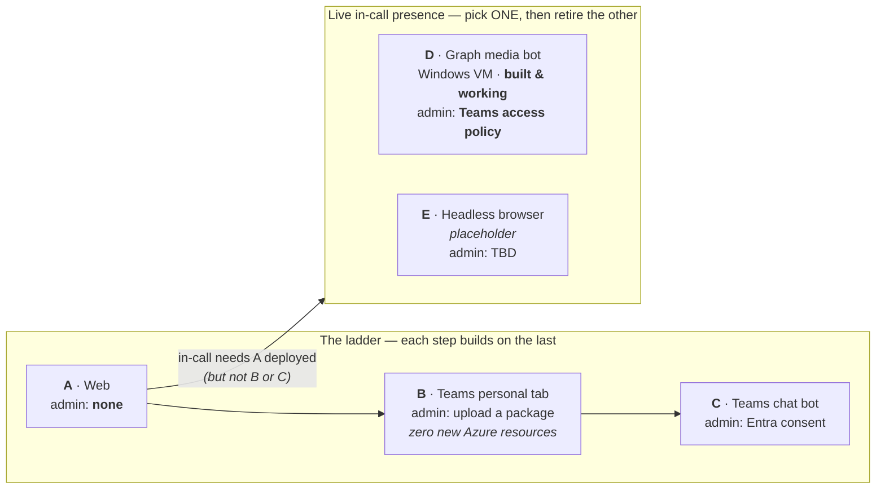

# Channels — how the avatar reaches people

> **Platform: Windows + PowerShell.** Every command in this documentation is
> written for PowerShell on Windows, which is the only combination that is
> routinely tested here. Channel D *requires* Windows regardless — the Teams
> Real-Time Media Platform runs on nothing else. On macOS or Linux the Python
> and `azd` steps work unchanged, but you will need to translate the shell
> syntax yourself (`Invoke-RestMethod` → `curl`, backtick continuations → `\`,
> `$env:VAR` → `$VAR`).

The avatar is **one brain with several front doors**. Everything below shares the
same core: the FastAPI backend, the Azure Voice Live session, the Foundry agent,
and its grounding (AI Search over meeting minutes + Bing Custom Search for news).
No channel re-implements answering.

What differs between channels is only **how audio and video get in and out**, and
that is what drives cost and — far more importantly — **how much administrator
access you need**.

> **Read the admin burden column first.** It is the single best predictor of
> whether a deployment succeeds. See [`../admin-checklist.md`](../admin-checklist.md)
> for the exact manual steps, who must perform each one, and what to do when you
> cannot get them.

---

## The channels

| | Channel | Status | Extra Azure infra | Admin burden | Doc |
| --- | --- | --- | --- | --- | --- |
| **A** | **Web** (standalone) | Shipped | — *(this is the core)* | **None** beyond an Azure subscription | [a-web.md](a-web.md) |
| **B** | **Teams personal tab** | Shipped | **None** | Upload/sideload a Teams app package | [b-teams-tab.md](b-teams-tab.md) |
| **C** | **Teams conversational bot** | Shipped *(optional)* | Azure Bot + Teams channel | Entra app + **admin consent** | [c-teams-chat-bot.md](c-teams-chat-bot.md) |
| **D** | **In-call avatar** — Graph media bot | **Working** | Azure Bot (calling) + **Windows VM** + DNS + TLS | **Highest**: Graph app permissions, admin consent, **Teams app access policy** | [d-in-call-media-bot.md](d-in-call-media-bot.md) |
| **E** | **In-call avatar** — headless browser | Placeholder | Container/job | TBD (expected lower than D) | [e-in-call-headless.md](e-in-call-headless.md) |

### Two things this table is deliberately saying

**A → B → C is a ladder, not a menu.** Each step is additive on the one before.
B is the best-value step in the whole product: it adds a Teams surface for **zero
extra Azure resources** — the manifest simply points a `staticTab` at the ACA URL
the web app already serves.

**D and E are rivals, not siblings.** They are two implementations of the *same*
capability (the avatar present in a live meeting). You are expected to run the
comparison in [e-in-call-headless.md](e-in-call-headless.md#comparison) and keep
one. They are numbered separately only so each can be documented and deployed
independently while the comparison is open.



Note what the arrow into the rivals box starts from: **A**, not C. In-call presence
needs the backend, not the chat bot — you can deploy D without ever installing C.

---

## Pick your path

| If you want to… | Deploy | Why |
| --- | --- | --- |
| Demo the avatar to anyone with a browser | **A** | No Teams, no admin, no manifest |
| Put it in front of Teams users with least friction | **A + B** | Zero extra infra; sideload if you lack admin rights |
| Let people `@mention` it in a Teams chat | **A + B + C** | Needs an Entra app + one-time admin consent |
| Have it **join a meeting, hear the room, and answer aloud** | **A + D** | The only path with true in-call presence |
| Evaluate a cheaper in-call option | **A + E** | Then run the comparison and drop the loser |

**Cannot get Teams admin?** Stop at **A + B** (sideloading a personal tab is
usually permitted when uploading custom apps is enabled). **D is blocked without
a Teams administrator** — it requires a Teams app access policy that only they
can create. Confirm that before investing in the VM.

---

## What actually deploys

Start by choosing a profile — it sets the flags for you and prints the full
numbered plan:

```powershell
uv run python scripts/set_profile.py       # interactive
uv run python scripts/set_profile.py --profile in-call
```

The profile lives in the azd environment, **not** in an `azd up` prompt. `azd up`
must stay non-interactive so re-deploys and CI keep working; the picker is
convenience over the flags, never a substitute for them.

Everything is **additive and conditional**: a deploy that does not opt in behaves
exactly as it did before the feature existed. The profile only ever *raises*
capability, so environments created before profiles existed are unaffected.

| Flag | Set by profile | Effect |
| --- | --- | --- |
| `DEPLOY_PROFILE` | — | `web` · `teams-tab` · `teams-chat` · `in-call`. Drives everything below. |
| *(none)* | `web`, `teams-tab` | Channel **A**. Container app, Foundry agent, AI Search, ACR, identity, roles. |
| `BOT_APP_ID` | you supply | Provisions `modules/botService.bicep` (Azure Bot + Teams channel) for **C**. |
| `MEETING_BOT_ENABLED` | `in-call` | Serves the media-bot bridge (`/ws/acs/audio`) for **D**. |
| `DEPLOY_MEETING_BOT_HOST` | `in-call` | Provisions the Windows media host + calling bot registration. |
| `MEETING_BOT_APP_ID` / `_DNS_LABEL` / `_ADMIN_PASSWORD` | you supply | Required for **D**; the host is skipped if any is missing. |
| `ENABLE_ACS` | — | Provisions `modules/communicationServices.bicep`. Independent of the above. |
| `DEPLOY_BING_GROUNDING` | `true` | Provisions `modules/bingGrounding.bicep` (Bing account + site allow-list) and the Foundry connection to it, enabling the agent's web/news tool. On by default; set `false` to skip. Independent of the above; applies to every channel. |

> **C and D each need an Azure Bot registration, and they cannot share one.** An
> Entra app can back only *one* Azure Bot resource, so the chat bot (`BOT_APP_ID`)
> and the calling bot (`MEETING_BOT_APP_ID`) must be different app registrations.
> Reusing one fails with `MsaAppId is already in use`. Preflight catches this.

Full variable reference: [`../configuration.md`](../configuration.md).
Deployment mechanics: [`../deployment.md`](../deployment.md).

---

## Where each channel lives in the repo

There is **no one-folder-per-channel rule**, and trying to read the tree that way
will mislead you. Two things break the pattern:

- **`teams/` is shared by B, C and D.** It holds one manifest template and one
  builder; flags decide which channel's package comes out. It is *Teams packaging*,
  not "the tab channel".
- **C has no folder of its own.** Its runtime is a module inside the existing
  backend, which is exactly why it needs no new host.

| Channel | Runtime code | Teams package | Infra module |
| --- | --- | --- | --- |
| **A** web | `backend/`, `frontend/` | — | base `infra/` |
| **B** tab | `frontend/teams.js` (same app) | `teams/` → `staticTabs` | *(none — reuses A)* |
| **C** chat bot | `backend/bot/` — in-process at `POST /api/messages` | `teams/` → `bots` entry | `modules/botService.bicep` |
| **D** in-call | `meeting-bot/` (.NET, own Windows host) + `backend/acs/` (bridge) + `frontend/acs-join.js`, `companion.js` | `teams/` → `supportsCalling`, `configurableTabs` *(optional)* | `modules/meetingBotHost.bicep` |
| **E** headless | *(not built)* | — | — |

One manifest, three progressive shapes — the build flags are the difference:

| `teams/build_package.py` flags | Manifest keys kept | Channel |
| --- | --- | --- |
| `--hostname X` | `staticTabs` only | **B** |
| `+ --bot-id <guid>` | `bots`, `supportsCalling=false` | **C** |
| `+ --enable-calling` | `bots`, `supportsCalling=true` | **D** invocable in a call |
| `+ --enable-companion` | `configurableTabs` | **D** meeting control panel |

Omitted keys are *dropped from the package*, so a channel you did not opt into
cannot appear in Teams. Details: [`../../teams/README.md`](../../teams/README.md).

---

## Every channel page has the same six sections

So you can compare them without re-reading prose:

1. **How it works** — an architecture diagram of *that channel's edge*, and why it
   is shaped that way
2. **What you get** — the user-visible capability
3. **What deploys** — resources and flags
4. **Manual / admin steps** — what automation *cannot* do, and who must do it
5. **How to verify** — the exact commands that prove it works
6. **Cost & teardown** — what it costs to leave running, and how to stop paying

*(Channel E is a placeholder and does not follow the contract yet — it has a
proposed architecture and pre-registered comparison criteria instead.)*

### Where architecture lives, and why it is split three ways

A reasonable question is whether each channel should carry its own full design and
architecture. It should not — because **all five channels share one core**, and five
copies of the same Voice Live/Foundry pipeline would drift apart within a month. So
the split is by *what changes*:

| Tier | Answers | Lives in | Scope |
| --- | --- | --- | --- |
| **Core architecture** | How does answering work? | [`../architecture.md`](../architecture.md) | Written **once**. Shared by every channel. |
| **Channel edge** | How does traffic get in and out *for this channel*? | §1 of each channel page | The **delta only** — the core is a single node in the diagram. |
| **Design record** | *Why* is it this shape, and what was rejected? | `*-design-*.md` | Only where a real decision was made. |

That last row is deliberate: **A, B and C have no design records and should not get
one.** Nothing was decided — B is the web app in an iframe, C is the Bot Framework
doing what the Bot Framework does. Writing "design documents" for them would be
ceremony, and ceremony is what makes people stop reading documentation. D has two
records because D had two genuinely hard decisions (the .NET/Windows split, and
audio/video from one synthesis). E will earn one when it is built.

---

## Design records (the "why")

These are decision documents, kept separate from the operational pages above
because they answer a different question — why the architecture is what it is,
including options that were rejected and what they would have cost.

- [d-design-media-bot.md](d-design-media-bot.md) — why a .NET/Windows media bot
  bridged to a Python brain, and the three options evaluated
- [d-design-avatar-video.md](d-design-avatar-video.md) — why the avatar's audio
  and video must come from one synthesis, and how the video reaches the meeting
