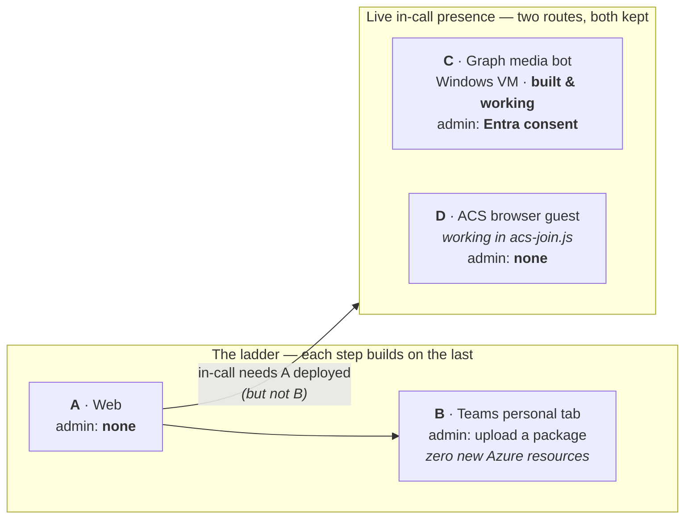

# Channels — how the avatar reaches people

> **Platform: Windows + PowerShell.** Every command in this documentation is
> written for PowerShell on Windows, which is the only combination that is
> routinely tested here. Channel C *requires* Windows regardless — the Teams
> Real-Time Media Platform runs on nothing else. On macOS or Linux the Python
> and `azd` steps work unchanged, but you will need to translate the shell
> syntax yourself (`Invoke-RestMethod` → `curl`, backtick continuations → `\`,
> `$env:VAR` → `$VAR`).

The avatar is **one brain with several front doors**. Everything below shares the
same core: the FastAPI backend, the Azure Voice Live session, the Foundry agent,
and its grounding (AI Search over meeting minutes + Bing Custom Search for news).
No channel re-implements answering.

What differs between channels is only **how audio and video get in and out**, and
that is what drives cost and — far more importantly — **how much administrator
access you need**.

> **Read the admin burden column first.** It is the single best predictor of
> whether a deployment succeeds. See [`../admin-checklist.md`](../admin-checklist.md)
> for the exact manual steps, who must perform each one, and what to do when you
> cannot get them.

---

## The channels

| | Channel | Status | Extra Azure infra | Admin burden | Doc |
| --- | --- | --- | --- | --- | --- |
| **A** | **Web** (standalone) | Shipped | — *(this is the core)* | **None** beyond an Azure subscription | [a-web.md](a-web.md) |
| **B** | **Teams personal tab** | Shipped | **None** | Upload/sideload a Teams app package | [b-teams-tab.md](b-teams-tab.md) |
| **C** | **In-call avatar** — Graph media bot | **Working** | Azure Bot (calling) + **Windows VM** + DNS + TLS | **Entra admin consent** for `Calls.*.All` *(a Teams access policy is needed only for short `/meet/` links)* | [c-in-call-media-bot.md](c-in-call-media-bot.md) |
| **D** | **In-call avatar** — ACS browser guest | **Media leg working**; headless host not built | ACS resource *(`ENABLE_ACS`)*; container/job only if made headless | **None** — anonymous guest join, verified live | [d-in-call-headless.md](d-in-call-headless.md) |

### Two things this table is deliberately saying

**A → B is a ladder, not a menu.** Each step is additive on the one before.
B is the best-value step in the whole product: it adds a Teams surface for **zero
extra Azure resources** — the manifest simply points a `staticTab` at the ACA URL
the web app already serves.

**C and D are alternatives, and both are supported.** They are two implementations
of the *same* capability — the avatar present in a live meeting — and you pick the
one that fits your tenant. Neither supersedes the other:

| | **C** — Graph media bot | **D** — headless browser |
| --- | --- | --- |
| **Pro** | Supported first-party API; joins **any** meeting from a link once consented; proven live | **No administrator at all**; scales to zero; no Windows, no VM |
| **Con** | Needs an Entra admin; ~$283/month always-on VM; the media SDK pin [expires every three months](c-in-call-media-bot.md) | Rides an SDK implementation detail that can break silently; needs the tenant to allow anonymous guest join; a full browser per meeting |
| **Reach for it when** | you have admin, and want the robust supported path | you cannot get admin — this is then the *only* option |



Note what the arrow into the rivals box starts from: **A**, not B. In-call presence
needs the backend, not the Teams tab — you can deploy C without ever installing B.

---

## Pick your path

| If you want to… | Deploy | Why |
| --- | --- | --- |
| Demo the avatar to anyone with a browser | **A** | No Teams, no admin, no manifest |
| Put it in front of Teams users with least friction | **A + B** | Zero extra infra; sideload if you lack admin rights |
| Have it **join a meeting, hear the room, and answer aloud** — *with* an admin | **A + C** | Supported first-party path; joins any meeting from a link |
| The same, but you **cannot get an administrator** | **A + D** | The only in-call route that needs no consent at all |

**Cannot get an Entra admin?** **C is blocked** — `Calls.JoinGroupCall.All` and
`Calls.AccessMedia.All` are application permissions, and only an administrator can
consent to them. There is no user-consent path and no way to join arbitrary meetings
without them, so **D is your in-call option**; otherwise stop at **A + B**.

**Cannot get a *Teams* admin?** That alone does not block C — use a classic
`/l/meetup-join/` link, which needs no access policy. See
[admin-checklist.md](../admin-checklist.md).

---

## What actually deploys

Start by choosing a profile — it sets the flags for you and prints the full
numbered plan:

```powershell
uv run python scripts/set_profile.py       # interactive
uv run python scripts/set_profile.py --profile in-call           # channel C
uv run python scripts/set_profile.py --profile in-call-browser   # channel D
```

The profile lives in the azd environment, **not** in an `azd up` prompt. `azd up`
must stay non-interactive so re-deploys and CI keep working; the picker is
convenience over the flags, never a substitute for them.

Everything is **additive and conditional**: a deploy that does not opt in behaves
exactly as it did before the feature existed. The profile only ever *raises*
capability, so environments created before profiles existed are unaffected.

| Flag | Set by profile | Effect |
| --- | --- | --- |
| `DEPLOY_PROFILE` | — | `web` · `teams-tab` · `in-call` · `in-call-browser`. Drives everything below, and resets the flags of whichever profile you did *not* pick. |
| *(none)* | `web`, `teams-tab` | Channel **A**. Container app, Foundry agent, AI Search, ACR, identity, roles. |
| `MEETING_BOT_ENABLED` | `in-call` | Serves the media-bot bridge (`/ws/acs/audio`) for **C**. |
| `DEPLOY_MEETING_BOT_HOST` | `in-call` | Provisions the Windows media host + calling bot registration. |
| `MEETING_BOT_APP_ID` / `_DNS_LABEL` / `_ADMIN_PASSWORD` | you supply | Required for **C**; the host is skipped if any is missing. |
| `ENABLE_ACS` | `in-call-browser` | Provisions `modules/communicationServices.bicep`. **Required by channel D**, the browser joiner at `/acs-join.html`, where a browser tab joins a meeting as an anonymous guest. Channels A–C do not need it: channel C joins via Graph calling, and the `acs` in `/ws/acs/audio` is the bridge protocol's name, not an ACS dependency. |
| `ACS_AVATAR_VIDEO_ENABLED`, `BROWSER_JOIN_VIDEO_ENABLED` | `in-call-browser` | Give **D** a face. Without them the joiner still hears and answers, but publishes no video tile. |
| `DEPLOY_BING_GROUNDING` | `true` | Provisions `modules/bingGrounding.bicep` (Bing account + site allow-list) and the Foundry connection to it, enabling the agent's web tool. On by default; set `false` to skip. Applies to every channel, but **only in agent mode** — see below. |

> **Provisioning follows `VOICE_BINDING`.** Grounding with Bing is a *managed
> Foundry tool*, and model mode has no agent for it to attach to, so under
> `VOICE_BINDING=model` bicep skips the Bing account, the Foundry agent and the
> agent's chat-model deployment — regardless of `DEPLOY_BING_GROUNDING`. Model
> mode's web tool is Web IQ, called in-process. Both bindings still need AI
> Search and the embedding deployment, which are never gated.

> **Channel C needs its own Azure Bot registration.** An Entra app can back only
> *one* Azure Bot resource, so `MEETING_BOT_APP_ID` must be an app registration
> dedicated to the calling bot. Pointing it at an app that already backs another
> bot fails with `MsaAppId is already in use`.

Full variable reference: [`../configuration.md`](../configuration.md).
Deployment mechanics: [`../deployment.md`](../deployment.md).

---

## Where each channel lives in the repo

There is **no one-folder-per-channel rule**, and trying to read the tree that way
will mislead you. Two things break the pattern:

- **`teams/` is shared by B and C.** It holds one manifest template and one
  builder; flags decide which channel's package comes out. It is *Teams packaging*,
  not "the tab channel".
- **C's Teams surface and its runtime live apart.** The manifest flags are built
  here; the media bot itself is a separate .NET service on its own Windows host.

| Channel | Runtime code | Teams package | Infra module |
| --- | --- | --- | --- |
| **A** web | `backend/`, `frontend/` | — | base `infra/` |
| **B** tab | `frontend/teams.js` (same app) | `teams/` → `staticTabs` | *(none — reuses A)* |
| **C** in-call | `meeting-bot/` (.NET, own Windows host) + `backend/acs/bridge.py` (`/ws/acs/audio`) | `teams/` → `supportsCalling`, `configurableTabs` *(optional)* | `modules/meetingBotHost.bicep` |
| **D** in-call | `frontend/acs-join.{html,js}` + `backend/acs/` (`/ws/acs/browser`, `client.py`, `routes.py`) | — *(no Teams package — it joins as a guest)* | `modules/communicationServices.bicep`, `modules/acsRoleForApp.bicep` |

One manifest, three progressive shapes — the build flags are the difference:

| `teams/build_package.py` flags | Manifest keys kept | Channel |
| --- | --- | --- |
| `--hostname X` | `staticTabs` only | **B** |
| `+ --enable-calling` | `bots`, `supportsCalling=true` | **C** invocable in a call |
| `+ --enable-companion` | `configurableTabs` | **C** meeting control panel |

Omitted keys are *dropped from the package*, so a channel you did not opt into
cannot appear in Teams. Details: [`../../teams/README.md`](../../teams/README.md).

---

## Every channel page has the same six sections

So you can compare them without re-reading prose:

1. **How it works** — an architecture diagram of *that channel's edge*, and why it
   is shaped that way
2. **What you get** — the user-visible capability
3. **What deploys** — resources and flags
4. **Manual / admin steps** — what automation *cannot* do, and who must do it
5. **How to verify** — the exact commands that prove it works
6. **Cost & teardown** — what it costs to leave running, and how to stop paying

*(Channel D is split in two: its **media leg is built and live-verified**, and is
documented in depth rather than to the contract above — the mechanism is the
interesting part. The **headless host** that would run it without an operator's
browser is still unbuilt, and carries a proposed architecture plus pre-registered
comparison criteria.)*

### Where architecture lives, and why it is split three ways

A reasonable question is whether each channel should carry its own full design and
architecture. It should not — because **all four channels share one core**, and four
copies of the same Voice Live/Foundry pipeline would drift apart within a month. So
the split is by *what changes*:

| Tier | Answers | Lives in | Scope |
| --- | --- | --- | --- |
| **Core architecture** | How does answering work? | [`../architecture.md`](../architecture.md) | Written **once**. Shared by every channel. |
| **Channel edge** | How does traffic get in and out *for this channel*? | §1 of each channel page | The **delta only** — the core is a single node in the diagram. |
| **Design record** | *Why* is it this shape, and what was rejected? | `*-design-*.md` | Only where a real decision was made. |

That last row is deliberate: **A and B have no design records and should not get
one.** Nothing was decided — B is the web app in an iframe. Writing "design
documents" for them would be
ceremony, and ceremony is what makes people stop reading documentation. C has two
records because C had two genuinely hard decisions (the .NET/Windows split, and
audio/video from one synthesis). D will earn one when it is built.

---

## Design records (the "why")

These are decision documents, kept separate from the operational pages above
because they answer a different question — why the architecture is what it is,
including options that were rejected and what they would have cost.

- [c-design-media-bot.md](c-design-media-bot.md) — why a .NET/Windows media bot
  bridged to a Python brain, and the three options evaluated
- [c-design-avatar-video.md](c-design-avatar-video.md) — why the avatar's audio
  and video must come from one synthesis, and how the video reaches the meeting
