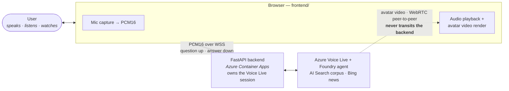

# Channel A — Web (standalone)

The core product, and the foundation every other channel builds on. A voice-first
avatar in a browser, with an optional text composer.

**Deploy this first.** Every other channel assumes it is already working, and it
is the only channel that needs no administrator involvement at all.

---

## 1. How it works

The browser does **only** audio I/O and video rendering. Every Voice Live SDK call
runs server-side. The one thing worth noticing: the avatar's **video never transits
the backend** — it is a direct WebRTC peer connection to Azure, negotiated through
the server.



No Teams, no bot, no meeting: the whole channel is the browser, the container app,
and the two Azure services behind it. Internals: [`../architecture.md`](../architecture.md).

## 2. What you get

A browser page where the user speaks, the avatar listens, and it answers aloud
with a lip-synced face — grounded in meeting minutes (AI Search) and curated news
(Bing Custom Search) through the Foundry agent.

## 3. What deploys

The default `azd up`, with **no flags set**:

| Resource | Purpose |
| --- | --- |
| Container App + Environment | Serves the FastAPI backend and the SPA |
| Container Registry | Image storage |
| Foundry account + project + agent | Answering, tool routing, grounding |
| Azure AI Search | The meeting-minutes corpus |
| Managed identity + role assignments | Keyless access to Foundry and Search |
| Log Analytics + Application Insights | Diagnostics |

Nothing Teams-related is provisioned. `botService.bicep` and
`communicationServices.bicep` are both skipped.

The web/news tool is deployed by default: `bingGrounding.bicep` adds
a Bing account + curated site allow-list, and a Foundry connection
to it — see section 4.

```powershell
azd up
```

Configuration reference: [`../configuration.md`](../configuration.md).
Deployment mechanics: [`../deployment.md`](../deployment.md).

## 4. Manual / admin steps

| Step | Who |
| --- | --- |
| Azure subscription + Contributor on the resource group | You |
| Model quota in the target region | You / subscription owner |
| Populate the AI Search index with minutes | You |
| Edit the Bing site allow-list to your own sources — `bingAllowedDomains` in [`../../infra/main.bicep`](../../infra/main.bicep) | You, unless you set `DEPLOY_BING_GROUNDING=false` |

The web/news tool is **on by default**; `azd up` deploys the Bing account, the allow-list
and the Foundry connection with no portal step and no `.env` edit. Edit `bingAllowedDomains`
so it searches your sources. To skip it (it is billable), set `DEPLOY_BING_GROUNDING=false`;
the avatar then answers from your indexed documents alone.

**No Entra admin. No Teams admin.** See
[`../admin-checklist.md`](../admin-checklist.md).

## 5. How to verify

```powershell
# the app is up
Invoke-RestMethod https://<your-app>.azurecontainerapps.io/health
# -> status healthy, service avatar-forge

# the SPA's boot settings: voice, avatar and the conversation defaults
Invoke-RestMethod https://<your-app>.azurecontainerapps.io/api/config
```

Neither endpoint tells you whether the **agent** is wired up — that is settled by the
`--- Data plane ---` summary printed at the end of `azd up`, and proved for real by
asking a grounded question.

Then open the endpoint in a browser, allow the microphone, and ask a question
that requires grounding (for example, about a recent board meeting). You should
hear a spoken answer with a moving face.

If the avatar appears but never answers, check
[`../auth.md`](../auth.md) — the agent path requires Entra ID, not an API key.

## 6. Cost & teardown

The container app scales to a low floor but the Foundry and Search resources bill
continuously. To stop paying entirely:

```powershell
azd down --purge
```

> [!IMPORTANT]
> Use `--purge`, not a bare `azd down`. The Foundry (Cognitive Services) account is
> **soft-deleted** for 48 hours and its name stays reserved, so a later `azd up` reusing
> that environment name fails or silently restores the old account.
>
> Teardown also empties the azd environment's stored values, so re-set whatever you had
> configured (`DEPLOY_PROFILE`, any `BOT_*`, `DEPLOY_BING_GROUNDING`, ...) before the
> next `azd up` — `uv run python scripts/preflight.py` lists what is missing.
