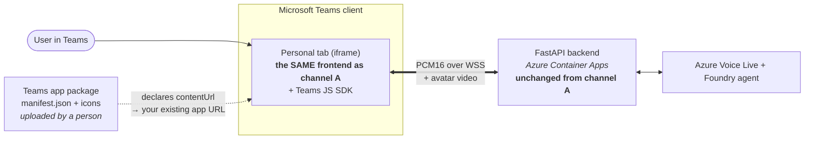

# Channel B — Teams personal tab

The same web avatar, embedded as a personal tab inside Microsoft Teams.

**This is the best-value step in the product.** It adds a Teams surface for
**zero extra Azure resources** — the manifest simply points a `staticTab` at the
container app URL channel A already serves.

Requires: [channel A](a-web.md) deployed.

> **Already running channel A? You do not need to redeploy.** The `web` and
> `teams-tab` profiles provision **identical** infrastructure — `DEPLOY_PROFILE`
> reaches exactly one decision in `infra/main.bicep`, and that decision only gates
> channel C's meeting-bot resources. Adding B is therefore two local commands
> (build the package, upload it); `azd up` is not one of them. Setting the profile
> is optional and only changes which steps `scripts/preflight.py --remaining`
> prints:
>
> ```powershell
> uv run python scripts/set_profile.py --profile teams-tab   # optional
> uv run python teams/build_package.py
> ```
>
> Picking `teams-tab` at the *first* `azd up` deploys the same resources and simply
> shows you the packaging steps up front. Neither order costs anything extra.

---

## 1. How it works

Teams renders **the same page as channel A** in an iframe. That is the entire channel:
the app package is just a manifest telling Teams which URL to frame.



The Teams JS SDK is loaded **only** when running inside Teams, so channel A is
unaffected. Nothing new is provisioned in Azure — the only new artefact is the
`.zip` someone uploads.

## 2. What you get

The avatar available inside Teams, using the Teams client's own microphone and
speaker. Same voice, same grounding, same agent — no second deployment.

## 3. What deploys

**No Azure resources.** Only a Teams app package:

```powershell
uv run python teams/build_package.py
```

The host and the branding both come from your selected `azd` environment
(`SERVICE_APP_URI` and the avatar model variables), so the package is tied to the
deployment it points at. Building outside an `azd` context — or targeting a
different host — needs it stated explicitly:

```powershell
uv run python teams/build_package.py --hostname <your-app>.azurecontainerapps.io
```

An explicit value must be a **bare host**: no scheme, path or port. Teams'
`validDomains` rejects anything else, so passing the full `SERVICE_APP_URI` is an
error rather than a silent mis-build.
This fills the placeholders in `teams/manifest.template.json` (schema v1.17) with
your deployed URL and IDs, and produces an installable `.zip`.

The name shown in Teams comes from `--name`, falling back to `TEAMS_APP_NAME`,
then to the app's resolved persona name (`AVATAR_DISPLAY_NAME`, or the active
avatar model's friendly name when that is unset) — so a package built against a
deployed environment is named for whatever the avatar calls itself, without
setting a second variable. The full name and description are derived from it.
See [`../configuration.md`](../configuration.md).

## 4. Manual / admin steps

| Step | Who | If blocked |
| --- | --- | --- |
| Build the package | You | — |
| **Custom app upload enabled** in the tenant | Teams admin *(often already on)* | Low-sensitivity setting; usually granted |
| Sideload the package to yourself | You | If sideloading is off, a Teams admin must publish it org-wide |

**Usually achievable without an administrator**, which is why this is the
recommended stopping point when admin access is limited. Full detail:
[`../admin-checklist.md`](../admin-checklist.md).

## 5. How to verify

1. In Teams → **Apps → Manage your apps → Upload an app → Upload a custom app** →
   select the zip
2. Open the app; the avatar stage should load
3. Ask a grounded question and confirm you hear the answer

The on-stage text composer is **always hidden inside Teams** by design (the tab
is voice-first). That is expected behaviour, not a fault — see `ENABLE_TEXT_INPUT`
in [`../configuration.md`](../configuration.md).

## 6. Cost & teardown

**No incremental cost** — it reuses channel A's deployment entirely.

To remove: uninstall the app in Teams. Nothing in Azure changes.
