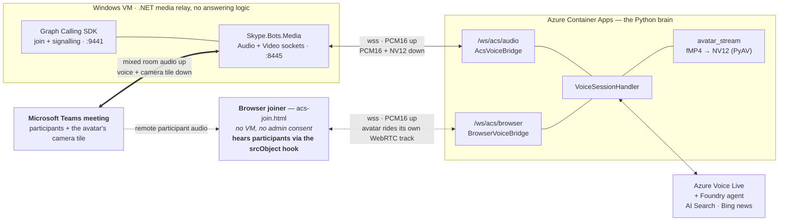

# Channel C — In-call avatar (Graph media bot)

The avatar **joins a Teams meeting as a participant**, hears the whole room, and
answers aloud with a lip-synced camera tile.

This is the only channel with true in-call presence, and the only one with hard
administrator dependencies. **Read [`../admin-checklist.md`](../admin-checklist.md)
before provisioning anything** — the VM is the expensive part and it is useless
without a Teams app access policy that only a Teams administrator can create.

Requires: [channel A](a-web.md) deployed.

**Why this shape:** [c-design-media-bot.md](c-design-media-bot.md) (the three
options evaluated, and why a .NET/Windows media relay is bridged to the Python
brain rather than rewriting either) and
[c-design-avatar-video.md](c-design-avatar-video.md) (why the face and the voice
must come from one synthesis).

---

## 1. How it works

Teams ⇄ **.NET media relay on a Windows VM** ⇄ WebSocket ⇄ **Python brain on ACA**
⇄ Voice Live + Foundry agent. The .NET side contains **no answering logic** — it is
a media pump.

Why the split: `Microsoft.Graph.Communications.Calls.Media` carries a native Windows
media stack, so it **must** run on a Windows Server guest OS. The brain stays in
Python where the rest of the product lives, and the seam between them is plain
PCM/NV12 over a WebSocket.



The two paths differ **only at the edge** — both end at the same
`VoiceSessionHandler`, so turn-taking, barge-in and grounding behave identically.
The design records explain the decisions:
[c-design-media-bot.md](c-design-media-bot.md) and
[c-design-avatar-video.md](c-design-avatar-video.md).

## 2. What you get

Two join paths, sharing one brain:

| Path | Hears | Use it for |
| --- | --- | --- |
| **Browser joiner** (`acs-join.html`) | Remote participants, via the `srcObject` hook — [verified live](d-in-call-headless.md) | No VM, no administrator |
| **Media bot** (Windows VM) | **The whole room**, through a first-party API | The supported path |

Both hear the meeting. They differ in *standing*: the media bot uses a documented
Microsoft media API, while the browser joiner relies on the ACS Web SDK attaching remote
streams to a media element in order to play them — real, measured, but an implementation
detail rather than a contract. Pick by which risk you prefer: an administrator
dependency plus a VM, or a technique that could break on an SDK upgrade.

## 3. What deploys

**One deployment.** The container side and the Windows host both come from `azd up`
when the `in-call` profile is selected:

```powershell
uv run python scripts/set_profile.py --profile in-call

# inputs Bicep cannot invent — its own Entra app, a unique DNS label, a VM password
azd env set MEETING_BOT_APP_ID <calling-bot-app-id>
azd env set MEETING_BOT_APP_TENANT_ID <tenant-id>
azd env set MEETING_BOT_DNS_LABEL <globally-unique-label>
azd env set MEETING_BOT_ADMIN_PASSWORD "<strong-password>"

uv run python scripts/preflight.py    # verifies all of the above before you spend money
azd up

# then, ON THE WINDOWS VM (RDP in), install/refresh the bot service
.\meeting-bot\scripts\setup-host.ps1 -Stage Prep
.\meeting-bot\scripts\setup-host.ps1 -Stage Cert -Fqdn <vm-fqdn> -CertEmail you@example.com
.\meeting-bot\scripts\setup-host.ps1 -Stage Build
.\meeting-bot\scripts\setup-host.ps1 -Stage Run -Fqdn <vm-fqdn> -Thumbprint <cert-tp> `
    -BridgeUrl wss://<your-container-app>/ws/acs/audio `
    -BotAppId <MEETING_BOT_APP_ID> -BotTenantId <MEETING_BOT_APP_TENANT_ID> `
    -BotSecret <bot-client-secret>
```

The `setup-host.ps1` stages run **on the VM**, not on your workstation — they install
the .NET runtime, issue the TLS cert and register the Windows service. Details and the
failure modes of each stage are in [`meeting-bot/README.md`](../../meeting-bot/README.md).

| Resource | Notes |
| --- | --- |
| Windows Server VM (`Standard_D4s_v5`) + NIC + NSG + public IP with DNS label | `infra/modules/meetingBotHost.bicep` |
| Azure Bot with **calling** enabled | Webhook points at the VM FQDN |
| NSG opening **9441** (signalling + control API), **8445** (media), **80** (ACME cert issuance), **3389** (RDP) | All four are open to `Internet` |
| `MEETING_BOT_ENABLED=true` on the container app | Serves `/ws/acs/audio` |

> **RDP is open to the whole internet** so you can run the `setup-host.ps1` stages.
> Restrict rule `Allow-RDP` in `meetingBotHost.bicep` to your own address before this
> is anything but a test host.

> **The calling bot needs its OWN Entra app.** An Entra app can back only one Azure
> Bot resource, so `MEETING_BOT_APP_ID` must not be reused from any other Azure Bot
> registration.
> Reusing it fails deployment with `MsaAppId is already in use` — an error that reads
> like a transient Azure problem and is not. Preflight checks for this collision.

The host is skipped unless all of `MEETING_BOT_APP_ID`, `MEETING_BOT_DNS_LABEL` and
`MEETING_BOT_ADMIN_PASSWORD` are set, so a bypassed preflight degrades to "no VM"
rather than a failure partway through provisioning.

Independent of `ENABLE_ACS` — the media bot does not require an ACS resource.

## 4. Manual / admin steps

Summary; the authoritative list with "who must do it" is in
[`../admin-checklist.md`](../admin-checklist.md).

| # | Step | Who |
| --- | --- | --- |
| 1 | Entra app registration + secret | You / Entra admin |
| 2 | Graph app permissions: `Calls.JoinGroupCall.All`, `Calls.JoinGroupCallAsGuest.All`, **`Calls.AccessMedia.All`**, `OnlineMeetings.Read.All` | Entra admin |
| 3 | **Admin consent** | **Entra admin** |
| 4 | Bot calling webhook → VM FQDN | You |
| 5 | **Teams application access policy** (`New-CsApplicationAccessPolicy` + `Grant-…`) | **Teams admin — hard blocker** |
| 6 | Real TLS certificate for the VM FQDN | You |

Steps 3 and 5 are **one-time and permanent** — they survive redeploys and VM
rebuilds. Worth saying when you ask.

The bot needs **no Teams license** in the tenant.

## 5. How to verify

```powershell
# host is up
Invoke-RestMethod -Uri "https://<vm-fqdn>:9441/api/health"     # -> {"status":"ok"}

# join a meeting
$join = '<Teams meeting join URL>'
Invoke-RestMethod -Method Post -Uri "https://<vm-fqdn>:9441/api/join" `
  -ContentType 'application/json' -Body (@{ joinUrl = $join } | ConvertTo-Json)

# live media counters while in the call (underruns, dropped, bufferedMs)
Invoke-RestMethod -Uri "https://<vm-fqdn>:9441/api/stats"

# leave (callId optional — omit to leave everything)
Invoke-RestMethod -Method Post -Uri "https://<vm-fqdn>:9441/api/leave" `
  -ContentType 'application/json' -Body '{}'
```

Expected: the avatar appears as a participant, its camera tile shows the face,
and asking a grounded question produces a spoken answer.

Full test procedure: [`../testing-meetings.md`](../testing-meetings.md).

> **`/api/stats` is the only observability the bot has.** Running as a Windows
> service, its stdout goes nowhere and it writes no log file. Poll `/api/stats`
> during a call rather than hunting for logs.

**Before debugging media problems, read the "traps that cost real debugging time"
section of [`../../meeting-bot/README.md`](../../meeting-bot/README.md).** It
records failures that each cost hours — the assembly/`deps.json` resolution trap,
the port-8445 restart race, and the single assumption (that the Voice Live avatar
stream is *continuous*, so idle means digital silence rather than no data) that
caused four separate defects.

## 6. Cost & teardown

**The VM runs about $283/month** (`Standard_D4s_v5`, 4 vCPU) and is by far the
dominant cost of this channel. It does not scale to zero.

That size is not padding: a 2-vCPU host was tried and had to be resized before the
Real-Time Media Platform would run. Halving it does not halve the bill, it breaks
the channel.

```powershell
# stop paying for compute between test sessions (keeps the disk and the FQDN)
az vm deallocate -n avatar-meetingbot-vm -g <rg>
az vm start -n avatar-meetingbot-vm -g <rg>      # when you next need it
```

Deallocating preserves the DNS label and the Teams access policy, so restarting
costs nothing but time. **Deallocate after every test session** — this is the
single easiest way to waste money on this project. It does not take you to zero:
the `Premium_LRS` OS disk and the static public IP keep billing (~$20/month) until
the resource group goes.

To remove the channel entirely: delete the VM resources and set
`MEETING_BOT_ENABLED=false`, then redeploy. Channels A–C are unaffected.

### Why not AKS?

Microsoft does list **Azure Kubernetes Service** as a supported host alongside
Cloud Services, Service Fabric/VMSS and plain IaaS VMs — an Azure **web app** is
the only named environment that is explicitly disallowed
([hosting requirements](https://learn.microsoft.com/en-us/microsoftteams/platform/bots/calls-and-meetings/requirements-considerations-application-hosted-media-bots),
updated 2026-07-22). Being listed is not the same as being cheaper, and for this
workload **AKS costs more, not less.** The same page attaches conditions that
remove the usual reasons to containerise:

| Requirement | Consequence |
| --- | --- |
| Production must run a **Windows Server** guest OS | A Windows node pool — which in AKS also obliges you to run a Linux system node pool alongside it |
| Each instance needs an **instance-level public IP** and an instance-mapped port | No shared ingress; per-node public addressing, the thing Kubernetes networking normally hides |
| "Real-time media calls stay where they're created" — pinned to the instance that accepted the call | No rescheduling, no draining a node mid-call; an evicted pod drops the call |
| ≥ 2 CPU cores, 4 vCPU minimum for non-Dv2 sizes | The worker is the same size as the VM we already run |

So you would pay for a Windows worker of comparable size, **plus** a Linux system
pool, **plus** the control plane if you want the uptime SLA — and still not scale
to zero, because a media bot must be listening when a call arrives.

**Correction:** an earlier note in this project suggested AKS might come in under
the VM's ~$283/month. That was wrong — it assumed bin-packing and scale-to-zero
that the pinning and per-instance-IP rules above rule out. AKS only starts to pay
off with **many concurrent meetings** across several media nodes, where
bin-packing and rolling upgrades matter. At one bot serving one meeting, a single
deallocatable VM is both cheaper and simpler.
