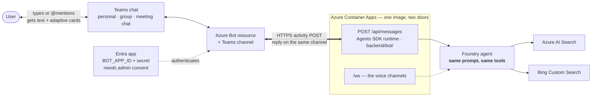

# Channel C — Teams conversational bot

An installable, `@mentionable` bot that answers in Teams chat via the same
Foundry agent, and deep-links into the tab.

**Status: shipped, and optional.** It is deliberately *not* on the critical path.
Deploy it if you want a text surface or a fallback for users who cannot use
in-call media; skip it otherwise.

Requires: [channel A](a-web.md) deployed. Pairs naturally with
[channel B](b-teams-tab.md), since both ship in one Teams app package.

---

## 1. How it works

The first channel that is **not** the web app in a frame. Traffic arrives as text
over the Bot Framework instead of audio over a WebSocket — but it lands on the
**same Foundry agent**, so answers are identical to what the avatar would say.



**No voice and no media** — this channel is text only, and it never joins a call.
That boundary is deliberate: live in-call presence is [channel D](d-in-call-media-bot.md).
The bot is hosted *inside* the existing container app, so there is no second service
to run.

## 2. What you get

Text answers (and adaptive cards) in Teams chat, hosted in-process by the same
FastAPI app at `POST /api/messages` via the Microsoft 365 Agents SDK.

**Explicitly not in scope:** live in-call media. The bot does not join meetings
or hear audio — that boundary is [channel D](d-in-call-media-bot.md)'s job.

## 3. What deploys

| Resource | Gated on |
| --- | --- |
| Azure Bot + Teams channel (`modules/botService.bicep`) | `BOT_APP_ID` being non-empty |

```powershell
azd env set BOT_APP_ID <app-id>
azd env set BOT_APP_PASSWORD <secret>
azd up
```

If `BOT_APP_ID` / `TEAMS_BOT_ID` is unset, the bot infra is skipped entirely and
the deployment behaves exactly as channel A.

> **[Channel D](d-in-call-media-bot.md) needs its own, separate Azure Bot — not this
> one.** A Graph calling bot also needs a bot registration, but an Entra app can back
> only *one* Azure Bot resource, so `MEETING_BOT_APP_ID` must be a **different app
> registration** from this channel's `BOT_APP_ID`. Reusing one fails deployment with
> `MsaAppId is already in use`. Preflight catches the collision before you deploy.

## 4. Manual / admin steps

| Step | Who | If blocked |
| --- | --- | --- |
| Entra app registration + client secret | You, if app registration is permitted | Ask an admin to create it and hand you the IDs |
| **Admin consent** for the bot's permissions | **Entra admin** | Hard blocker — but one-time |
| Add the bot entry to the Teams app package | You | — |

See [`../admin-checklist.md`](../admin-checklist.md).

## 5. How to verify

```powershell
# the messaging endpoint is mounted (405 = mounted, GET not allowed — that is correct)
Invoke-WebRequest -Method Get -Uri https://<your-app>.azurecontainerapps.io/api/messages `
  -SkipHttpErrorCheck | Select-Object StatusCode
```

Then in Teams, `@mention` the bot in a chat and ask a grounded question. You
should get a text answer from the same agent the voice channels use — if the web
app answers but the bot does not, the problem is the bot registration or consent,
not the agent.

## 6. Cost & teardown

The Azure Bot resource itself is inexpensive; the cost is essentially channel A's.

To remove: unset `BOT_APP_ID` and redeploy — the module is skipped and the bot
resource is removed.
