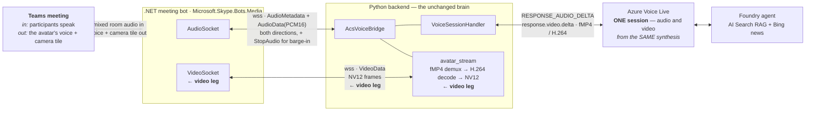

# The avatar's synced video face in a Teams meeting

> **Status: built, shipped and live-verified.** The avatar appears as a lip-synced
> camera tile in real meetings.
> **Decision owner:** the user explicitly required a *synced* face (video and audio
> from the **same** avatar synthesis), and rejected an unsynced shared-stage face as
> misleading. This doc is the canonical design for that synced face.

This document covers **only the face**. The audio leg (the avatar hears the room and
answers aloud) is the **audio leg**, described in [`d-design-media-bot.md`](./d-design-media-bot.md).
The **video leg** rides the **same** .NET meeting-bot host and the **same** Python brain; it adds
a second, additive media leg and nothing else changes.

---

## 1. The decision, in one paragraph

To put Nuru's face in the meeting as a **real participant camera tile** that is
**lip-synced** to her spoken answer, the video frames must come from the **same Voice
Live avatar synthesis** that produces the answer audio. Azure Voice Live already renders
a talking-head/full-body avatar driven by the TTS it speaks — so the audio and video are
born in sync at the source. The job of the video leg is to (a) turn that avatar **on** for the
server-side meeting bridge session, (b) get the avatar's **video** frames into Python,
(c) decode them to raw **NV12**, (d) forward time-aligned NV12 to the .NET bot over the
existing bridge WebSocket, and (e) have the bot push those frames into the call through a
Graph `Microsoft.Skype.Bots.Media` **`VideoSocket`** as Nuru's camera. The audio leg is
unchanged; the two streams stay aligned because neither is re-synthesised — they are two
encodings of one synthesis.

We **rejected** the cheaper shared-stage "Companion" face: that face is driven by a
*separate* browser Voice Live session with no timing relationship to the audio the bot
speaks into the call, so the lips would not match the voice. An unsynced face is worse
than no face.

---

## 2. Why audio and video must share one synthesis (the core constraint)

Lip-sync is a property of a **single** synthesis: Voice Live emits phoneme-aligned audio
and the matching mouth shapes together. If you take the bot's answer **audio** from one
synthesis and the **face** from a different one (e.g. a second browser avatar session
re-speaking the same text), the two are independently timed — network jitter, separate
TTS runs, and separate first-token latencies guarantee drift. There is no practical way
to re-align them after the fact.

Therefore the design forwards **both** the audio (already done for the audio leg) **and** the
video from the **one** server-side Voice Live session the bridge already owns. Inbound
room audio → that session → it produces (i) answer **audio** PCM and (ii)
avatar **video** frames, both from the same `response`. We carry both to the
bot and play them out together.

---

## 3. End-to-end data flow



Both seam arrows are the **same socket**, `wss://…/ws/acs/audio`.

The **only** new arrows are the two marked *video leg*: the avatar video produced by the
same Voice Live session, decoded to NV12 in Python, sent down the existing bridge socket
as `VideoData`, and emitted by the bot's `VideoSocket` as a camera tile.

---

## 4. Getting the avatar video into Python — two source options

This is the single hard unknown of the video leg. There are two ways to obtain the avatar's
video server-side; the design **prefers Option 1** because it removes the WebRTC risk
entirely.

### Option 1 — WebSocket avatar mode (`response.video.delta`)  ✅ chosen, now BUILT

Voice Live supports a **websocket** avatar output mode (`avatarOutputMode = "websocket"`)
in which it streams the rendered avatar to the client as `response.video.delta` events on
the same socket the bridge already holds — **no WebRTC/SDP/ICE handshake involved**. The
repo already handled these for the browser (`event_handlers.py` →
`{"type":"video_data","delta":…}`).

> **⚠️ Corrected by measurement (2026-07-30).** This section previously assumed the deltas
> were *base64 H.264 elementary stream*. They are **not**. Real bytes were captured off the
> live service and inspected; the actual format is:
>
> ```
> container : FRAGMENTED MP4   ftyp(iso5/iso6/mp41) + moov, then (moof + mdat)…
> video     : H.264, 512x512, yuv420p, ~24.57 fps
> audio     : AAC   ← the answer audio is muxed into the SAME stream
> ```
>
> Three consequences, each of which would have broken a naive implementation:
>
> 1. **Not Annex-B.** There are no `00 00 00 01` start codes at the head, so feeding the
>    deltas to a raw H.264 parser (or straight to a `VideoSocket`) fails.
> 2. **Deltas are not fragment-aligned.** 60 captured deltas produced 92 fragments — the
>    first delta happened to be exactly the `ftyp`+`moov` init segment, but after that a
>    delta is an arbitrary slice of the byte stream. A **streaming demuxer** is required;
>    a per-delta parser cannot work.
> 3. **Enabling the avatar removes the separate audio stream.** In this mode Voice Live
>    emits **no** `response.audio.delta` at all (measured: `audio_bytes=0` with the avatar
>    on vs 663,600 bytes with it off). The only copy of the answer audio is the AAC track
>    inside the fMP4. Turning the avatar on without recovering it would have **silenced
>    the bot in the meeting** — regressing the one behaviour that already worked.

So the implemented pipeline is:

1. Configure the bridge's Voice Live session with `avatarEnabled=true`,
   `avatarOutputMode="websocket"` (via `_in_call_config`, reusing `build_avatar_config`).
2. Feed every `response.video.delta` payload into a **streaming fMP4 demuxer**
   (`backend/acs/avatar_stream.py`, PyAV on a queue-backed file object in a worker thread).
3. **Video:** centre-crop to the target aspect, scale, convert to **NV12**, and decimate by
   presentation time to the bot's playout rate. The crop matters — the avatar renders
   square (512x512) but the media platform only accepts its enumerated 16:9 `NV12_*`
   formats, so a plain rescale would visibly squash the face. The decimation matters
   because the source runs faster (~24.6 fps) than the bot plays (15 fps); without it the
   bot's frame queue grows without bound and the face drifts behind the voice.
4. **Audio:** decode the AAC track and resample to PCM16, then push it through the
   *existing* outbound audio path so the anti-aliasing low-pass, wake-phrase suppression
   and barge-in behaviour all continue to apply unchanged.
5. Forward each NV12 frame as a `VideoData` bridge frame (base64 + width/height).

**Why the decode lives in Python, not C#:** PyAV ships manylinux wheels so it runs on the
existing Linux Container App; it keeps the Windows media bot a dumb pump, which is its
whole design intent; and it puts the codec work next to the Voice Live session that
produces it. The .NET side needed **no change** — its `VideoData` contract already matched.

**Verification:** the captured stream was replayed through the real bridge with
deliberately fragment-misaligned chunks. Every emitted `VideoData` was NV12 640x360
(345,600 bytes exactly), 92 source frames decimated to 47, and 3.93 s of PCM16 audio was
recovered — i.e. the meeting would still hear her.

### Option 2 — WebRTC capture with aiortc  ⚠ fallback only

The browser path uses `avatarOutputMode="webrtc"` and renders the avatar via a WebRTC
peer connection (ICE servers + SDP relayed through `handler.send_avatar_sdp_offer`). In
principle a server-side **aiortc** peer could perform the same SDP/ICE handshake and pull
the decoded video track frames directly (aiortc hands you `av.VideoFrame`s already
decoded). **Risk:** doing the WebRTC handshake without a browser, against Voice Live's
avatar relay (TURN/ICE negotiation, codec params), is unproven here and historically
finicky. Use Option 2 only if Option 1's websocket video turns out to be unavailable or
lower-quality for our avatar/region.

**Recommendation:** build Option 1 first; keep Option 2 documented as the contingency.
Either way the bridge → bot contract (`VideoData` NV12) is identical, so the .NET side
and the wire protocol don't change between options.

---

## 5. Component changes

### 5.1 .NET meeting bot (`meeting-bot/`)

All additive and gated on `Bot:EnableVideo` (default **false** = byte-for-byte the
audio-only session). Verified to compile against the real SDK on Windows.

- **`Configuration/BotOptions.cs`** — new `EnableVideo`, `VideoWidth`, `VideoHeight`,
  `VideoFps` (defaults 640×360@15). Off by default.
- **`Bot/MeetingBot.cs` (`MeetingBotService`)** — `CreateLocalMediaSession` adds an
  outbound-only NV12 `VideoSocket` (`StreamDirection.Sendonly`,
  `SupportedSendVideoFormats` = the configured format + a 720p fallback) **only** when
  `EnableVideo`. New `VideoFormatFor(w,h,fps)` maps config to a supported
  `VideoFormat.NV12_*` static.
- **`Bot/CallHandler.cs`** — `WireVideoSocket()` subscribes to `VideoSendStatusChanged`
  (only send while `MediaSendStatus.Active`, adopt the platform's
  `PreferredVideoSourceFormat`), drains a video queue in `VideoPlayoutLoopAsync` at the
  configured fps, and sends `VideoSendBuffer` (a thin NV12 `VideoMediaBuffer`, mirroring
  the existing `AudioSendBuffer`). Real avatar frames (from the bridge) play when present;
  a cached **placeholder** NV12 frame keeps the tile alive otherwise. Barge-in flushes the
  video queue alongside the audio.
- **`Bridge/VoiceLiveBridgeClient.cs`** — protocol extended with an inbound
  `VideoData{Data,Width,Height}` frame and a `VideoReceived` event carrying a transport
  `VideoFrame(byte`] Nv12,int Width,int Height)` record. No media-SDK dependency, so the
  contract stays unit-testable on any OS.

> The placeholder lets us **prove the camera-tile path end-to-end on a live call before
> the Python video source exists** — exactly the de-risking the plan calls for. If Nuru
> shows up as a solid-colour tile that tracks send-status, the `VideoSocket` plumbing is
> correct and only the frame *source* remains.

### 5.2 Python backend (`backend/`)

- **`backend/acs/avatar_stream.py`** (new) — `AvatarStreamDecoder`: streaming fMP4 demuxer
  that splits the Voice Live avatar stream back into NV12 video and PCM16 audio. Runs PyAV
  in a worker thread over a queue-backed file object, because the deltas arrive
  asynchronously while PyAV wants a blocking file. Deliberately **never reset on
  barge-in** — the init segment arrives only once per session, so tearing the demuxer down
  mid-session would leave every later fragment undecodable; barge-in is handled by dropping
  frames downstream, where the suppression logic already lives.
- **`backend/acs/bridge.py`** — feeds deltas to the decoder, emits `VideoData` frames,
  suppresses video alongside audio (so an unaddressed response doesn't animate the tile
  either), and tears the decoder down with the socket. Recovered audio is routed through
  the existing `send_binary` so anti-aliasing, resampling and gating are untouched.
- **`backend/acs/routes.py`** — `_in_call_config()` switches the meeting-bot session to
  avatar/`websocket` mode, reusing the app's own UI defaults so the meeting face is the
  same avatar the web app shows (one source of truth, nothing to drift).
- **`backend/voice/`** — **unchanged**; `build_avatar_config` already produces the avatar
  config and the event layer already surfaces `response.video.delta`.
- New dependency: **PyAV** (`av>=15`) — ships manylinux wheels so the Linux ACA image is
  fine (decode runs on the Python side, which is *not* the Windows-locked part).
- Gated on `MEETING_BOT_VIDEO_ENABLED`, default **off**: with the flag off no decoder is
  created, video deltas are ignored, and the session config is identical to before.

### 5.2b Browser joiner (`frontend/acs-join.js`)

The browser joiner already sent an outgoing video tile, but it painted a **static branded
placard**. It now paints the live avatar instead. Enabled by
`BROWSER_JOIN_VIDEO_ENABLED` (default **off**, and additionally gated on the existing
`ACS_AVATAR_VIDEO_ENABLED` that turns the tile on at all).

The work is split differently from the media-bot path, because a browser can decode fMP4
natively and a `VideoSocket` cannot:

| | media bot (`/ws/acs/audio`) | browser joiner (`/ws/acs/browser`) |
| --- | --- | --- |
| who decodes the H.264 | Python (PyAV → NV12) | the browser (MediaSource) |
| who decodes the AAC | Python | Python |
| what crosses the socket | NV12 frames + PCM16 | **raw fMP4** + PCM16 |

So on the browser leg the server runs the decoder in **audio-only** mode
(`AvatarStreamDecoder(decode_video=False)`) purely to recover the PCM16, and forwards the
untouched fMP4 bytes as `{"type":"video_data","delta":…}`. The browser plays those in an
offscreen **muted** `<video>` via MediaSource and draws it onto the same canvas that
already feeds the ACS `LocalVideoStream`.

Three details that are load-bearing:

- **The `<video>` is muted.** The answer audio still reaches the call through the existing
  PCM path, so letting the element play its own AAC track would double the voice *and*
  defeat the half-duplex echo gate.
- **Video deltas are never dropped**, even while a response is suppressed or the host has
  pressed *Mute*. MediaSource needs a byte-contiguous stream — the `ftyp`/`moov` init
  segment arrives once per session, so dropping fragments corrupts everything after them.
  Silencing is enforced on the audio path, which is what the room actually hears.
- **The tile falls back to the placard when the stream goes idle** (~900 ms with no
  advance in `currentTime`). Between turns Voice Live simply stops sending, and a frozen
  face staring at the room looks broken; the placard doubles as the "listening" state.

Because audio never travels the video code path, a failure of the face cannot silence her —
which is the property that mattered, given the audio leg is the part already proven in real
meetings.

### 5.3 Infra — none new
The video leg adds **no** new Azure resource. It reuses the same Windows media host and the
existing bridge WebSocket. The only operational change is CPU headroom on the host/back end
for the decode + an extra `VideoSocket` (the D4s_v5 already sized for media is adequate at
360p/15fps; revisit for 720p/30fps).

---

## 6. Turn-taking & lifecycle (unchanged semantics)

- The face follows the **voice**: frames flow only while Nuru is answering. Between
  answers the tile shows the placeholder/last frame (or we can blank it). She never
  "speaks over" anyone because the audio gate (wake-phrase + barge-in from the audio leg) still
  governs when a `response` is produced at all.
- **Barge-in:** `StopAudio` already flushes queued audio; the video leg also flushes the video
  queue, so a cancelled answer's trailing frames don't linger.
- **Leave/teardown:** unchanged — disposing the call handler tears down both sockets.

---

## 7. Risks, costs & open questions

| Risk / unknown | Impact | Mitigation |
| --- | --- | --- |
| **Avatar video source server-side** (Option 1 `response.video.delta` quality/availability for our avatar+region) | Could force the riskier aiortc path | Validate Option 1 first with a tiny harness that dumps decoded frames to PNG; fall back to Option 2 only if needed |
| **H264 → NV12 decode latency/CPU** in Python on top of Voice Live first-token | Slower/jerky face | 360p@15fps first; PyAV hardware/optimised decode; co-locate; measure; drop frames under load (audio is never dropped) |
| **A/V drift across the bridge** (audio and video queued separately) | Lips lag voice | Same synthesis → same source clock; pace video by its own frame timestamps; keep both queues shallow; flush both on barge-in |
| **Frame pacing / `VideoSendStatusChanged`** semantics on the real platform | Black/stuttering tile | Honour `MediaSendStatus.Active` + `PreferredVideoSourceFormat`; placeholder proves pacing before real frames |
| **NV12 stride/resolution mismatch** vs negotiated format | Garbled tile | Only send frames whose w/h match the active `VideoFormat`; rescale in Python (PyAV `reformat`) to the negotiated size |
| **Extra bandwidth/CPU on the Windows host** | Cost | Keep 360p/15fps default; gate entirely behind `EnableVideo`; 720p/30fps is opt-in |
| **Photo (vasa-1) vs standard avatar** differences in websocket video | Source may vary by avatar type | Test with the deployed avatar (currently Simone/photo); fall back to a standard full-body avatar if websocket video is only emitted for one type |

**What the hard part turned out to be.** The predicted risk was H264→NV12 decode cost.
The actual defect was subtler and cost the most debugging time: `_handle_audio` used
`bytes(af.planes[0])`, but **PyAV allocates audio planes with alignment padding**, so
every 1536-sample chunk carried ~64 stale samples. That produced an audible tick every
64 ms *and* inflated stream duration by 4.1 %, which drifted the lips away from the
voice over a long answer. Fix: `memoryview(af.planes[0])[:af.samples * 2]`.

The lesson worth keeping: **when a fix does not move the measurement, stop fixing and
re-measure upstream of everything already touched.** Several plausible A/V-sync fixes
were applied before the real cause was found, because the symptom (drift) pointed at
pacing rather than at a buffer-slicing bug two layers up.

---

## 8. Phased increments (as executed)

All six steps are complete. Recorded because the *ordering* is the reusable part: each
step proved one unknown in isolation, so a failure was always attributable.

1. **.NET scaffold** — `EnableVideo` + `VideoSocket` + placeholder NV12 playout +
   `VideoData`/`VideoReceived` contract.
2. **Live placeholder proof** — ran with `Bot__EnableVideo=true` on a real meeting;
   confirmed a **camera tile** (solid placeholder) activating on
   `VideoSendStatusChanged`. Proved the send path independently of the source.
3. **Python source spike (Option 1)** — enabled the avatar in **websocket** mode on the
   bridge session, captured `response.video.delta`, decoded a GOP and dumped frames to
   verify they were real and correctly sized.
4. **Wire real frames** — streamed decoded NV12 as `VideoData`; the bot's existing loop
   plays them instead of the placeholder.
5. **Tune** — resolution/fps, decode performance, drift, barge-in flush. This is where
   the PyAV padding bug surfaced (§7).
6. **Option 2 (aiortc) was never needed** — Option 1's websocket video was usable, so the
   contingency path was not built.

Audio value was never blocked on any of this; `EnableVideo=false` still yields
the audio-only session unchanged.
