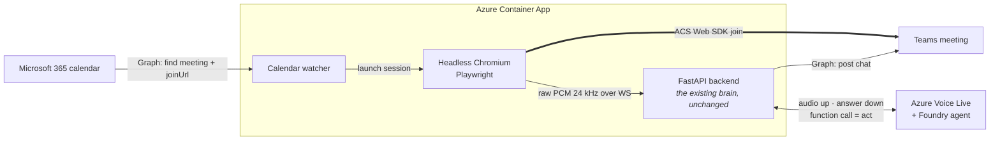

# Channel D — In-call avatar (headless browser)  ⟵ placeholder

**Status: not built.** This page exists to hold the design and, more importantly,
to **fix the comparison criteria before the work starts** — so the eventual
choice between this and [channel C](c-in-call-media-bot.md) is a decision rather
than a justification written afterwards.

---

## The idea

Instead of a server-side media bot using the Graph Communications calling stack,
run a **headless browser** (Chromium) that joins the meeting as an ordinary
participant through the Teams web client, and wire its microphone and speaker to
the existing Voice Live pipeline. This is the approach taken by the ADIA design.

### Reference architecture *(proposed — nothing here is built or verified)*



Two things this diagram implies that [channel C](c-in-call-media-bot.md) does not:

- **The join is scheduled, not operator-triggered.** A calendar watcher finds the
  meeting via Graph and launches a browser session. C needs a human to `POST /api/join`.
  That watcher is net-new work, and reading the calendar is itself a Graph permission.
- **The whole thing runs in a container**, so it can scale to zero between meetings —
  the single biggest cost argument against C's always-on Windows VM.

> **Discrepancy to resolve before building.** The reference diagram says *ACS Web SDK
> join*, but the description above says *Teams web client*. These are different
> mechanisms with different consequences: the ACS Web SDK joins as an anonymous interop
> guest (we already run this in C's browser joiner), whereas driving the real Teams web
> client means a signed-in account and a licence.
>
> **Update (2026-08-03) — CONFIRMED WORKING.** This note previously said the ACS Web
> SDK "cannot hear other participants", so D "collapses". That conclusion was wrong,
> and so was the observation it rested on.
>
> The measurement (`wiredTracks 0, maxRms 0`) was real, but it was **not evidence about
> the platform**. The code called `getMediaStreamTrack()`, which is not a member of
> `RemoteAudioStream` — the interface exposes `getMediaStream(): Promise<MediaStream>`
> and `getVolume()`. Worse, the function containing that call had **no caller**. So the
> SDK was never actually asked for the stream, and the zero was our own bug.
>
> The [ADIA reference implementation](#adia) takes the remote stream from the DOM
> instead: it intercepts `HTMLMediaElement.prototype.srcObject`, so when the SDK
> attaches a participant's stream to an element in order to *play* it, the page keeps a
> reference and routes it into a capture worklet. The SDK is never asked.
>
> `acs-join.js` now tries the **documented** `getMediaStream()` first and keeps the
> interception as a fallback, reporting which one delivered as `remoteVia=sdk` or
> `remoteVia=srcObject` in `capture_stats`. The interception is the path that has been
> **run in a real meeting**. With the microphone disabled (`?mic=0`), so the only
> possible audio source was another participant:
>
> ```text
> capture stats: maxRms=0.15861 remoteStreams=1 wiredTracks=2 remoteMeters=2
>                remoteMaxRms=0.18466 micCapture=False
> User transcript: 'Hey Simone, how are you?'
> ```
>
> `micCapture=False` with `remoteMaxRms=0.18466` and a correct transcript is the whole
> proof: **the browser leg hears the meeting, with no administrator anywhere in the
> path.** The assistant answered aloud, and the follow-up question was picked up by the
> 30-second follow-up window.
>
> **What this does and does not establish.** It proves remote participant audio reaches
> Voice Live. It does *not* yet cover:
>
> - **More than one other human.** The test had a single remote participant, so whether
>   ACS delivers one stream per participant (the hook wires each) or a single mix is
>   still unobserved. The hook captures whatever gets attached either way, but that is
>   inference, not measurement.
> - **What the second wired track is.** `wiredTracks=2` against `remoteStreams=1` means
>   something beyond the one remote participant was attached — plausibly our own
>   outgoing audio being rendered. `remoteMaxRms` was non-zero during one
>   `selfTalking=True` window, which is consistent with that. No feedback loop occurred
>   because the `selfTalking` half-duplex gate suppresses capture while the avatar
>   speaks, but that gate is now load-bearing rather than belt-and-braces. Logging track
>   ids would settle it.
>
> The standing caveat still applies: this rides an implementation detail, not a
> contract. If a future SDK renders remote audio purely through Web Audio, the hook
> stops firing and `remoteMaxRms` returns to 0 — which is exactly how the regression
> announces itself. `?remote=0` disables the hook without a redeploy.

## Joiner URL flags

Tunable per session, so a live call can be adjusted without a redeploy.

| Flag | Default | Effect |
| --- | --- | --- |
| `?mic=0` | mic on | Drops the local microphone tap. Isolates the srcObject hook — the only way to prove the leg hears *other* participants rather than the operator. |
| `?remote=0` | hook on | Disables the srcObject hook. Kill switch back to mic-only behaviour. |
| `?duplex=full` | half | Keeps the microphone live while she speaks, so a human can cut her off mid-answer. Also a checkbox on the join page, toggleable mid-call. |
| `?lead=<seconds>` | `0.28` | Audio-ahead-of-video offset for lip-sync. |

### Why barge-in is half-duplex by default

This leg runs the **same capture pipeline as the web app** — same `getUserMedia`
constraints, the same `pcm16-processor` AudioWorklet at 960 samples / 40 ms, and the
same policy of never cutting the stream (gates attenuate the signal to silence
rather than stopping it, because a stream that stops mid-utterance orphans the
server VAD: it fires `speech_started`, never sees `speech_stopped`, and the turn
hangs forever). The Voice Live session config is identical too — semantic VAD,
semantic end-of-utterance, `azure_deep_noise_suppression`, `server_echo_cancellation`.

The one thing that is **not** the same is the number of inputs. The web app has
exactly one: a microphone the browser has already echo-cancelled and
noise-suppressed. This leg sums three — that microphone, the raw room tap, and the
optional display capture. The extra two are unprocessed, no echo canceller sees
them, and the room tap carries the call's own mix.

That is why simply opening the mic during her answer was, in testing, "a disaster":
it opened the room tap too, her own voice came straight back, and she interrupted
herself continuously. The gates are therefore **per source**:

| Source | While she is speaking | Rationale |
| --- | --- | --- |
| Microphone | open in full duplex, closed in half | Browser AEC + NS already applied; this is the web app's own policy |
| Room tap | **always closed** | A feedback path, not a barge-in path — nothing cancels it |
| Display capture | **always closed** | Same: it carries whatever the Teams window is playing |

The cost is that only the operator's microphone can interrupt her; a *remote*
participant cannot. That is a real limitation of this leg and the price of not
having an echo canceller on the room tap.

`roomSpeakRms` in the capture stats is the measurement behind this: it is the peak
room-tap level sampled **while she is speaking**. Non-zero means the tap is indeed
carrying her voice back.

**On headphones there is no loop at all**, so full duplex reduces to exactly the web
app's topology. `?duplex=full` turns it on, as does the **"Let me interrupt her
mid-answer"** checkbox on the join page, which applies immediately without
rejoining. Leave it off on a speakerphone or laptop speakers.

## Silence is ambiguous — the wake-phrase hint

The wake phrase is what stops her talking over a room, but it creates a UX trap:
when an utterance arrives without it she stays *completely* silent, which from the
room's side is indistinguishable from a dead microphone. Live testing hit this
immediately — *"Hey, what was the schedule in the last meeting?"* was heard,
transcribed and correctly suppressed, and read as her being broken.

So a suppressed utterance now paints a short **`say "Hey Simone" to ask me`** nudge on
her tile for 4s. Silent by design: interjecting audibly is exactly what the wake
phrase exists to prevent. The label is derived from `ACS_WAKE_PHRASES[0]`, so it can
never drift from the gate that actually decides.

## <a id="adia"></a>Prior art — the ADIA implementation

A client-built agent (`ADIA-Agent`) implements this same architecture end to end and is
worth reading before writing any of it here:

| Concern | How ADIA does it |
| --- | --- |
| Host | `mcr.microsoft.com/playwright/python` container, one browser context per meeting |
| Join | ACS Web Calling SDK, `agent.join({ meetingLink })`, anonymous guest |
| Room audio in | intercepts `HTMLMediaElement.prototype.srcObject` → capture worklet → WS |
| Agent audio out | overrides `getUserMedia` to return a `MediaStreamDestination`, so the "microphone" *is* the agent |
| Devices | no PulseAudio or Xvfb — `--use-fake-device-for-media-stream` plus the override |

Two things it does **not** establish. Its own README says the incoming-audio path is
preview and *"validate against a real meeting"*, and its tests cover config, prompts and
Voice Live helpers — **nothing exercises the audio bridge or the browser**. So it is a
credible architecture, not evidence that the capture works.

Also inherited by any anonymous-guest design: the guest has **no Teams chat identity**
(ADIA posts chat through a separate M365 service account), and each meeting costs a full
Chromium session, so concurrency is expensive.

## Why it is worth evaluating

Channel C works, but its cost is not the VM — it is the **admin dependency**. C
requires Graph application permissions, admin consent, and a Teams application
access policy that only a Teams administrator can grant. In tenants where those
are unobtainable, C is simply unavailable regardless of engineering effort.

The hypothesis under test: **a browser joins as a guest, so none of that applies.**
If true, D removes every hard blocker in C. That is the entire case for it.

## What is unknown

Recorded honestly, before any work:

- **Which joiner mechanism it actually is** — ACS Web SDK (anonymous guest, known
  to be deaf to other participants) or the real Teams web client (needs an account
  and a licence). See the discrepancy note above; this one question decides whether
  the channel is viable at all
- Whether meeting policy permits anonymous/guest join in the target tenant
- Whether a camera tile can be published (the avatar's *face*, not just voice) —
  C achieves this; a browser may be limited to screen share
- Audio fidelity and added latency versus C's measured budget
- Stability over long meetings, and behaviour when the lobby is enabled
- Container cost and whether it can scale to zero (a real advantage over C's
  always-on VM at ~$283/month)
- Whether it violates any acceptable-use terms — **check this first**, because a
  negative answer ends the evaluation immediately

## Operational constraint — the joiner tab must stay visible

Measured in a live meeting, from `capture stats`:

| joiner tab | canvas repaints | decoded avatar frames |
| --- | --- | --- |
| visible | 55 fps | 25 fps |
| hidden | ~6 fps | 0 fps |

The browser generates the outgoing video tile, so anything that throttles its
rendering degrades the tile every participant sees. The moment the tab is hidden
(switched away, minimised, or fully covered — e.g. Teams maximised on a laptop
screen), `requestVideoFrameCallback` stops entirely and `setInterval` is clamped.
At 6 fps the avatar's lips move a handful of times a second, which reads as
"robotic" and as broken lip sync no matter how the audio offset is tuned.

Mitigations in the code, in order of effectiveness:

1. Repaints are driven by `MediaStreamTrackProcessor` reading decoded frames off
   the media pipeline. That is data-driven rather than a timer, so it is not
   subject to timer throttling. Falls back to `requestVideoFrameCallback`.
2. A watchdog repaint runs from the audio callback (the audio thread is never
   throttled). This is only ~6 fps — a floor, not a fix.
3. The joiner page warns when the tab is hidden.

**Operationally: keep the joiner tab visible** — a second monitor, or side by side
with Teams. This is a genuine disadvantage of D versus C, where a server-side
media bot has no such dependency, and belongs in the comparison below.

## <a id="comparison"></a>Comparison criteria — agreed up front

Both options are scored on the same axes. Fill this in after building D; do not
add or drop criteria afterwards.

| Criterion | C — Graph media bot | D — headless browser |
| --- | --- | --- |
| **Admin dependency** *(decisive)* | Entra admin consent for `Calls.*.All` (the Teams access policy is only needed for short `/meet/` links) | **None — verified.** Joined, heard a participant and answered aloud with no consent of any kind |
| Hears the whole room | Yes | **Yes** — verified in a real meeting via the `srcObject` hook (single remote participant so far) |
| Publishes a camera tile (the face) | Yes | Yes — already built in `acs-join.js` |
| Added latency over the Voice Live budget | ~125 ms transport | ? |
| Audio fidelity | Verified clean | ? |
| Idle cost | ~$283/month VM (`D4s_v5`), no scale-to-zero | ? |
| Operational fragility | Native Windows media stack; documented traps | ? |
| Terms-of-use standing | Supported, first-party API | ? |
| Effort to reach parity | Built | ? |

**Decision rule — both are kept (owner's call, 2026-08-03).** An earlier version of
this page said that if D cleared the admin dependency it "supersedes C and C should be
retired rather than kept in parallel". **That is overridden.** C is a genuine design
that works, and the two fail in *different directions*:

| | C — Graph media bot | D — headless browser |
| --- | --- | --- |
| Authorisation | admin consent once, then **any** meeting from a link | none — but the tenant must permit anonymous guest join |
| Platform standing | supported, first-party API | tries the documented `getMediaStream()` first, falls back to the `srcObject` **implementation detail** — the fallback is the path proven live |
| Breaks when | no administrator is available | the SDK changes how it renders remote audio, or anonymous join is disabled |

That makes them complementary rather than redundant: C is the robust path wherever an
administrator exists, D is the only path where one does not. The cost of keeping both
is real and is accepted deliberately rather than by drift — C carries the
[three-month media-SDK treadmill](c-in-call-media-bot.md), D carries an unsupported
touchpoint that can fail silently. Neither is free.

## When to build it

After channel C is documented and stable — which it now is. Track under the
follow-up to issue #27.
