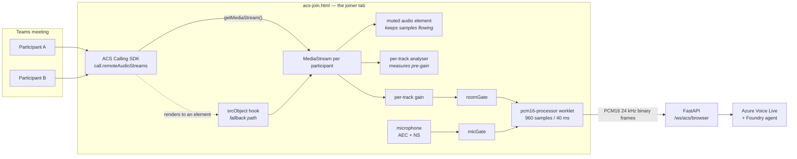
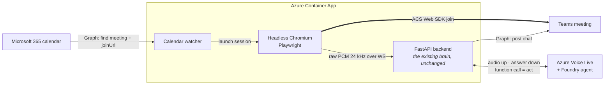

# Channel D — In-call avatar (ACS browser guest)

**Two things share this page, and they are at very different stages.** Keeping them
apart is the single most useful thing this document does.

| | What it is | Status |
| --- | --- | --- |
| **The media leg** — `frontend/acs-join.js` | A browser page that joins a Teams meeting as an anonymous **ACS** guest, hears the other participants, and answers aloud with the avatar's face on a video tile | **Built**, and verified in real meetings |
| **The host** — headless Chromium + a calendar watcher | Running that same page unattended in a container instead of a human opening a tab | **Not built** — the proposal and its open questions are kept further down |

"Headless" was never a *capability*; it is a way to *host* code that already exists.
Every media question — can it join, can it hear the room, can it publish a face — is
answered by the leg that is built, and none of those answers would change if the same
page later ran without a human watching it.

> **Channel lettering is under review.** The owner has proposed making this leg **C**
> and the [Graph media bot](c-in-call-media-bot.md) **D**, so the ladder runs from
> zero-admin to most-admin. Deferred deliberately: the letters are referenced from
> issue #27, the open PR, `meeting-bot/` and three design pages, so renaming is one
> clean sweep for later rather than churn now. Read D as "the ACS browser guest".

---

## How it joins

No Teams identity is involved anywhere. The page mints a short-lived **ACS VoIP
token** from the backend and joins as an *anonymous interop guest* — the same class of
participant as someone who clicks "join on the web" without signing in.

| Step | Where | Detail |
| --- | --- | --- |
| 1. Mint an identity | `POST /api/acs/token` → `backend/acs/routes.py` | Server-side. Uses `ACS_CONNECTION_STRING` if set, otherwise `ACS_ENDPOINT` with `DefaultAzureCredential`. Returns a short-lived VoIP token, so the browser never sees a connection string. Returns **503** when `ENABLE_ACS` is false. |
| 2. Build a locator | `buildMeetingLocator()` | A classic `.../l/meetup-join/...` link becomes `{ meetingLink }`. Short `/meet/` links are **not** accepted by the `meetingLink` locator and are detected separately. |
| 3. Join | `callAgent.join(locator, { audioOptions: { localAudioStreams: [localAudio], muted: false } })` | Her outgoing audio stream is attached **at join time**, so she is audible the moment she is admitted rather than after a second negotiation. |
| 4. Admission | Teams, not us | Anonymous guests land in the **lobby** when the meeting has one, and a human admits them. Nothing in the code bypasses that, and nothing should. |
| 5. Wire media | on `call.state === "Connected"` | `startBrowserMedia()` runs first (its first statement opens the media websocket), then `startPlacardVideo()`. |

She appears in the roster as `<AVATAR_DISPLAY_NAME> (AI assistant)`.

**What this buys, and what it costs.** No Entra consent, no Teams administrator, no
application access policy — that is the whole reason this leg exists. The price is
that she has no Teams identity: she cannot post in the meeting chat as herself, she
cannot be @mentioned, and she shows as an external guest. A first-class Teams identity
is what [the Graph media bot](c-in-call-media-bot.md) is for, and it is why that
channel is kept despite costing an administrator.

## How it hears the room

This is the part that surprises people, so it is written out in full.

**ACS does not hand you a "meeting audio" stream.** It exposes one `RemoteAudioStream`
per remote participant and renders them itself for playback. Getting those samples
into a capture pipeline takes two independent mechanisms and one browser quirk, and
all three are load-bearing.



### Path 1 — the documented one

`RemoteAudioStream.getMediaStream()` returns a `Promise<MediaStream>`.
`scanRemoteAudioStreams()` sweeps `call.remoteAudioStreams` on connect and every 3 s
after, so participants who join late are picked up too. Wiring is idempotent
(deduplicated by track id), which is what makes re-scanning free.

> **This path looked dead for months, and the reason was ours.** The code called
> `getMediaStreamTrack()` — not a member of the interface, which exposes
> `getMediaStream()` and `getVolume()` — and the function containing that call had
> **no caller at all**. The resulting `wiredTracks=0, maxRms=0` was read as proof that
> the ACS Web SDK "cannot hear other participants", and that conclusion was written
> into this page as the reason the whole channel collapsed. The measurement was real;
> the SDK was simply never asked. It is worth remembering as the cost of drawing a
> platform conclusion from an unverified local failure.

### Path 2 — the `srcObject` interception

`installSrcObjectHook()` redefines `HTMLMediaElement.prototype.srcObject` globally, so
every assignment anywhere on the page is observed. The SDK has to *play* remote audio,
so it assigns each stream to an element, and the hook sees it. The technique comes from
[the ADIA implementation](#adia).

This rides an **implementation detail, not a contract**. If a future SDK renders remote
audio purely through Web Audio, the hook stops firing and `remoteMaxRms` returns to 0 —
which is precisely how that regression would announce itself. `?remote=0` disables the
hook without a redeploy.

Whichever path reaches a track first owns its `via` label, and the documented path is
attached **before** the priming element is created so that it wins the race. Otherwise
the diagnostic would always read `srcObject` and we would never learn whether the
supported path works.

> **The hook fires on the avatar's own elements too.** Her voice arrives on a WebRTC
> track attached to elements on this same page. Unguarded, it would be wired into the
> room tap and posted straight back to Voice Live as the next question — she would
> interrupt herself on every answer. Her track ids go into `avatarOwnTracks` *before*
> the assignment and are skipped, and tracks belonging to the stream handed to ACS as
> our outgoing audio are excluded the same way, by identity.

### The quirk that makes either path work

**Chrome only pulls samples from a *remote* WebRTC `MediaStream` through Web Audio
while an `HTMLMediaElement` is also consuming it.** A `MediaStreamAudioSourceNode` on
its own produces silence — no error, no warning, just zeros.

So every wired stream also gets a **muted** `<audio>` element which is played and kept
alive in `primingAudioEls`. Muted, because the SDK already renders the meeting for
whoever is at the tab; a second audible copy would be an echo. The element exists
purely to keep the pipeline pulling.

### From the taps into Voice Live

Both taps meet in one Web Audio graph:

| Stage | Node | Why it is there |
| --- | --- | --- |
| per-track meter | `AnalyserNode` | Measures each remote track **before** its gain, so a gated track still reports its true level. Metering after the gate would erase the evidence needed to judge the gate. |
| per-track gate | `GainNode` | Lets one track be silenced without closing the whole room tap |
| room gate | `roomGate` | The shared gate for every remote tap |
| mic gate | `micGate` | The near-field microphone, already echo-cancelled and noise-suppressed by the browser |
| capture | `pcm16-processor` AudioWorklet | 960 samples at 24 kHz = **40 ms** frames, converted to PCM16. Identical to the web app. |
| sink | `captureSink` at gain **0** → `destination` | A capture node only runs while it is connected to the destination; zero gain makes it process without playing the room back into the operator's ears |

Frames go down the `/ws/acs/browser` websocket as binary, where `BrowserVoiceBridge`
forwards them to Voice Live.

**Frames are sent continuously, even when every gate is shut.** The gates attenuate the
*signal*; they never stop the *stream*. Cutting the stream mid-utterance orphans the
server VAD — it fires `speech_started`, never sees `speech_stopped`, and the turn hangs
forever. This invariant is inherited from the web app and is not negotiable.

### Why the microphone is a separate source

The room taps carry the far side. The microphone carries whoever is sitting at the
joiner tab, and it is kept separate for three reasons: it is the only source the
browser has echo-cancelled and noise-suppressed; it is the only one that still works
if both remote paths fail; and it is the only input that can safely stay open while she
speaks — which makes it the only barge-in path this leg has today.

### It is proven live, and here is exactly what was proven

Run in a real Teams meeting with the microphone disabled (`?mic=0`), so the only
possible audio source was another participant:

```text
capture stats: maxRms=0.15861 remoteStreams=1 wiredTracks=2 remoteMeters=2
               remoteMaxRms=0.18466 micCapture=False
User transcript: 'Hey Simone, how are you?'
```

`micCapture=False` with a non-zero `remoteMaxRms` and a correct transcript is the whole
proof: **the browser leg hears the meeting, with no administrator anywhere in the
path.** She answered aloud, and the follow-up question was caught by the follow-up
window.

What it does **not** establish, stated so it is not quietly assumed:

- **More than one other human.** There was a single remote participant, so whether ACS
  delivers one stream per participant or a single mix under load is still unobserved.
  The wiring handles either, but that is inference.
- **What the second wired track is.** `wiredTracks=2` against `remoteStreams=1` means
  something beyond the one participant was attached. This is what the per-track metering
  described under [Barge-in](#barge-in-the-mic-is-never-gated) exists to identify.

## The avatar rides the web app's transport

The face and the voice reach this leg exactly the way they reach the web app: Voice
Live negotiates a **WebRTC peer connection** with the joiner and delivers the
rendered avatar as a video track and the spoken answer as an audio track on it. The
audio track is wired straight into the ACS `LocalAudioStream`, so what the transport
delivers is what the room hears, when it arrives.

That is a deliberate convergence, and it replaced a design specific to this channel:
the server relayed the fragmented-MP4 avatar stream and `acs-join.js` rebuilt A/V
sync by hand — MediaSource for the picture, a scheduling cursor with a tunable
`?lead=` offset for the voice, plus a drift guard and a silence shaver to stop the
two ratcheting apart. Every lip-sync complaint traced to that reconstruction, and
none of the machinery exists any more.

| | web app (channel A) | joiner (this channel) |
| --- | --- | --- |
| avatar transport | WebRTC | **WebRTC** |
| lip-sync | from the transport | **from the transport** |
| presentation | `<video>` on the page | `<video>` → canvas → ACS video tile |

The presentation layer stays different because Teams needs a *transmitted* track,
and because a meeting has no screen for the "thinking" cue or the wake-phrase hint —
those overlays are composited onto the tile. Compositing costs a frame or two of
**constant** delay; unlike a scheduling cursor it has nothing that can accumulate,
so it cannot drift.

That claim is now falsifiable rather than asserted — and it was tested. The lip-sync
complaints that drove this port disappeared once the transport changed, so the
compositor is not the thing that was costing time.

The overlay *wording* converges even though the drawing cannot. The "thinking"
captions and their cadence are `app.js`'s `THINKING_*` constants — same three
rotating lines, same 2.2s rotation, same escalation to the slow line after 3.5s,
same 25s failsafe ceiling — so a change to the copy lands on both surfaces. Two
things differ on purpose: the cue appears after 250ms rather than 700ms, because a
brief blank on a screen is nothing but silence in a meeting invites someone to
start talking; and the rotation is derived from elapsed time on each painted frame
instead of `setInterval`, because background tabs clamp timers to ~1Hz and this tab
sits behind the Teams window.

The practical consequence is the point: a fix to the web app's avatar path is
inherited here, because it *is* the same path.

> **The one thing this transport makes newly dangerous.** `installSrcObjectHook()`
> intercepts every `srcObject` assignment on the page, and the avatar's own elements
> are on that page. Without a guard her voice would be wired into the room tap and
> posted back to Voice Live as the next question — she would interrupt herself on
> every answer. Her track ids are registered *before* the assignment and skipped.

The PCM playback path is kept for the no-avatar case, reduced to an ordinary jitter
buffer with no tunable offset. In avatar mode the server drops PCM entirely, because
a stray frame would play on top of the WebRTC track and double her voice.

## Joiner URL flags

Tunable per session, so a live call can be adjusted without a redeploy.

| Flag | Default | Effect |
| --- | --- | --- |
| `?mic=0` | mic on | Drops the local microphone tap. Isolates the srcObject hook — the only way to prove the leg hears *other* participants rather than the operator. |
| `?remote=0` | hook on | Disables the srcObject hook. Kill switch back to mic-only behaviour. |

### Barge-in: the mic is never gated

This leg runs the **same capture pipeline as the web app** — same `getUserMedia`
constraints, the same `pcm16-processor` AudioWorklet at 960 samples / 40 ms, and the
same policy of never cutting the stream (gates attenuate the signal to silence
rather than stopping it, because a stream that stops mid-utterance orphans the
server VAD: it fires `speech_started`, never sees `speech_stopped`, and the turn
hangs forever). The Voice Live session config is identical too — semantic VAD,
semantic end-of-utterance, `azure_deep_noise_suppression`, `server_echo_cancellation`.

The one thing that is **not** the same is the number of inputs. The web app has
exactly one: a microphone the browser has already echo-cancelled and
noise-suppressed. This leg sums three — that microphone, the raw room tap, and the
optional display capture. The extra two are unprocessed, no echo canceller sees
them, and the room tap carries the call's own mix.

That distinction is the whole design. Opening *everything* during her answer was, in
testing, "a disaster" — the room tap fed her own voice back and she interrupted
herself continuously. Closing everything was just as bad in the opposite direction.
So the gates are **per source**:

| Source | While she is speaking | Rationale |
| --- | --- | --- |
| Microphone | **open** | Browser AEC + NS already applied; this is the web app's own policy |
| Room tap | **closed** | A feedback path, not a barge-in path — nothing cancels it |
| Display capture | **closed** | Same: it carries whatever the Teams window is playing |

The cost is that only the operator's microphone can interrupt her; a *remote*
participant cannot. That is a real limitation of this leg, and the price of not having
an echo canceller on the room tap.

#### The evidence for the middle row is weaker than it looks

`roomSpeakRms` — the peak room-tap level sampled while she is speaking — was the whole
justification for closing the room tap. It is not sufficient, because it is a single
peak across **every** remote track at once. "Her voice is coming back" and "the one
participant is talking" produce the same number.

The deployed telemetry makes that concrete. In every window where `roomSpeakRms` was
non-zero it was **exactly equal** to `remoteMaxRms`, with `parts=1`:

```text
roomSpeakRms=0.20941 remoteMaxRms=0.20941 parts=1 remoteStreams=1 wiredTracks=2
roomSpeakRms=0.23026 remoteMaxRms=0.23026 parts=1 remoteStreams=1 wiredTracks=2
```

That single participant is most likely the operator's own Teams client replaying her
voice into the meeting — but the aggregate cannot prove it, and it has been the sole
basis for the gate regardless.

So each remote track is now metered **individually**, with its peak split by whether
she was speaking at the time, and each has its own gain into the shared room gate. The
analyser sits before the gain so a gated track still reports its true level. In
`capture stats`:

| Reading | Interpretation | Action |
| --- | --- | --- |
| `spk` high, `idl` ~0 | our own audio returning on that track | gate that track alone |
| `idl` high | a person, who could be interrupting | leave it open |
| both ~0 over a large `n` | the track carries nothing | ignore it |

If no track turns out to be an echo path, the room gate can be removed outright and
**remote participants get to interrupt her too**. That change is deliberately waiting on
the measurement rather than on reasoning — the last gate altered on reasoning alone was
the half-duplex mode below, and it made every answer worse.

> **There was a half-duplex mode. It is gone.** For a while the microphone was gated
> shut during her answer too, exposed as `?duplex=` and a "let me interrupt her"
> checkbox. Live testing on 2026-08-03 settled it. With the gate on, a question took
> *three* attempts to register, because the gate ate the front of each utterance and
> the server VAD never saw a turn begin. Toggling it mid-answer was worse still — she
> stopped dead and reacted to every sound in the room. Joining with the mic simply
> left open gave immediate barge-in and no false triggers at all.
>
> The web app never had this gate. Adding it here was the divergence; deleting it is
> the fix, and there is no flag to bring it back, because a flag would only preserve
> the path that lost.

### A note on speakers

Her voice reaches the operator through the **Teams client**, a different application,
so the browser's echo canceller has no reference signal for it and cannot subtract it
from the microphone. On headphones this is moot. On laptop speakers the microphone can
pick her up; server-side echo cancellation and semantic VAD are what stand between
that and a false turn, and in testing they held. If a speakerphone ever does produce
self-triggering, that is the mechanism — not the removed gate.

## Silence is ambiguous — the wake-phrase hint

The wake phrase is what stops her talking over a room, but it creates a UX trap:
when an utterance arrives without it she stays *completely* silent, which from the
room's side is indistinguishable from a dead microphone. Live testing hit this
immediately — *"Hey, what was the schedule in the last meeting?"* was heard,
transcribed and correctly suppressed, and read as her being broken.

So a suppressed utterance now paints a short **`say "Hey Simone" to ask me`** nudge on
her tile for 4s. Silent by design: interjecting audibly is exactly what the wake
phrase exists to prevent. The label is derived from `ACS_WAKE_PHRASES[0]`, so it can
never drift from the gate that actually decides.

## Reading `capture stats`

Every ~5 s the page posts a `capture_stats` frame and `backend/acs/bridge.py` logs it
as one line. It is the primary debugging instrument for this channel, so each field is
worth knowing. Retrieve it from Log Analytics (`ContainerAppConsoleLogs_CL`), not from
`az containerapp logs show`, which is unreliable:

```kusto
ContainerAppConsoleLogs_CL
| where TimeGenerated > ago(1d)
| where Log_s contains 'capture stats'
| order by TimeGenerated desc
| take 20
| project TimeGenerated, Log_s
```

| Field | Reads | Meaning |
| --- | --- | --- |
| `frames` / `maxRms` | counter / 0–1 | Captured frames and their peak level this window. `maxRms` at 0 with a live call means nothing is reaching the worklet. |
| `capVia` | `worklet` / `scriptprocessor` | Which capture node engaged. `scriptprocessor` is the fallback and means 170 ms frames instead of 40 ms. |
| `ctxRate` | Hz | `AudioContext` sample rate; should be 24000 so no resampling happens. |
| `micOpen` / `roomOpen` | bool | Live gate states. `micOpen` should be `True` at all times unless the operator muted. |
| `humanMuted` | bool | Whether every remote participant is muted, which closes both gates. It reported `True` in every sample once, because an **empty** participant list was read as “everybody is muted”; the SDK under-reports on Teams interop, so it now listens when it cannot tell. A value that never varies is usually a broken sensor. |
| `roomSpeakRms` | 0–1 | Peak room-tap level sampled **while she was speaking**. See the caveat below. |
| `parts` | count | Remote participants ACS reports. `0` means a solo test, and makes every remote-audio number meaningless. |
| `remoteStreams` | count | `call.remoteAudioStreams.length`. |
| `wiredTracks` / `remoteMeters` | count | Tracks actually wired into the capture graph. |
| `remoteMaxRms` | 0–1 | Peak across all remote taps this window. |
| `remoteVia` | `sdk` / `srcObject` / both | Which path delivered. If this ever loses `srcObject` **and** `sdk`, the leg has gone deaf. |
| `tracks` | per-track list | `id/via spk=<peak while she spoke> idl=<peak while she was silent> n=<speak frames>/<idle frames>` |
| `videoState`, `avatarPic`, `avatarIce`, `avatarVoice` | — | Face and voice health. `avatarIce` separates "no face and no answer" (ICE failed) from "no face only". |
| `drawFps` / `vFps` / `pumpVia` | fps | Canvas repaints, decoded avatar frames, and which pump delivered them (`frames` = `MediaStreamTrackProcessor`, `rvfc` = the fallback). |
| `build` / `stale` | hash / bool | Which asset the tab is running. **`stale=True` means the tab predates the current deploy** — reload before believing anything else on the line. |
| `hidden` | bool | Tab visibility; see the operational constraint below. |
| `micCapture` | bool | `False` when `?mic=0`, which is how you prove the leg hears *others* rather than the operator. |

> **`roomSpeakRms` alone cannot settle whether the room tap echoes her.** It is a
> single peak across every remote track at once, so "her voice is coming back" and
> "the one participant is talking" produce the same number. In the deployed telemetry
> it was *equal to* `remoteMaxRms` in every window where it was non-zero, with
> `parts=1` — consistent with both readings and decisive for neither. The per-track
> `tracks=[...]` breakdown exists for exactly this reason: a track loud only in `spk`
> is our own audio returning, while a track with energy in `idl` is a person.

## Operational constraint — the joiner tab must stay visible

Measured in a live meeting, from `capture stats`:

| joiner tab | canvas repaints | decoded avatar frames |
| --- | --- | --- |
| visible | 55 fps | 25 fps |
| hidden | ~6 fps | 0 fps |

The browser generates the outgoing video tile, so anything that throttles its
rendering degrades the tile every participant sees. The moment the tab is hidden
(switched away, minimised, or fully covered — e.g. Teams maximised on a laptop
screen), `requestVideoFrameCallback` stops entirely and `setInterval` is clamped.
At 6 fps the avatar's lips move a handful of times a second, which reads as
"robotic" and as broken lip sync no matter how the audio offset is tuned.

Mitigations in the code, in order of effectiveness:

1. Repaints are driven by `MediaStreamTrackProcessor` reading decoded frames off
   the media pipeline. That is data-driven rather than a timer, so it is not
   subject to timer throttling. Falls back to `requestVideoFrameCallback`.
2. A watchdog repaint runs from the audio callback (the audio thread is never
   throttled). This is only ~6 fps — a floor, not a fix.
3. The joiner page warns when the tab is hidden.

**Update — the first mitigation is confirmed working.** `pumpVia=frames` now appears
in live logs, so `MediaStreamTrackProcessor` is the pump in practice rather than in
theory, and a hidden tab logged `vFps=25`: decoded avatar frames keep arriving at full
rate while backgrounded. That is the throttling-immune path doing its job.

> **One reading from the same session is not yet explained.** That hidden-tab line
> carried `drawFps=0` alongside `vFps=25`. Since the pump calls the same `draw()` that
> increments `drawCount`, those two numbers should not be able to disagree, so one of
> the assumptions behind them is wrong. It is recorded here rather than explained away;
> a visible-versus-hidden A/B on the current build would settle it, and until then the
> operational advice below stands unchanged.

**Operationally: keep the joiner tab visible** — a second monitor, or side by side
with Teams. This is a genuine disadvantage of D versus C, where a server-side
media bot has no such dependency, and belongs in the comparison below.

## Deploying it

This leg is **additive**: a deployment without it behaves exactly as it does today.
Pick the profile and everything below is set for you — there is nothing to configure by
hand.

### What has to exist

| Setting | Value | What it does |
| --- | --- | --- |
| `ENABLE_ACS` | `true` | **The one that provisions infrastructure.** `infra/main.bicep` deploys the conditional `modules/communicationServices.bicep` and passes `ACS_ENDPOINT` into the container app. Left at `false`, no ACS resource is created and `/api/acs/*` answers 503. |
| `ACS_DATA_LOCATION` | e.g. `United States` | Data residency geography for the ACS resource. Chosen at provision time. |
| `ACS_ENDPOINT` | set by infra | Written automatically when `ENABLE_ACS=true`. Auth is via the container's managed identity, which needs a role on the ACS resource. |
| `ACS_CONNECTION_STRING` | optional | Alternative to endpoint + managed identity. Takes precedence when set; simplest for local development. |
| `ACS_AVATAR_VIDEO_ENABLED` | `true` | Asks Voice Live to synthesise avatar **video** for in-call sessions. Without it there is no face to publish. |
| `BROWSER_JOIN_VIDEO_ENABLED` | `true` | Publishes that face as the ACS video tile. Setting it `false` is the safe rollback — her voice keeps working. |

The three the profile controls — `ENABLE_ACS`, `ACS_AVATAR_VIDEO_ENABLED` and
`BROWSER_JOIN_VIDEO_ENABLED` — are set for you, so the table above is a reference for
what is happening rather than a list of things to type:

```powershell
uv run python scripts/set_profile.py --profile in-call-browser
uv run python scripts/preflight.py
azd up
```

Then open `https://<app>/acs-join.html`, paste a Teams meeting link, and join.

Turn-taking is tuned separately with `ACS_WAKE_PHRASES`, `ACS_REQUIRE_WAKE_PHRASE` and
`ACS_FOLLOWUP_WINDOW_S`. Full descriptions and defaults live in
[`configuration.md`](../configuration.md#teams-in-call-avatar-channels-c-and-d-issue-27).

### Adding it to an environment that already exists

Going from A or A+B to this one is the case worth spelling out, because the obvious
command is the wrong one. These flags reach the container as **environment variables
written by Bicep**, so `azd deploy` — which only ships a new image — cannot see them:

```powershell
uv run python scripts/set_profile.py --profile in-call-browser
azd provision   # creates ACS, rewrites the container app's env
azd deploy      # puts your image back
```

`set_profile.py` detects this case and prints exactly those commands. **Run both.**
`azd provision` on its own reverts the container app to the placeholder image from
Bicep and still reports success, which looks like a broken deploy rather than a
missing step.

> **`ENABLE_ACS` is an infrastructure flag, not a runtime one.** The backend never reads
> it. `backend/config.py` derives its own gate as
> `ACS_ENABLED = ACS_ENDPOINT or ACS_CONNECTION_STRING or MEETING_BOT_ENABLED`, so what
> actually opens `/api/acs/*` is an ACS address having *reached the container*.
> `ENABLE_ACS=true` is simply what makes `infra/` create the resource and pass
> `ACS_ENDPOINT` down.
>
> The practical consequence: setting `ENABLE_ACS` on an existing environment changes
> nothing until you **provision and then deploy**. And `azd provision` on its own resets
> the container app to the Bicep placeholder image — it reports success while the site
> silently serves the wrong revision. Always follow it with `azd deploy`.

> **Picking this profile also switches the media bot off.** Profile selection is
> authoritative rather than cumulative: `set_profile.py` writes the chosen profile's
> flags and resets every flag belonging to the profiles you did not choose. Moving from
> `in-call` to `in-call-browser` therefore sets `DEPLOY_MEETING_BOT_HOST=false`, and the
> next `azd provision` tears the Windows VM down. That is deliberate — the alternative
> is quietly paying ~$283/month for a host the current profile never wanted — but it
> does mean the two in-call legs are an either/or through the profile mechanism.

### Admin steps you must do yourself

Almost none, which is the point of this channel:

- **Nothing in Entra.** No consent, no app registration, no directory role.
- **Nothing in the Teams admin centre.** No application access policy.
- **The tenant must permit anonymous/guest join** for the meetings in question — a
  meeting-organiser or tenant setting, not something this code can influence.
- **Somebody has to admit her from the lobby**, unless the meeting auto-admits.

### Compliance

She is a participant with a microphone and a camera tile, and she is visibly named
`(AI assistant)` in the roster. She does not record the meeting, and no meeting audio
is persisted by this leg — audio is streamed to Voice Live for recognition and
discarded. Participants should still be told an AI assistant is present; the display
name does that passively, and announcing it once is better practice.

## The unbuilt half — running it headless

Everything above is built. Everything below is a proposal kept for when unattended
operation is actually wanted, together with the record of how the media questions
were settled.

### The idea

Instead of a server-side media bot using the Graph Communications calling stack,
run a **headless browser** (Chromium) that joins the meeting as an ordinary
participant through the Teams web client, and wire its microphone and speaker to
the existing Voice Live pipeline. This is the approach taken by the ADIA design.

#### Reference architecture *(proposed — nothing here is built or verified)*



Two things this diagram implies that [channel C](c-in-call-media-bot.md) does not:

- **The join is scheduled, not operator-triggered.** A calendar watcher finds the
  meeting via Graph and launches a browser session. C needs a human to `POST /api/join`.
  That watcher is net-new work, and reading the calendar is itself a Graph permission.
- **The whole thing runs in a container**, so it can scale to zero between meetings —
  the single biggest cost argument against C's always-on Windows VM.

> **Discrepancy to resolve before building.** The reference diagram says *ACS Web SDK
> join*, but the description above says *Teams web client*. These are different
> mechanisms with different consequences: the ACS Web SDK joins as an anonymous interop
> guest — which is exactly what the built leg above already does, needing no account and
> no admin — whereas driving the real Teams web client means a signed-in account and a
> licence, and would give the assistant a genuine Teams identity in the roster.
>
> Settle this first, because it decides whether the headless work is a *hosting* change
> to proven code or a new join mechanism with its own unknowns.

## <a id="adia"></a>Prior art — the ADIA implementation

A client-built agent (`ADIA-Agent`) implements this same architecture end to end and is
worth reading before writing any of it here:

| Concern | How ADIA does it |
| --- | --- |
| Host | `mcr.microsoft.com/playwright/python` container, one browser context per meeting |
| Join | ACS Web Calling SDK, `agent.join({ meetingLink })`, anonymous guest |
| Room audio in | intercepts `HTMLMediaElement.prototype.srcObject` → capture worklet → WS |
| Agent audio out | overrides `getUserMedia` to return a `MediaStreamDestination`, so the "microphone" *is* the agent |
| Devices | no PulseAudio or Xvfb — `--use-fake-device-for-media-stream` plus the override |

Two things it does **not** establish. Its own README says the incoming-audio path is
preview and *"validate against a real meeting"*, and its tests cover config, prompts and
Voice Live helpers — **nothing exercises the audio bridge or the browser**. So it is a
credible architecture, not evidence that the capture works.

Also inherited by any anonymous-guest design: the guest has **no Teams chat identity**
(ADIA posts chat through a separate M365 service account), and each meeting costs a full
Chromium session, so concurrency is expensive.

## Why it is worth evaluating

Channel C works, but its cost is not the VM — it is the **admin dependency**. C
requires Graph application permissions, admin consent, and a Teams application
access policy that only a Teams administrator can grant. In tenants where those
are unobtainable, C is simply unavailable regardless of engineering effort.

The hypothesis under test: **a browser joins as a guest, so none of that applies.**
If true, D removes every hard blocker in C. That is the entire case for it.

## What is unknown

Recorded honestly before any work, and kept with the answers struck through as they
arrived. These are questions about the **headless host**; the media leg answered its
own share of them by being built:

- ~~Which joiner mechanism it actually is~~ — **answered.** It is the ACS Web SDK as
  an anonymous guest, and it *does* hear other participants. The claim that it was
  "deaf" was our own unverified bug, described under [how it hears the
  room](#how-it-hears-the-room)
- Whether meeting policy permits anonymous/guest join in the target tenant
- Whether a camera tile can be published (the avatar's *face*, not just voice) —
  C achieves this; a browser may be limited to screen share
- Audio fidelity and added latency versus C's measured budget
- Stability over long meetings, and behaviour when the lobby is enabled
- Container cost and whether it can scale to zero (a real advantage over C's
  always-on VM at ~$283/month)
- Whether it violates any acceptable-use terms — **check this first**, because a
  negative answer ends the evaluation immediately

## <a id="comparison"></a>Comparison criteria — agreed up front

Both options are scored on the same axes. Fill this in after building D; do not
add or drop criteria afterwards.

| Criterion | C — Graph media bot | D — headless browser |
| --- | --- | --- |
| **Admin dependency** *(decisive)* | Entra admin consent for `Calls.*.All` (the Teams access policy is only needed for short `/meet/` links) | **None — verified.** Joined, heard a participant and answered aloud with no consent of any kind |
| Hears the whole room | Yes | **Yes** — verified in a real meeting via the `srcObject` hook (single remote participant so far) |
| Publishes a camera tile (the face) | Yes | Yes — already built in `acs-join.js` |
| Added latency over the Voice Live budget | ~125 ms transport | ? |
| Audio fidelity | Verified clean | ? |
| Idle cost | ~$283/month VM (`D4s_v5`), no scale-to-zero | ? |
| Operational fragility | Native Windows media stack; documented traps | ? |
| Terms-of-use standing | Supported, first-party API | ? |
| Effort to reach parity | Built | ? |

**Decision rule — both are kept (owner's call, 2026-08-03).** An earlier version of
this page said that if D cleared the admin dependency it "supersedes C and C should be
retired rather than kept in parallel". **That is overridden.** C is a genuine design
that works, and the two fail in *different directions*:

| | C — Graph media bot | D — headless browser |
| --- | --- | --- |
| Authorisation | admin consent once, then **any** meeting from a link | none — but the tenant must permit anonymous guest join |
| Platform standing | supported, first-party API | tries the documented `getMediaStream()` first, falls back to the `srcObject` **implementation detail** — the fallback is the path proven live |
| Breaks when | no administrator is available | the SDK changes how it renders remote audio, or anonymous join is disabled |

That makes them complementary rather than redundant: C is the robust path wherever an
administrator exists, D is the only path where one does not. The cost of keeping both
is real and is accepted deliberately rather than by drift — C carries the
[three-month media-SDK treadmill](c-in-call-media-bot.md), D carries an unsupported
touchpoint that can fail silently. Neither is free.

## When to build it

After channel C is documented and stable — which it now is. Track under the
follow-up to issue #27.
