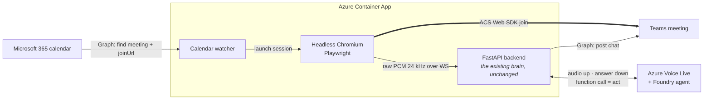

# Channel E — In-call avatar (headless browser)  ⟵ placeholder

**Status: not built.** This page exists to hold the design and, more importantly,
to **fix the comparison criteria before the work starts** — so the eventual
choice between this and [channel D](d-in-call-media-bot.md) is a decision rather
than a justification written afterwards.

---

## The idea

Instead of a server-side media bot using the Graph Communications calling stack,
run a **headless browser** (Chromium) that joins the meeting as an ordinary
participant through the Teams web client, and wire its microphone and speaker to
the existing Voice Live pipeline. This is the approach taken by the ADIA design.

### Reference architecture *(proposed — nothing here is built or verified)*

Two things this diagram implies that [channel D](d-in-call-media-bot.md) does not:

- **The join is scheduled, not operator-triggered.** A calendar watcher finds the
  meeting via Graph and launches a browser session. D needs a human to `POST /api/join`.
  That watcher is net-new work, and reading the calendar is itself a Graph permission.
- **The whole thing runs in a container**, so it can scale to zero between meetings —
  the single biggest cost argument against D's always-on Windows VM.

> **Discrepancy to resolve before building.** The reference diagram says *ACS Web SDK
> join*, but the description above says *Teams web client*. These are different
> mechanisms with different consequences: the ACS Web SDK joins as an anonymous interop
> guest (we already run this in D's browser joiner, and we know it **cannot hear other
> participants** — Teams client isolation), whereas driving the real Teams web client
> means a signed-in account and a licence. If E is actually the ACS Web SDK, it inherits
> D's browser-joiner limitation and the entire case for it collapses. **Settle this
> first** — it is cheaper than any prototype.

## Why it is worth evaluating

Channel D works, but its cost is not the VM — it is the **admin dependency**. D
requires Graph application permissions, admin consent, and a Teams application
access policy that only a Teams administrator can grant. In tenants where those
are unobtainable, D is simply unavailable regardless of engineering effort.

The hypothesis under test: **a browser joins as a guest, so none of that applies.**
If true, E removes every hard blocker in D. That is the entire case for it.

## What is unknown

Recorded honestly, before any work:

- **Which joiner mechanism it actually is** — ACS Web SDK (anonymous guest, known
  to be deaf to other participants) or the real Teams web client (needs an account
  and a licence). See the discrepancy note above; this one question decides whether
  the channel is viable at all
- Whether meeting policy permits anonymous/guest join in the target tenant
- Whether a camera tile can be published (the avatar's *face*, not just voice) —
  D achieves this; a browser may be limited to screen share
- Audio fidelity and added latency versus D's measured budget
- Stability over long meetings, and behaviour when the lobby is enabled
- Container cost and whether it can scale to zero (a real advantage over D's
  always-on VM at ~$140/month)
- Whether it violates any acceptable-use terms — **check this first**, because a
  negative answer ends the evaluation immediately

## Comparison criteria — agreed up front

Both options are scored on the same axes. Fill this in after building E; do not
add or drop criteria afterwards.

| Criterion | D — Graph media bot | E — headless browser |
| --- | --- | --- |
| **Admin dependency** *(decisive)* | Graph consent + **Teams access policy** | Hypothesis: none |
| Hears the whole room | Yes | ? |
| Publishes a camera tile (the face) | Yes | ? |
| Added latency over the Voice Live budget | ~125 ms transport | ? |
| Audio fidelity | Verified clean | ? |
| Idle cost | ~$140/month VM, no scale-to-zero | ? |
| Operational fragility | Native Windows media stack; documented traps | ? |
| Terms-of-use standing | Supported, first-party API | ? |
| Effort to reach parity | Built | ? |

**Decision rule:** if E clears admin dependency *and* publishes a camera tile at
comparable quality, it supersedes D and D should be retired rather than kept in
parallel. Maintaining two in-call implementations is a cost nobody is paying for.
If E cannot show a face, it is a fallback for policy-blocked tenants, not a
replacement.

## When to build it

After channel D is documented and stable — which it now is. Track under the
follow-up to issue #27.
