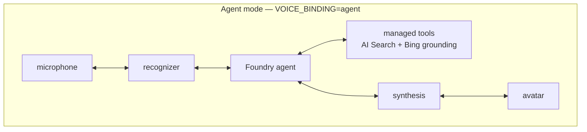
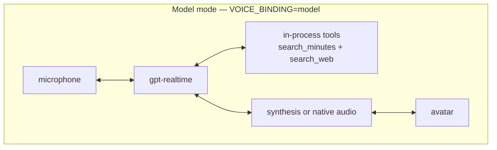
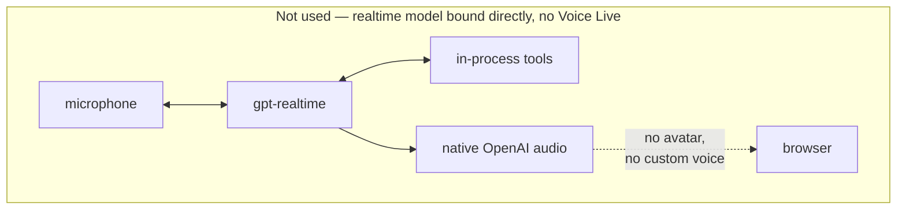

# Voice Live binding — agent mode and model mode

Voice Live can be bound to two different things, and the choice changes the shape
of every turn. This page is the design record for that choice: what each binding
gives you, what it costs, and what was measured rather than assumed.

- **Agent mode** (`VOICE_BINDING=agent`, the default **and the recommended choice**)
  binds Voice Live to the Foundry agent. This is the original design and the one every
  channel has shipped on.
- **Model mode** (`VOICE_BINDING=model`) binds Voice Live directly to a realtime
  speech-to-speech model, and moves the tools in-process.

Both are supported. The default is unchanged, so a deployment that sets nothing
behaves exactly as it always has.

---

## 1. Why a second binding exists

The assistant's job is to answer an executive out loud, in a meeting, without an
awkward pause. Answer *quality* was never the problem — the corpus and the tools
were already good. The problem is the gap between someone finishing their question
and the avatar starting to speak.

In agent mode that gap has a fixed floor, because the turn is a chain:

```
speech ─▶ recognizer ─▶ agent reasons ─▶ managed tool ─▶ agent resumes ─▶ synthesis ─▶ speech
```

Every stage is a hop, and the recognizer has to finish before the agent can start.
Microsoft's own Voice Live documentation splits its model table along exactly this
line: `gpt-realtime` and friends take **native speech input**, while `gpt-4o`,
`gpt-4.1` and `gpt-5` take *"audio input through Azure speech to text"*. The
overview says chaining speech-to-text, dialog and text-to-speech *"can lead to
increased engineering complexity and end-user perceived latency."*

Model mode deletes the recognizer stage from the answer path. Audio goes to the
model; audio comes back.

---

## 2. The three shapes

There are two supported bindings, and a third arrangement that comes up in almost
every discussion of realtime avatars. It is worth drawing all three, because the
performance claims you will read about realtime models belong to the third one.







The recognizer leaves the **answer path** — transcription is still configured in both
supported modes (it is one field on the Voice Live session, not a component), but the
model works from the audio and no longer waits for the text. The tools also moved from
*inside Foundry* to *inside this application*.

### Pros and cons

Everything below is either measured on this deployment or verified against the live
service. Where the widely-repeated claim differs from what we measured, both are given.

| Option | Pros | Cons |
| --- | --- | --- |
| **1. Voice Live + Foundry agent + tools**<br/>`VOICE_BINDING=agent`<br/>*default & recommended* | • **Native RAG.** AI Search and Grounding-with-Bing-Custom-Search are managed Foundry tools — no glue code, no retrieval to maintain<br/>• **Path-scoped web sources.** 17 entries with boost levels, e.g. `mtn.com/investors` (SuperBoost). A path can be targeted<br/>• Foundry owns threads, history and the tool-calling loop<br/>• **Semantic end-of-utterance** available — worth ~200 ms/turn over silence timing<br/>• Prompt and tools live in the agent: change them without redeploying the app<br/>• Built-in governance surface | • Managed tool round trip is slower: **1.3–1.9 s** vs 0.27–1.63 s<br/>• More Azure surface: model deployment **plus quota**, agent registration, Bing account (G2 SKU)<br/>• Less control over the raw session and token-level behaviour |
| **2. Voice Live + realtime model + tools**<br/>`VOICE_BINDING=model` | • **Tools run in-process: 0.27–1.63 s** round trip<br/>• **No model deployment and no quota request** — Voice Live manages the model itself<br/>• Fewest resources of the two supported modes: no agent, no Bing account<br/>• Direct control of session, prompt and function loop<br/>• Spoken interim cue is available, because Voice Live gives a synthesis stage to inject into | • **Semantic EOU is unavailable** — the service rejects it outright, so turn-taking falls back to a silence timer and hands back ~200 ms/turn<br/>• **We own retrieval.** Quality is ours to get right — currently weaker than agent mode (#78)<br/>• **Web scoping degrades to bare hosts.** The same sources are used — the host list is derived from `bingAllowedDomains` — but `site:` cannot match a path, so `mtn.com/investors` becomes `mtn.com`<br/>• Prompt/tool changes need an app redeploy<br/>• **No measured latency win here** — see below |
| **3. Realtime model + tools, no Voice Live**<br/>**not used** | • Lowest *theoretical* speech-to-speech latency — this is where the "absolute lowest latency" claim actually comes from<br/>• Fewest moving parts; native audio straight off the model socket | • **No avatar.** Voice Live drives the TTS Avatar video and lip-sync off the synthesis stage; bound directly there is no such stage<br/>• **No custom neural voice.** A realtime model emits its own audio and bound directly the built-in voices are all you can ever get — `azure-custom` / `azure-personal` are reachable *only* because Voice Live inserts a replaceable synthesis stage<br/>• **No interim response injection** — the service returns a hard 400; with native audio there is nowhere to inject<br/>• VAD, barge-in and audio orchestration would all have to be rebuilt |

**On the latency claim.** Option 3 is what "realtime models are dramatically faster"
refers to, and the claim is fair *for that shape*. It does not transfer to option 2,
and our own A/B says so: pinned to the same marker and interleaved, time-to-**answer**
was **2.42 s (model) vs 2.45 s (agent)** — indistinguishable, with model mode's range
the wider of the two. The entire apparent gap was time-to-first-*sound*, which is the
spoken filler, a feature flag we had only built on one side. Details in
[section 5](#5-comparing-the-two).

The reason the gap closes is that this workload is **retrieval-bound, not
conversation-bound**. Removing the recognizer and synthesis stages from the critical
path saves real milliseconds, but a grounded answer still waits on a search and then on
the model reading what came back. That cost is identical in both bindings, and it
dominates.

**Why option 3 is off the table.** Its cons are not inconveniences — they delete the
product. This is an *avatar* with a branded voice, and Voice Live is precisely the
component that makes both reachable from a realtime model. It is not a convenience
layer wrapped around the model socket; it is the bridge to the Azure Speech and avatar
infrastructure. Verified first-hand rather than taken on trust — the service rejects
interim injection on native voices with a 400 that fails the whole `session.update`
([`backend/voice/builders.py`](../backend/voice/builders.py)).

---

## 3. What model mode gives

### Measured, against real audio

These are from a probe that speaks a real question into a real session and marks
every response boundary, not from reasoning about the architecture.

> ⚠️ **The first row is not a like-for-like comparison, and the A/B is still
> outstanding.** The two cells measure **different events** — agent mode's figure is
> time to first *token*, model mode's is time to first *audio*. They were also taken
> on **different deployments**; the one the agent numbers came from no longer exists.
> The direction is plausible, the magnitude is unverified. Treat the row as two
> separate observations until both modes are re-measured on one deployment, quoting
> the same marker. The probe already records both markers in every run, so this is a
> matter of quoting the right field, not of new instrumentation.

| | agent mode | model mode |
| --- | --- | --- |
| after the speaker stops | 3.1–4.4 s to first **token** | **1.7–2.4 s** to first **audio** |
| tool round trip | 1.3–1.9 s (managed) | **0.27–1.63 s** (in-process) |
| new Azure resources | — | **none** |

The second and third rows are sound: tool round trip is the same event measured the
same way in both, and the resource count is structural.

A single turn, instrumented end to end:

```
0.00s  speech stopped, response created
1.00s  assistant text begins
1.23s  function call starts
2.03s  audio playing
2.43s  function call result          (tool cost: 1.2s)
3.97s  the answer itself
6.24s  generation complete
```

The whole turn **generates in 6.2 s while emitting 32 s of speech** — generation
runs roughly 5× faster than realtime. This matters because it separates two
problems that are easy to confuse: *how long until she starts speaking* (latency,
which model mode improves) and *how long she then talks for* (length, which is a
prompt concern and independent of the binding).

### Less infrastructure, not more

Voice Live manages the realtime model itself — there is no model deployment and no
quota request behind `VOICELIVE_MODEL`. Model mode provisions **nothing** of its
own. It is a configuration change, not a deployment.

> **When that stops being true.** Voice Live's managed model is the *base* model on
> a shared, pay-as-you-go pool. Deploying a realtime model yourself — Bring Your Own
> Model — is only required to get provisioned throughput (PTU) for guaranteed
> capacity, to bind a fine-tuned model instead of the base one, or to apply
> content-safety filters configured at the deployment level. None of those apply
> here, so `VOICELIVE_MODEL` stays a name in the session payload rather than a
> resource in the template.

It also *removes* three things. Because the binding decides whether a Foundry agent
is in the request path at all, `azd up` under `VOICE_BINDING=model` skips:

| skipped | why |
| --- | --- |
| the agent's chat-model deployment (`gpt-5.4`) | backs the *agent*; nothing in the backend reads it. Costs $0 at rest but holds 50K TPM of quota — enough to block a second deployment in a constrained region |
| the Foundry agent itself | never bound; `AGENT_NAME` is not read in this mode |
| the Bing account + allow-list + connection | a managed Foundry tool has no agent to attach to (see *The tools become ours*), so it bills a G2 SKU nothing can reach |

`DEPLOY_BING_GROUNDING` is ignored under this binding rather than obeyed — the
resource would be unreachable whatever the flag says.

**Not gated, in either mode:** AI Search and the `text-embedding-3-small`
deployment. Model mode uses the index *more* directly than agent mode does —
`search_minutes` calls it in-process — and the meeting catalogue is fetched from
it unconditionally on every session.

### The tools become ours

This is the part with genuine engineering consequences, and it is not optional.

Inspecting the SDK's session schema settles it:

```
ToolType values : FUNCTION, MCP          <- the complete list
tool classes    : FunctionTool, MCPTool
foundry/search  : none — no azure_ai_search, no bing_grounding
```

Binding to a model takes the agent out of the picture, and its managed tools go
with it. There is no mixing the two. So model mode ships its own:

| tool | source | measured |
| --- | --- | --- |
| `search_minutes` | the same `knowledge-index` the agent queried, hybrid + semantic | 620–714 ms |
| `search_web` | Web IQ, host-allow-listed | 268–298 ms warm |

Owning them is also the reason they are faster: an in-process function can be
cached, pre-warmed, and trimmed. A managed tool cannot.

`search_web` is advertised to the model **only when a key is configured**. With no
key the tool does not exist as far as the model is concerned, and the assistant
answers from the minutes corpus alone — the same graceful degradation the agent
path has for a missing Bing connection.

---

## 4. What model mode costs

Two real trade-offs. Neither is a bug, and both should inform the choice.

### Semantic end-of-utterance detection is unavailable

Semantic EOU is text-based, so it needs the local speech recognizer that only
exists in the cascaded pipeline. The service rejects it outright:

> Text-based end-of-utterance detection requires a local speech recognizer and is
> only supported on cascaded pipelines.

It fails the **entire** `session.update`, not just the field, so this cannot be
left for the service to ignore — the code drops it explicitly when binding to a
model. Model mode therefore falls back to plain silence-duration turn-taking and
loses the 500 ms → 300 ms tuning that agent mode benefits from.

That tuning is worth ~200 ms per turn, against model mode's ~1.5 s saving. The
trade is favourable, but it is a trade.

### The voice choice is a fork, not a preference

A realtime model can emit audio natively, with no synthesis stage at all. That is
the lowest-latency output available. But the service is explicit about what it
costs:

> Interim response in realtime pipeline requires an Azure TTS voice
> (azure-standard, azure-custom, azure-personal, or avatar-voice-sync). OpenAI
> native voices stream audio directly and cannot support interim response
> injection.

Read carefully, that sentence describes the mechanism: OpenAI voices stream audio
**directly**, which means Azure voices do *not* — they pass through a synthesis
stage. And that stage is precisely what makes Azure custom neural voice reachable.

| | OpenAI native voice | Azure voice |
| --- | --- | --- |
| synthesis stage | none | yes |
| latency | lowest | one stage more |
| custom neural voice | ✗ | ✓ |
| personal voice | ✗ | ✓ |
| interim response | ✗ | ✓ |

So for a branded avatar, the synthesis stage **is the reason to be on Voice Live**
rather than talking to a realtime model directly. Choosing an OpenAI native voice
forfeits custom voice, personal voice and interim response together — it is one
decision, not three.

Because the combination is rejected with a hard error rather than ignored, the
code null-s interim response whenever an OpenAI voice is selected, and logs why.

Verified in model mode with the avatar enabled: `AzureStandardVoice`,
`AzurePersonalVoice` and `AzureCustomVoice` are all accepted. The custom-voice
roadmap survives model mode intact.

---

## 5. Comparing the two

The binding is **deployment-wide**. There is no per-session override: a client cannot
ask for a binding, and nothing in `DEVELOPER_MODE` exposes one. To compare, set
`VOICE_BINDING`, redeploy, and run the same script of questions again.

That is deliberate. A live switch would have bought a side-by-side A/B at the cost of
a permanent flag on the session path and one more way for a deployment to answer
differently than production does. It also would not have fixed the thing that actually
makes the two hard to compare.

> **The real trap is metric definitions, not deploy variance.** The numbers already
> recorded for the two modes measure *different events* — model mode's figure is time
> to **first audio**, agent mode's is time to **first token**. Those are not the same
> quantity, and no amount of running them side by side makes them comparable. Before
> any A/B, pin both modes to the same marker.

Two further confounds, both measured rather than assumed:

- **The spoken filler is a feature flag, not an architecture.** It was built only in
  model mode, so a naive first-audio comparison is biased toward it by roughly the
  length of a tool call. Agent mode was then probed live and **does** accept
  `interim_response` — the service echoed the config back in full — so the gap is
  something we withheld from agent mode, not something model mode earns. Enable it on
  both sides or neither.
- **The two bindings search different engines over the same sources.** Agent mode uses
  Grounding with Bing Custom Search over **17 path-scoped, boost-ranked entries**;
  model mode uses Web IQ over the **13 bare hosts those entries sit on**, derived
  automatically from the same list because `site:` cannot match a path or a rank. The
  source set is identical by construction; the precision is not. A web-grounded
  question is therefore not the same question in both modes. Report web-grounded
  numbers separately from minutes-only ones, which *are* comparable — the corpus is
  identical.

When both were pinned to the same marker and interleaved A/B/A/B, time-to-**answer**
came out at 2.45s (agent) versus 2.42s (model) — indistinguishable, with model mode's
range the wider of the two. The entire difference was time-to-first-*sound*.

Each websocket already opens its own Voice Live connection and shares no state, so the
constraint is purely which binding the deployment was built with.

---

## 6. Configuration

| Variable | Default | Meaning |
| --- | --- | --- |
| `VOICE_BINDING` | `agent` | `agent` or `model`. Anything else falls back to `agent`. |
| `VOICELIVE_MODEL` | `gpt-realtime-2` | Realtime model bound in model mode. Managed by Voice Live — no deployment, no quota. Ignored in agent mode. |
| `WEBIQ_API_KEY` | *(unset)* | Enables `search_web`. Stored as a **container-app secret**, never a plain env var. Unset leaves the web tool off. |
| `WEBIQ_BASE_URL` | code default | Web IQ endpoint. Optional. |
| `WEBIQ_ALLOWED_DOMAINS` | *(empty)* | Comma-separated host allow-list applied to results. |

`WEBIQ_ALLOWED_DOMAINS` is the same security boundary as `bingAllowedDomains`: a
hard host allow-list is what makes an open-web tool safe to hand an executive
assistant. Leaving it empty allows any host the endpoint returns.

To switch a deployment over:

```powershell
azd env set VOICE_BINDING model
azd env set WEBIQ_API_KEY <key>          # optional, enables the web tool
azd env set WEBIQ_ALLOWED_DOMAINS "mtn.com,sashares.co.za"
azd up
```

To switch back, set `VOICE_BINDING=agent` and redeploy. Nothing is provisioned or
destroyed either way.

### The prompt moves too

In agent mode the persona lives on the Foundry agent, in `prompts/agent/`. In model
mode there is no agent to hold it, so it is sent with the session from
`prompts/realtime/instructions.md` — ~3.9 KB as actually sent (the loader strips
editor commentary), against the agent's 15–19 KB.

It is a **separate prompt on purpose**, not a copy. A prompt written for a
reasoning model does not transfer unchanged to a realtime one — realtime models
trade some reasoning depth for immediacy, and they respond to different
instructions. Two findings from tuning it are worth keeping:

- **Bounding the model's preamble beat suppressing it.** Two attempts at "never
  narrate" failed outright. "At most four words" produced a consistent
  *"One moment."* — which usefully covers the ~1.2 s tool gap. Working with the
  behaviour beat fighting it.

  > **Superseded — the acknowledgement is now suppressed, and this is being
  > retested.** Live testing found the preamble fires on nearly every tool-backed
  > turn, which is nearly every turn, and a canned phrase ahead of each answer
  > reads as a tic rather than as reassurance. Two things produced it
  > independently — the `interim_response` platform feature *and* this prompt
  > clause — so muting one alone changed nothing audible. Both are now off by
  > default. The finding above is kept because it records a real failure mode:
  > if the model reverts to *longer* improvised preambles, bounding rather than
  > forbidding is the known-good fallback. See issue for the tuning work.
- **`max_response_output_tokens` does not control spoken length.** Swept at 1200,
  400 and 200, the answer ended cleanly every time and the duration barely moved,
  because the cap counts *text* tokens and a three-sentence answer is only ~75.
  It is a guillotine that never falls. Spoken length is a prompt concern.

---

## 7. Which to choose

| Situation | Binding |
| --- | --- |
| Anything shipping today, unchanged behaviour required | **agent** |
| Time-to-answer is the priority | either — **measured indistinguishable** (2.45s vs 2.42s) |
| The managed Bing grounding tool is required as-is | **agent** |
| Path-scoped / boosted web sources matter | **agent** — Web IQ scopes to bare hosts only |
| Semantic EOU tuning matters more than ~1.5 s | **agent** |
| You want the tool round trip under your own control | **model** |
| Branded custom neural voice | either — keep an Azure voice |

Agent mode is both the default and the recommendation, deliberately. Model mode is the
one with fewer moving
parts at runtime and it owns its tool round trip (0.27–1.63 s in-process, against
1.3–1.9 s managed), but it moves tool correctness from Foundry's problem to ours, and
retrieval quality is the thing to watch: the managed `azure_ai_search` tool does its
own query rewriting and semantic ranking, so a comparison that only measures
milliseconds can "win" by answering worse.

> **Model mode is not faster to an answer.** That was the expectation going in, and
> the interleaved A/B in §5 falsified it. What model mode did have was a spoken filler
> that started sound at 1.00 s — and agent mode accepts the same feature. Choose model
> mode for tool control and one less hop, not for speed.

---

## 8. Testing

`tests/test_voice_binding.py` pins the switch — 23 checks, no Azure required.

The load-bearing assertions are the **negative** ones: that agent mode gains none
of the model-mode keys. That is the property that keeps the default deployment
byte-identical, and it is the one most likely to be broken by a careless edit.

It is mutation-verified. Dropping the `DEVELOPER_MODE` gate, the OpenAI-voice
guard, or the model-mode EOU drop each makes it fail.

```powershell
uv run python tests\test_voice_binding.py
```

---

## See also

- [Configuration reference](configuration.md) — every environment variable
- [Architecture](architecture.md) — how a turn flows through the system
- [Channels](channels/README.md) — the delivery surfaces this binding sits under
