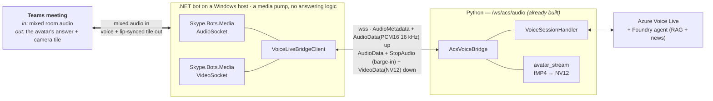

# Avatar-Forge Teams meeting media bot (.NET / Windows)

> **Deploying or operating this?** Start at
> **[`docs/channels/c-in-call-media-bot.md`](../docs/channels/c-in-call-media-bot.md)**
> — the operational page (what deploys, admin steps, verification, cost). This file
> is the *code-local* reference: project layout, build, and the traps that cost real
> debugging time.

> **The in-call media bot — channel C (issue #27).** This is the thin .NET/Windows media
> relay described in [`docs/channels/c-design-media-bot.md`](../docs/channels/c-design-media-bot.md).
> It joins a Teams meeting, captures the **mixed participant audio**, and forwards
> raw PCM16 over a WebSocket to the **unchanged** Python backend
> (`backend/acs/bridge.py::AcsVoiceBridge`). All answering / RAG / turn-taking
> stays in Python.

## Why this exists (the one-paragraph version)

A browser/Teams-tab client can only ever hear **its own mic** (Teams client
isolation), and ACS Call Automation server-side media does **not** carry Teams
*meeting* audio — both proven live. The **only** way for Nuru to hear everyone in
the room is the Graph **Real-Time Media Platform** (`Microsoft.Skype.Bots.Media`),
which is **.NET + Windows-only**. So this is a small, separate Windows service that
acts as a dumb media pump into the existing Python brain.

## ⚠️ Platform reality — must build AND run on Windows

`Microsoft.Graph.Communications.Calls.Media` carries a native Windows media stack.
The bot **must run on a Windows Server guest OS** (Cloud Service, Service Fabric +
VMSS, IaaS VM, or AKS Windows node pool). It **cannot** run on Linux/macOS or an
Azure Web App / Linux Container App. You may *edit* the C# anywhere; you must
*build & host* on Windows (`RuntimeIdentifier=win-x64`).

## Architecture



The seam is the **already-built** `/ws/acs/audio` endpoint. The bot just speaks its
wire protocol (`AudioMetadata` → base64-PCM16 `AudioData` frames; inbound
`AudioData` to play, `StopAudio` for barge-in). The only Python-side requirement for
the audio leg is two env flags: `MEETING_BOT_ENABLED=true` (serves `/ws/acs/audio` without an
ACS resource) and `ACS_AUDIO_SAMPLE_RATE=16000` (matches the media platform). Both are
set through bicep when you deploy the in-call profile.

## Project layout

| Path | Role |
| --- | --- |
| `Program.cs` | ASP.NET host; binds config, starts the bot, maps controllers. |
| `Configuration/BotOptions.cs` | Strongly-typed config (`Bot:*`). |
| `Bot/MeetingBot.cs` | Owns the `ICommunicationsClient`; `JoinMeetingAsync` / `LeaveAsync`. |
| `Bot/CallHandler.cs` | Per-call media plumbing: AudioSocket ⇄ bridge. |
| `Bot/AuthenticationProvider.cs` | App-only Graph token (MSAL) + inbound validation. |
| `Bot/JoinInfo.cs` | Parses the classic `meetup-join` link into thread id, organizer and tenant. |
| `Bridge/VoiceLiveBridgeClient.cs` | **The Python contract.** WS client speaking the AcsVoiceBridge protocol. No media-SDK dependency, so it is testable anywhere. |
| `Http/JoinController.cs` | Operator API: `POST /api/join`, `POST /api/leave`, `GET /api/stats`, `GET /api/health`. |
| `Http/CallingController.cs` | Bot Framework calling webhook (`POST /api/calling`). |
| `Http/HttpInterop.cs` | Adapters between ASP.NET Core and the Graph SDK's HTTP types. |
| `tests/BridgeContract.Tests/` | Contract tests for the Python seam — see below. |
| `scripts/setup-host.ps1` | 4-stage Windows host setup: Prep, Cert, Build, Run. |

The Azure side is **not** here: the host template lives at
`infra/modules/meetingBotHost.bicep` and deploys with `azd up`.

## Tests

The wire protocol is the only part of this system that can be tested without live
Azure resources, and it is also the easiest to break silently — the two sides are
written in different languages and agree only by convention, with deliberately
asymmetric casing (the bot sends `kind`/`audioData`, Python replies with
`Kind`/`AudioData`). "Tidy up" either side and the bot still connects, the meeting
still looks healthy, and the avatar simply never speaks.

```powershell
cd meeting-bot\tests\BridgeContract.Tests
dotnet test
```

Eight tests cover the metadata handshake, outbound PCM16 framing and the silent
flag, inbound audio, `StopAudio` barge-in, `VideoData` with its dimensions, and
that one malformed frame does not kill the receive loop for the rest of the
meeting. They run on **any** OS: the suite link-compiles
`Bridge/VoiceLiveBridgeClient.cs` instead of referencing `MeetingBot.csproj`,
which would drag in the Windows-only native media stack.

## Configuration

Set via `appsettings.json` or environment (`Bot__*`). **Never commit the secret.**

| Key | Value |
| --- | --- |
| `Bot:AppId` | The **calling** bot's Entra app id (multi-tenant). Must be dedicated to this bot. |
| `Bot:TenantId` | The tenant the app is registered in (its *home* tenant, not necessarily the meeting's). |
| `Bot:AppSecret` | from env `BOT_CLIENT_SECRET` (stored in azd env, git-ignored) |
| `Bot:ServiceFqdn` | The host's public FQDN — the `meetingBotHost.bicep` output, `<dns-label>.<region>.cloudapp.azure.com`. |
| `Bot:CertificateThumbprint` | a publicly-trusted cert in `LocalMachine\My` matching the FQDN |
| `Bot:BridgeWebSocketUrl` | `wss://<your-container-app>/ws/acs/audio` |
| `Bot:BridgeSampleRate` | `16000` |
| `Bot:EnableVideo` | `true` for the avatar camera tile (see below) |
| `Bot:VideoWidth` / `Bot:VideoHeight` / `Bot:VideoFps` | `640` / `360` / `15` (only used when `EnableVideo=true`) |
| `Bot:ValidateInboundRequests` | `true` (default) — validate the bearer token on inbound calling notifications |

> **Inbound notification validation.** The signaling port is deliberately reachable from
> the internet (Teams must call it), so `/api/calling` validates the bearer token
> Microsoft's calling service signs its notifications with: the signature is checked
> against the keys published at
> `https://api.aps.skype.com/v1/.well-known/OpenIdConfiguration` and the audience must be
> this bot's `Bot:AppId`. Without it, anything that can reach the port could inject
> fabricated call notifications.
>
> `Bot__ValidateInboundRequests=false` is an escape hatch only — use it to confirm a
> diagnosis if genuine callbacks are ever rejected, then turn it back on. It logs a
> warning on every notification while disabled.

> **The avatar's video face.** With
> `Bot__EnableVideo=true` the bot adds an outbound NV12 `VideoSocket` and appears as a
> **camera tile**. The frames come from Python: the bridge runs its Voice Live session in
> avatar/`websocket` mode, decodes the resulting stream and forwards real `VideoData`
> (NV12) frames, so the face is lip-synced to the voice it is speaking.
>
> **This must be enabled on BOTH sides** — `Bot__EnableVideo=true` here *and*
> `MEETING_BOT_VIDEO_ENABLED=true` on the container app. The sizes must also agree:
> `Bot__VideoWidth/Height/Fps` map to a supported `NV12_*` format via `VideoFormatFor`,
> and the bot drops any frame whose dimensions differ, falling back to its placeholder.
>
> Enabling video changes the **audio** source too, which is why the Python flag is a
> single switch rather than a cosmetic one: in avatar/`websocket` mode Voice Live stops
> emitting `response.audio.delta` and muxes the answer audio (AAC) into the same
> fragmented-MP4 stream, so the bridge recovers the audio from there instead. Both
> defaults are `false` = the audio-only bot, byte-for-byte unchanged. Full
> design: [`docs/channels/c-design-avatar-video.md`](../docs/channels/c-design-avatar-video.md).

## What `azd up` provisions

Selecting the in-call profile deploys `infra/modules/meetingBotHost.bicep`, which
creates:

| Resource | Name | Notes |
| --- | --- | --- |
| Windows VM | `avatar-meetingbot-vm` | `Standard_D4s_v5` (4 vCPU) — see the sizing note below |
| Public IP + DNS label | `<MEETING_BOT_DNS_LABEL>.<region>.cloudapp.azure.com` | the FQDN the cert and Teams both need |
| Signaling endpoint | `https://<fqdn>:9441/api/calling` | Teams calls this |
| Operator API | `https://<fqdn>:9441/api/join` | you call this |
| Calling-bot registration | `avatar-meetingbot-registration` | Teams channel, `callingWebhook` on |
| NSG | `avatar-meetingbot-nsg` | 9441 (signaling), 8445 (media), 80 (ACME), 3389 (RDP) |

The names are deterministic, so the commands in this file work as written.

> **Do not shrink the VM.** `Standard_D4s_v5` is the smallest size the Real-Time Media
> Platform has been proven to run on here — a 2-vCPU host failed and had to be resized.
> It costs ~$283/month, so deallocate it between test sessions rather than downsizing it.

On the Python side the same deployment sets `MEETING_BOT_ENABLED=true` (and
`MEETING_BOT_VIDEO_ENABLED=true` if you want the face) on the container app, which is
what makes `/ws/acs/audio` accept the bot's handshake. `MEETING_BOT_ENABLED` lets the
bridge serve the bot **without** provisioning an ACS resource.

> **Restarting the service:** stop it and wait for port **8445** to actually clear before
> starting again. The Real-Time Media platform binds that port, and if the previous
> process still holds it the new one dies at startup with
> `Media platform failed to initialize -> AddressInUse`, which looks alarmingly like a
> media-stack fault but is only a restart race.

## What a healthy host looks like

Use this as the checklist when bringing a host up, or when diagnosing one that has
stopped working. Every row below is a thing that has broken at least once.

| Check | Expected | If it fails |
| --- | --- | --- |
| VM size | `Standard_D4s_v5` or larger | media platform aborts with a "needs at least 2 cores" error |
| TLS cert in `LocalMachine\My` | publicly-trusted, CN matches the FQDN, not expired | Teams silently never calls the webhook |
| VC++ x64 redistributable | installed | native media stack fails to load (`vcruntime140`/`msvcp140`) |
| `dotnet publish -r win-x64 --self-contained` | succeeds; native media DLLs present in the output | `DllNotFoundException('NativeMedia')` — the `CopySkypeNativeMedia` csproj target handles this automatically |
| `AvatarForgeMeetingBot` service | Running, HTTPS bound on `:9441` | check port 8445 is free (restart race, above) |
| `https://<fqdn>:9441/api/health` from **outside** Azure | `{"status":"ok"}` | NSG rule, DNS label, or cert binding |

Testing it in a real meeting is a separate runbook:
[`docs/testing-meetings.md`](../docs/testing-meetings.md).

## Host setup — `scripts/setup-host.ps1`

A 4-stage helper drives the Windows host. Stage `Prep` can run remotely via
`az vm run-command`; the rest need the repo on the VM, because they involve
interactive certificate issuance and a build.

RDP in as the local administrator the template created — `MEETING_BOT_ADMIN_USERNAME`
(default `avatarbot`) with the `MEETING_BOT_ADMIN_PASSWORD` you set before `azd up`.
The address is the VM's FQDN on port 3389, which the NSG already allows.

```powershell
# On the VM, from a clone of this repo:
# firewall + .NET 8 SDK/runtime + VC++ x64 redist
.\meeting-bot\scripts\setup-host.ps1 -Stage Prep

# win-acme Let's Encrypt (HTTP-01, needs inbound TCP 80) -> prints the thumbprint
.\meeting-bot\scripts\setup-host.ps1 -Stage Cert -Fqdn <vm-fqdn> -CertEmail you@example.com

# git clone + dotnet publish -r win-x64
.\meeting-bot\scripts\setup-host.ps1 -Stage Build

# set the Bot__* machine environment variables, then install + start the service
.\meeting-bot\scripts\setup-host.ps1 -Stage Run -Fqdn <vm-fqdn> -Thumbprint <cert-tp> `
    -BridgeUrl wss://<your-container-app>/ws/acs/audio `
    -BotAppId <MEETING_BOT_APP_ID> -BotTenantId <MEETING_BOT_APP_TENANT_ID> `
    -BotSecret <bot-client-secret>
```

The `Run` stage takes no defaults for the identity arguments on purpose: a
plausible-but-wrong app id fails deep inside the Graph media stack with an
unhelpful error, so the script would rather refuse to start.

## Runbook

Steps 1–6 bring a host from nothing to serving. Steps 7–8 are the Teams-side work.

1. **Provision the host + calling registration** (`azd up` does this when the in-call
   profile is selected):
   ```powershell
   uv run python scripts/set_profile.py --profile in-call
   azd env set MEETING_BOT_APP_ID <calling-bot-entra-app-id>
   azd env set MEETING_BOT_APP_TENANT_ID <its-home-tenant-id>
   azd env set MEETING_BOT_DNS_LABEL <globally-unique-label>
   azd env set MEETING_BOT_ADMIN_PASSWORD '<strong-password>'
   uv run python scripts/preflight.py
   azd up
   ```
   The template is `infra/modules/meetingBotHost.bicep`. It needs its **own** Entra
   app — an app can back only one Azure Bot resource, so `MEETING_BOT_APP_ID` must
   be dedicated to this bot and not already back another one.
2. **Python side** — `azd up` sets `MEETING_BOT_ENABLED=true`,
   `ACS_AUDIO_SAMPLE_RATE=16000` and `ACS_REQUIRE_WAKE_PHRASE=true` on the container
   app (wired through bicep, so they survive later deploys).
3. **Prep stage** — firewall + .NET 8 SDK/ASP.NET runtime + VC++ x64 redist on the VM.
4. **TLS cert** — `setup-host.ps1 -Stage Cert` (win-acme, HTTP-01). Record the
   thumbprint; the renewal task is scheduled automatically.
5. **Build & publish on the VM** — `-Stage Build`.
6. **Run** — `-Stage Run`. Verify `https://<fqdn>:9441/api/health` → `{"status":"ok"}`
   **from outside Azure**, not just from the VM.
7. **Teams manifest (optional)** — build with
   `uv run python teams/build_package.py --bot-id <MEETING_BOT_APP_ID> --enable-calling`
   (sets `supportsCalling: true`), then upload it in Teams ("Apps → Manage your apps →
   Upload an app"). This is only needed for the chat/tab surface and in-meeting *app*
   presence — the calling bot joins via Graph application permissions (next section)
   and does **not** require the app to be installed in the meeting.
8. **Live test** — start a Teams meeting in a tenant that has Teams *and* has
   admin-consented this bot, then POST the classic join link to `/api/join`. Full
   runbook with what to check: [`docs/testing-meetings.md`](../docs/testing-meetings.md).

### Which tenant can the bot join? (multi-tenant + admin consent)

The bot acquires its Graph token **against the meeting's organizer tenant** (the `Tid`
encoded in the classic `meetup-join` link), not its own home tenant — so a meeting
hosted in any tenant can be joined **provided that tenant has admin-consented the bot**.
This mirrors how third-party meeting bots join customer tenants. Two facts must both hold:

- **The link must be the classic `…/l/meetup-join/19%3ameeting_…%40thread.v2/…?context=…`
  form.** The new short `…/meet/<id>?p=…` share link carries no thread id or tenant and
  cannot be joined. Get the classic link from the invite body ("Click here to join the
  meeting" → right-click → Copy Link).
- **The organizer's tenant must have admin-consented the bot app** (registered
  **multi-tenant**). A directory admin in that tenant grants this **once** via:

  ```
  https://login.microsoftonline.com/<TARGET_TENANT_ID_OR_DOMAIN>/adminconsent?client_id=<MEETING_BOT_APP_ID>
  ```

  This creates the bot's service principal in that tenant and grants the declared Graph
  application permissions (`Calls.JoinGroupCall.All`, `Calls.AccessMedia.All`,
  `Calls.JoinGroupCallAsGuest.All`, `OnlineMeetings.Read.All`). The bot needs **no Teams
  license** in that tenant.

> **The simplest configuration is one tenant for both.** If the tenant hosting the bot is
> also licensed for Microsoft 365 and you hold global admin there, meetings can be
> organized in the same tenant and the admin consent above is self-service — no external
> admin, no cross-tenant step.
>
> A host tenant **without** a Teams licence cannot organize meetings at all, which makes
> the bot untestable there no matter how healthy it looks. Check this before you build.
> If you organize meetings in a different tenant, that tenant needs the one-time admin
> consent above from someone with directory rights in it.

## What is verified

- **The Python contract is covered by tests** — `dotnet test` in
  `tests/BridgeContract.Tests` exercises the metadata handshake, outbound framing,
  inbound audio, `StopAudio` barge-in and `VideoData` against a stand-in for the
  Python bridge running on a real socket.
- `infra/modules/meetingBotHost.bicep` compiles clean (`az bicep build`).
- **The media-SDK code builds, publishes and runs on a Windows host** — the bot starts
  as a Windows service, initializes the Real-Time Media platform, binds HTTPS with a
  publicly-trusted cert, and serves its API from the public internet.
- **Inbound calling notifications are validated** — `AuthenticationProvider` checks
  the notification's bearer token against the calling service's published signing keys and
  this bot's app id, instead of accepting everything. Verified against the deployed build:
  a missing header, a non-bearer scheme, a garbage token, and a forged token carrying the
  correct audience *and* issuer but an invalid signature are all rejected.
- **In-meeting behaviour is proven in real meetings** — the bot joins, hears every
  participant (not just the operator), answers aloud, renders a lip-synced camera tile,
  and yields on barge-in. Re-verify with [`docs/testing-meetings.md`](../docs/testing-meetings.md).

## Traps that cost real debugging time

Three failures here look like something they are not. Each is recorded with the symptom
you will actually see, because the symptom points the wrong way.

**1. `Could not load file or assembly 'Microsoft.Skype.Internal.Media.H264NetCore'` —
for a file that is plainly sitting in the folder.** The app publishes *self-contained*,
and a self-contained host builds its trusted-assembly list purely from `deps.json`. The
`CopySkypeNativeMedia` target copies the Skype media DLLs as **content**, not as package
references, so they never appear in `deps.json` and the media platform's dynamic
`Assembly.Load` cannot resolve them — even though the bytes are right there. Fixed by an
`AssemblyLoadContext.Default.Resolving` hook at the very top of `Program.cs` that probes
`AppContext.BaseDirectory`. It must stay the first executable statement, before any media
code runs. Note `Ijwhost.dll` must be present alongside them: these are mixed-mode
(C++/CLI) images and without it they fail to load *and* make a correct fix look broken.

**2. `Failed to bind ...:8445: address already in use`, reported as a media-platform
initialization failure.** It is a restart race, not a media fault — the previous process
still holds the media port. Stop the service, poll
`Get-NetTCPConnection -LocalPort 8445 -State Listen` until it is clear, then start.

**3. Playout counters are the fastest diagnosis for in-call media.** `CallHandler` logs
periodically:

| counter | meaning if non-zero / rising |
| --- | --- |
| `underruns` | the bridge is not keeping up with the 50 fps drain. A silent frame is now sent to keep the stream contiguous — early builds skipped the slot instead, which left a hole in the waveform and was audible as a **steady tick** once the avatar made the stream continuous. |
| `placeholder` | no real frame was available, so the solid-colour tile went out. Sustained non-zero means the Python video path is not delivering. |
| `mismatched` | the platform negotiated a size different from the configured one. Real frames are sent with a format derived from the frame itself, so this is informational — but a build that *dropped* mismatched frames showed the avatar tile appearing and then going blank. |
| `queued` | outbound backlog. The video queue is capped at `MaxQueuedVideoFrames`; the **oldest** frames are dropped so the face stays close to the voice rather than drifting behind it. |

> **The single assumption that caused two separate production bugs:** with the avatar
> enabled, the Voice Live stream is *continuous* — roughly 16 video deltas/second and
> near-continuous audio for the whole session, with idle stretches being exact digital
> silence rather than an absence of data. Any logic that infers "she is speaking" from
> "a chunk arrived" is wrong. Gate on measured speech energy instead.

## Cost / honesty note

Per the ADR in `docs/channels/c-design-media-bot.md`, this breaks the pure-Python / Linux-ACA
guardrail **only** for the media leg, because no alternative can hear the room. The
brain stays Python; this service stays a dumb pump. The real tax is the Windows host
+ certs + one extra PCM hop — not the language.
